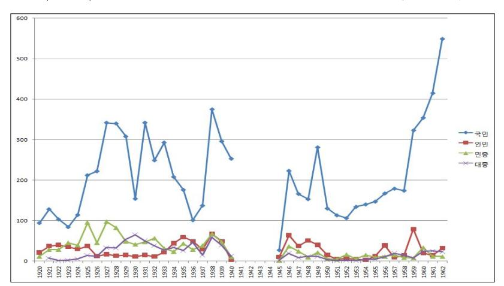
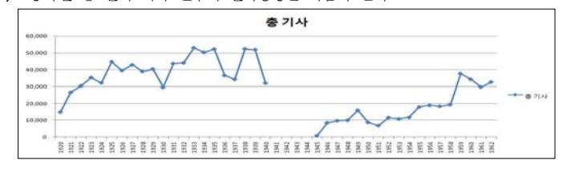
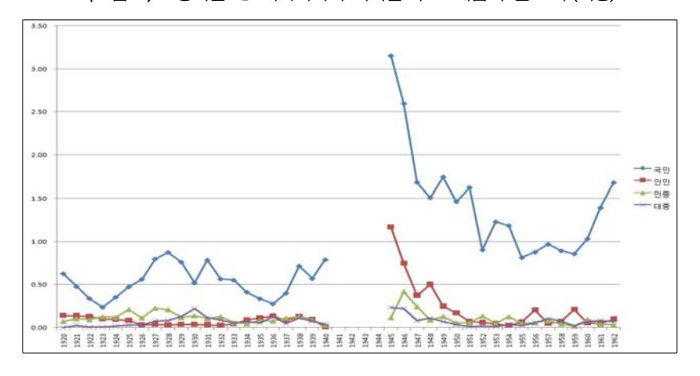
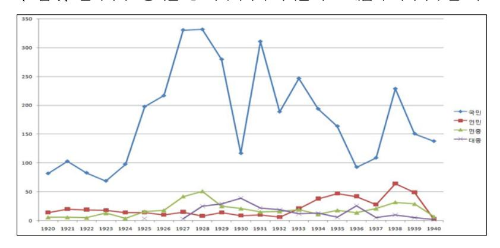
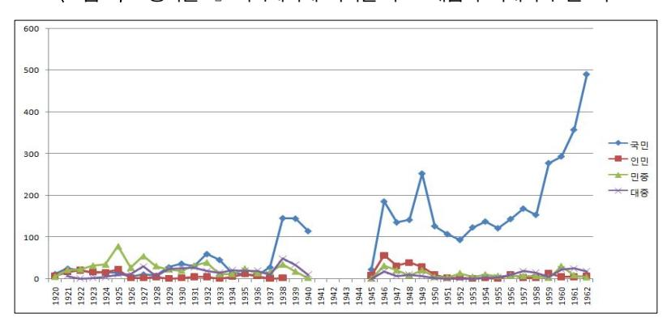
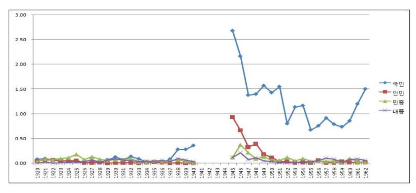
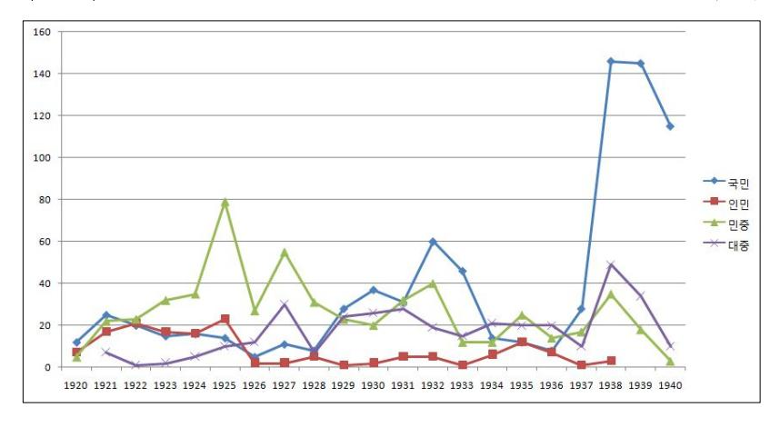
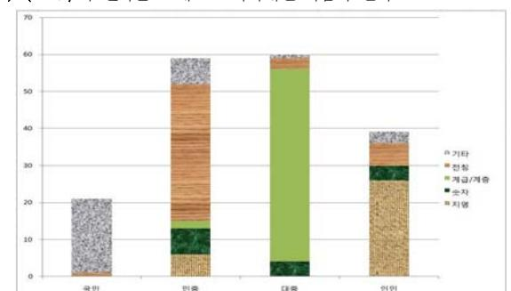

#### 특집 경계에선민중, 새로운민중사를향하여

# 식민지기 집합적 주체 에 관한 개념사적 접근 동아일보 기사제목 분석을 중심으로

허수

머리말

- 동아일보와 집합적 주체
- 유형별 용례 분석
- 복합명사형
- 수식어 전치형
- 단독형

맺음말

## 머리말

본 논문은 새로운 민중사 를 모색하면서 시도해본 실증적인 작업의 하나이 다 년대 민중사학은 학문적 실천적 의의가 함에도 불구하고 민중 을 한국사회의 변혁을 수행하는 운동적 주체 로 보는 이미지를 고착화 시켰다 이 때문에 이와 관련한 역사 연구는 민중은 역사의 주체 라는 슬로건

이 글은 년 역사문제연구소 정기심포지엄 성균관대학교 주년기념관 에서 발표한 다음 글의 제 장 식민지 공간과 민중 의 활성화 를 대폭 수정 보완한 것이다 허수 개념 속의 식민지 경험 역사문제연구소 [ 역사문제연구소 정기심포지엄] 경계 에 선 민중 새로운 민중사를 향하여 년 월 일 토 성균관대학교 주년기념관 층 첨단강의실 쪽

한림대학교 한림과학원 교수

대표논저 일제하 의 사회사상과 천도교 서울대학교 국사학과 박사학위논문 개벽의 에 나타난 매체적 성격 표지 및 목차 분석을 중심으로 성균관대학 교 동아시아학술원 대동문화연구원 대동문화연구

아래 주로 민중운동사를 중심으로 이루어졌다 그러나 이러한 민중상은 종종 엘리트의 지도를 전제하고 있을 뿐만 아니라 미리 설정된 변혁의 주체와 경 로에 끼워 맞추어진 이미지라서 일상생활에서 민중의 다양성과 능동성을 포 착하는 데에는 많은 한계를 나타냈다

민중사학의 형성과 전개에 이론적 현실적 근거가 되었던 대내외적 상황이 크게 변화하면서 한국사회의 정치적 민주화 동구 공산주의권의 몰락 등 민중사학의 투쟁하는 민중상 은 민주화 이후의 한국사회 를 설명하는 데 한계를 노정했고 이와 반대로 기존의 민중 개념으로 담기 어려운 소수자 즉 외국인 노동자 소수자 등에 대한 관심이 높아졌다 이런 경향은 역사 연구에도 반영되어 민중운동사 연구는 크게 줄어들었고 연구자들의 관심은 생활사 문화사 방면으로 옮겨갔다 그 과정에서 예전에 범람했던 민중 논의 는 급격히 사라지게 되었다

지금은 새로운 민중사 의 모색기 라 부를 만하다 아직 새로운 민중사 라 는 용어는 민중지향성 정도의 범박한 속성을 민중사학과 공유할 뿐 민중 의 내포와 외연 연구방법론 등 많은 면에서 민중사학과 차별화된 내용을 채 워나가야 할 단계에 있다 민중 개념을 재구성하는 작업도 이러한 노력에 속 한다

본 논문은 첫째 식민지기 동아일보의 기사제목에 나타난 집합적 주체 개념을 분석함으로써 민중 개념의 식민지적 존재양태에 한걸음 다가서고자 한다 그리고 집합적 주체 개념을 하나의 단위로 묶어서 언급되는 다수의 행위자 정도로 규정하여 서술하고자 한다 둘째 방법론적으로는 식민지기 개 념 연구를 위한 방법론 정립을 시도하고자 한다

첫째 목표와 관련하여 그동안 민중 개념에 관한 연구는 년대의 민중 을 중심으로 이루어졌다 최근에는 개항기 및 해방 후 민중 혹은 이

민중사학 의 성과와 한계에 관해서는 다음 두 글을 참조 이용기 민중사학을 넘어선 민중사 를 생각한다 내일을 여는 역사 허영란 민중운동사 이후의 민중사 민중사 연구의 현재와 새로운 모색 역사문제연구

와 연관된 집합적 주체 에 관한 연구가 이루어졌다 이러한 선행 연구성과 를 참조하되 새로운 민중사를 추구하기 위해서는 민중 개념이 우리 사회에 서 처음 사용되던 초기 상황에 대한 역사적 이해가 무엇보다도 필요하리라 생 각된다 또한 민중 개념의 재구성을 위해서는 민중 개념만이 아니라 인접 개념들과 함께 고찰하는 것이 더욱 풍부한 함의를 발견할 수 있게 할 것이다 여기서는 식민지기 집합적 주체를 가리키는 개념을 국민 인민 민중 대중 의 네 개념을 중심으로 살펴보고자 한다 식민지기에 시민 개념도 적 지 않은 빈도수를 보이기는 하지만 이 개념은 주로 시민대회 등의 용례로 사용되었으며 또 이 용례를 살펴볼 경우 등도 함께 검 토해야 하는 별도의 작업이 필요하므로 일단 이번 검토대상에서는 제외했다 한편 본 논문에서 첫 번째 목표에 못지않게 중요하다고 생각하는 것은 식 민지기 개념 연구를 위한 방법적 모색이다 개념사 연구가 태동한 유럽뿐만 아니라 이웃 중국과 일본의 개념사 연구가 자국의 자료상황이나 구축된 인프 라 조건 위에서 특성화된 연구성과를 거두고 있는 데 비해 한국의 개념사 연 구는 아직도 시작 단계라 할 수 있다 우리도 체계적인 자료의 축적과 잘 기

전명혁 민중사 논의와 새로운 모색 역사연구 장상철 년대 민중 개념의 재등장 사회과학계와 민중문학 민중신학에서의 논의 경제와 사회 강 정구 민중은 어떻게 상상되었나 한국시학회 제 차 전국학술대회 논문집

박명규 [한국개념사총서 ] 국민 인민 시민 개념사로 본 한국의 정치주체 김동택 대한매일신보에 나타난 민족 개념에 관한 연구 대동문화연구 김성 보 남북국가 수립기 인민과 국민 개념의 분화 한국사연구 황병주 년대 비판적 지식인 사회의 민중인식 기억과 전망

최근 박명규는 국민 인민 시민 소화 이라는 저서를 통해 한국근현대사 전체에서 세 개념이 지닌 의미 변화를 본격적으로 검토한 바 있다

집합적 주체 라는 용어는 매우 넓어서 여기에는 민족 군중 등도 포함될 수 있다 그러나 분석의 출발점과 초점을 식민지기 민중 개념에 두고 그 분석 시야를 확장하는 차원에서 네 개념을 시야에 넣은 것이지 집합적 주체 일반을 검토하는 것이 궁극적인 목표 가 아니기 때문에 민족 개념은 제외했다 민족 은 민중 과 병렬적으로 논의하기 어려울뿐 더러 좀 더 상위의 개념으로 생각되며 빈도수나 그것이 가지는 의미상 별도의 본격적인 조명 이 필요하다고 생각했기 때문이다 군중 개념은 민족 과는 달리 민중 개념과 병렬적으로 비교해볼 만한 개념이지만 미처 이것까지 포함해서 고찰하지는 못했다

다음 글이 좋은 참조가 된다 송승철 미래를 향한 소통 한국 개념사 방법론을 다시 생각한

획된 연구방법론의 수립이 필요하다 본 논문은 이러한 상황을 인식하면서도 우선 현재 마련된 조건 속에서 식민지기 개념 연구를 진척시킬 방법적 도구로 는 무엇이 활용가능한지를 탐색하고자 했다 여기서는 이미 국가정보화사업으 로 전산화되어 있는 한국근현대 신문잡지 데이터베이스 자료를 이용하여 주 요 개념에 대한 계량적 분석을 시도하는 일에 착목했다

## 동아일보와 집합적 주체

국민 인민 민중 대중 의 네 개념이 식민지기에 어떤 변동양상과 용 례를 보였는지에 대해서는 아직 정리된 바가 없으므로 이를 위해서는 이 개 념들의 변화를 포괄적이고 시계열적으로 볼 수 있는 자료의 선택이 필요하다 여기서는 동아일보의 기사제목을 주요 분석대상으로 삼고자 한다 그 이유 는 첫째 접근 및 이용의 편의성이다 주지하듯이 동아일보는 현재 국사편 찬위원회의 국사데이터베이스 에서 년부터 년까지 기사제목의 검색 및 원문 이미지형태의 본문 열람이 가능하다 둘째 상대적으로 균질적 이며 장기지속적인 자료라는 점이다 식민지기에는 잡지나 신문 특히 민간 발 행지는 오랫동안 안정적으로 발간되기 어려웠다 이런 가운데 동아일보는 년부터 년까지 발행되었을 뿐만 아니라 해방 직후부터 재발간되었 으므로 해방 이후의 개념변동 양상과 대비해서 드러나는 식민지기의 특성을 파악하는 데에도 유용하다

물론 동아일보의 기사제목만으로 특정 개념의 양태를 판단하는 데에는

다 한림대학교 한림과학원 한림대학교 한림과학원 인문한국사업 동아시아 기본개념의 상호소통사업 제 회 국제 학술대회 동아시아 개념의 절합과 횡단 년 월 일 한림 대학교 국제회의실

현재 국사데이터베이스 에 수록된 동아일보의 기사 총수는 만여 건에 달한다 이 중 해방 이전은 만여 건 해방 이후는 만여 건이다

그림 동아일보 기사제목에 나타난 주요 개념의 빈도수 초기 수치

많은 한계가 있을 것이다 그러나 동아일보 기사제목은 당시 특정 개념의 사회적 용례를 반영할 뿐만 아니라 역으로 구독자들에게 영향을 끼친 측면도 있다 따라서 현재 식민지기 개념사 연구에 필요한 기초자료의 축적이라는 점 에서 동아일보의 기사제목 분석은 개념의 사회적 유통을 살펴보기 위한 표 본조사로서의 가치를 가진다고 본다

이상의 사항을 염두에 두고 동아일보 기사제목에서 국민 인민 민 중 대중 의 네 개념을 각각 검색한 뒤 그 결과를 본 논문의 목적에 맞게 가공하는 과정을 거쳐 본격적인 검토를 해보고자 한다

먼저 국사데이터베이스 에서 동아일보 기사제목에 나타난 네 개념을 검색한 합계는 모두 건이다 이것은 년부터 년까지의 내외신 기사를 모두 포함한 검색결과이다 이 만여 건 기사의 개념별 분포상황을 정 리하면 그림 과 같다

이 그래프를 보면 여타 개념에 비해 국민 개념의 빈도수가 두드러지며 특히 이러한 경향은 년대 말과 식민지기에 현저하다 여타 개념은 상대 적으로 빈도수가 낮게 나타난다 그런데 동아일보 기사제목을 분석할 때 다 음 두 가지 점에 유의해야 한다

첫째 전체적인 동향 파악을 위해서는 각 개념의 빈도를 나타내는 절대수치 보다는 연도별 비중을 중심으로 파악할 필요가 있다 동아일보 기사 총수는 발행 면수의 증감 총독부의 정간조처 등 여러 변수로 인해 매년 크고 작은 변동을 보이기 때문이다 이런 조건 위에서는 각 개념의 연도별 빈도수가 가진 상대적 비중은 타 연도의 그것과 단순히 비교하기 어렵다 그러므로 네

발행 면수의 증감이 일어나서 안정적으로 지속되는 기점과 그 시점에서의 증감상황을 살펴보 면 다음과 같다

| 면수 증감 시점 | 면수 |
|----------|----|
|          | 면  |
|          | 면  |
|          | 면  |
|          | 면  |
|          | 면  |
|          | 면  |
|          | 면  |
|          | 면  |
|          | 면  |
|          | 면  |

- 식민지기 동아일보에 대한 조선총독부의 정간조처는 모두 회이다 정간기간 및 정간의 빌 미가 된 기사는 다음과 같다
  - 차 일 제사문제 재론
  - 차 일 국제농민본부의 전문
  - 차 일 조선의 현상하에
  - 차 일 일장기 말소사건

동아일보의 총 정간기간은 일이다 참고로 조선일보의 정간기간은 일이며 중외 일보는 일이다 이상은 박찬승 언론운동 한국독립운동사편찬위원회 독립기념관 한국 독립운동사연구소 쪽

동아일보 전체 기사 건수의 변화양상은 다음과 같다

개념의 시계열적 변동을 상호 비교해서 파악하기 위해서는 각 연도별 기사 총 수에서 특정 연도의 해당 개념 빈도수가 차지하는 비율을 산정하여 이를 중심 으로 네 개념의 변동양상을 파악하는 것이 바람직하다

식민지기에 동아일보가 시기별로 증면했음에도 불구하고 총 기사 수가 크게 감소하는 해가 몇 군데 보이는데 이는 차례의 정간조처와 관계 깊다 그중 특히 년과 년은 정간일수가 많아서 기사 수에 영향을 끼 쳤다 년이 낮은 이유는 동아일보가 년 월부터 본격적으로 재 발행되었던 사정을 반영한 것이다 이상의 변수를 고려하여 그림 의 수치 를 비중으로 환산해보면 그림 의 결과를 얻게 된다

그림 를 보면 국민 과 인민 개념의 사용이 해방 직후의 정치적 활성 화 속에서 폭발적으로 증가했음을 알 수 있다 이는 기존의 연구결과와도 부 합한다 그리고 이 두 개념은 년대 초에 다시 가파르게 상승하는 모습 을 볼 수 있다 황병주는 최근 연구에서 의 경험을 통해 많은 사람들이 민중의 역동성과 가능성을 발견 했으나 이 때의 민중 은 지식인 언론 등에 서 사용되는 상층 언어의 성격이 짙었다 고 보았다

둘째 분석대상에서 외신기사를 분리할 필요가 있다 외신기사의 제목도 신 문 독자에게 특정 개념의 유통을 자극하는 요인이 될 수 있으며 해외의 사건 에 대한 보도기사 중에는 국내에서 익숙한 용어로 바꾸어 전달하는 경우도 더 러 있을 수 있다 그러나 식민지 조선사회의 내적 용례를 일차적으로 파악하 기 위해서는 외국의 사건이나 단체명 등을 단순하게 전달하는 외신기사는 제 외하는 것이 바람직하다 다만 해외에서의 한국인 활동과 관련한 기사는 국내 기사로 간주하여 분석대상에 포함했다

간혹 해당 사이트를 검색해보면 일부 기사가 동일하게 중복 추출되는 경우가 있다 이런 중복 기사도 제외할 필요가 있다

김성보 앞의 글 참조

황병주 앞의 글

그림 동아일보 기사제목에 나타난 주요 개념의 빈도 수 비중

표 해방 전후 동아일보의 국내 국외기사에 나타난 주요개념의 구분

|      | 국내 | 국외 | 계 |
|------|----|----|---|
| 일제시기 |    |    |   |
| 해방 후 |    |    |   |
| 계    |    |    |   |

이와 같은 기준으로 만여 건의 데이터를 분류해보면 표 과 같다 표 에서 일제시기와 해방 후를 비교할 때 주목할 점은 해방 후의 기사는 국내 기사가 훨씬 많은 데 비해 일제시기에는 국외기사의 비중이 더 높다는 점이 다 특히 그림 에서 알 수 있듯이 국민 개념의 경우 이러한 점은 두드러 진다 해방 전과 후에 왜 이러한 차이가 나타났는가를 규명하는 것도 흥미로 울 것이지만 본 논문에서는 일제시기와 해방 후의 기사를 단순 비교하기 어 렵다는 점을 강조하고자 한다 그림 에서 국외기사를 제외한 결과가 그림 이며 그것을 비중으로 환산해서 비교한 것이 그림 이다 그림 를 그림 와 비교해보면 해방 이후는 커다란 변화를 느낄 수 없는 데 반해 일 제식민지시기에는 국민 개념의 빈도수가 매우 낮다는 것을 알 수 있다

그림 일제시기 동아일보 기사제목에 나타난 주요 개념의 국외기사 빈도수

그림 동아일보 기사제목에 나타난 주요 개념의 국내기사 빈도수

그림 동아일보 기사제목에 나타난 주요 개념의 국내기사 비중

그림 일제시기 동아일보 기사제목에 나타난 주요 개념의 빈도수 변동양상 수치

## 그림 일제시기 동아일보 기사제목에 나타난 주요 개념의 빈도수 변동양상 비중

그림 와 그림 에서 본 논문의 주된 관심 분야인 식민지기 부분을 특 화하면 그림 그림 과 같다

식민지기에는 총 기사 수에서 해방 이후와 같은 정도의 커다란 증감은 상대적으로 적어서 빈 도수의 변동과 비중의 변동양상은 대동소이하다 분석과정에서는 개념의 비중뿐만 아니라 빈 도수에 대한 파악도 필요하다 이런 까닭에 이 장의 분석에서는 그림 과 그림 을 다

전체적으로 볼 때 년대에는 민중 개념의 빈도수가 가장 높고 년 이후에는 국민 개념이 강세를 보이는 점을 알 수 있다 인민 개념은 하 향추세를 그리며 시간이 지날수록 최저를 기록하고 있다 대중 개념은 년 전후와 년에 높게 나온다

## 유형별 용례 분석

이 장에서는 그림 의 빈도수 동향 등을 염두에 두면서 각 개념들의 용 례를 분석하기로 한다 그림 의 개념별 빈도수를 숫자로 나타낸 것이 표 이다 국민 개념이 여전히 건으로 최다를 기록했으며 그 뒤로 민 중 건 대중 건 인민 건 의 순서를 보인다

각 개념별 용례를 살펴보기 위해 각 개념이 들어가 있는 기사제목을 보면서 해당 개념이 드러난 단어의 최소단위를 주제어로 뽑고 이것을 소분류 중 분류 로 구분한 것이 부표 부표 이다

주제어는 될 수 있는대로 기사제목에 들어 있는 형태를 그대로 살리고자 했 다 그래야 개념 분석대상으로서의 의의가 더 클 것으로 생각되어서였다 주제 어 개수는 국민 이 개 민중 이 개 대중 이 개 인민 는 개이 다

함께 활용할 것이다

부표 부표 는 중분류의 내용에 따라 정렬한 것이다

타 개념에 비해 국민 개념의 주제어가 빈도수 개에 비해 적은 것은 특정 주제어의 빈도 수 비중이 높기 때문이다 예컨대 국민부 와 국민부원 이 각각 건과 건 국민정신총동 원 이 건이다 그 다음이 국민 건 국민등록 건 순이다 이에 비해 민중 은 민중 대회 건 민중보건 건 민중운동자대회 건 순으로 국민 개념의 경우에 비해 주 제어의 편중이 적다 그러나 민중 단독으로 사용된 경우는 건으로 네 개념 중에서 가장 높다 대중 개념은 단독으로 사용된 경우가 건으로 다소 높은 편이며 그 다음이 대중생 활 건 소비대중 건 순이다 나머지는 건 이하가 대부분이다 인민 개념도 단독 용례는 건으로 많지만 다음 순서가 인민혁명군 이 건이고 그 외는 모두 건 미만이다

| 연도 | 국민 | 민중 | 대중 | 인민 | 합계 | 연도 | 국민 | 민중 | 대중 | 인민 | 합계 |
|----|----|----|----|----|----|----|----|----|----|----|----|
|    |    |    |    |    |    |    |    |    |    |    |    |
|    |    |    |    |    |    |    |    |    |    |    |    |
|    |    |    |    |    |    |    |    |    |    |    |    |
|    |    |    |    |    |    |    |    |    |    |    |    |
|    |    |    |    |    |    |    |    |    |    |    |    |
|    |    |    |    |    |    |    |    |    |    |    |    |
|    |    |    |    |    |    |    |    |    |    |    |    |
|    |    |    |    |    |    |    |    |    |    |    |    |
|    |    |    |    |    |    |    |    |    |    |    |    |

표 일제시기 주요 개념의 빈도수 변동양상

소분류 는 주제어가 들어간 기사내용을 보고 동일한 사건이나 대상 혹은 동일한 범주로 묶일 수 있는 것을 동일한 단어로 표시했다 이는 개별 차원의 언표적 차이를 넘어 실제로 같은 사안이나 사건 동일한 범주를 가리키는 주 제어별로 묶어서 파악하기 위해서다

합계

중분류 는 해당 집합적 주체 개념을 넘어 집합적 주체 개념 간의 비교를 위해 좀 더 포괄적인 범주로 나눈 것이다 이와 관련하여 부표 부표 의 주제어는 표 과 같이 크게 세 유형으로 구분할 수 있다 첫 번째 유형 은 집합적 주체 개념이 단독으로 사용된 용례이다 은 를 하는 이라 등이 여기에 속한다 이 범주에는 개념 조 사 의 형태를 취하는 경우도 포함시켰다 은 의 등이 그것이다 여기서 국민 개념이 문장 내의 다른 용어 즉 보건 이나 생 명 과 갖는 연관성은 조금 뒤 살펴볼 다른 두 유형에 비해 우연적이고 유동적 이다 적 화 등의 형태는 다른 일반 조사와 연결된 형태에 비해 서는 좀 더 관용적인 형태로 사용되므로 반드시 단독형이라 하기 어려운 면도

표 주제어의 유형구분과 그 의미

| 구분 | 유형      | 형태             | 중분류    | 분석적 의미     |
|----|---------|----------------|--------|------------|
|    | 단독형     | 개념 조사          | 적 화 | 가장 유동적인 용례 |
|    | 수식어 전치형 | 수식어 개념         |        | 중간 단계의 유동성 |
|    | 복합명사형   | 명사 개념 개념 명사 | 그 외    | 안정적 공식적 용례 |

표 유형별로 본 주요 개념의 분포양상

| 주요 개념 유형 |   | 국민 |   | 민중 | 대중 | 인민 | 합계 |  |
|-------------|---|----|---|----|----|----|----|--|
| 단독형         |   |    |   |    |    |    |    |  |
| 수식어 전치형     |   |    |   |    |    |    |    |  |
| 복합명사형       |   |    |   |    |    |    |    |  |
| 합계          | 건 |    | 건 |    | 건  | 건  | 건  |  |

있지만 사례가 많지 않아서 그다지 일반화된 용례는 아닌 것으로 간주해 단 독형에 포함시켰다 한편 민중 성원 의 경우처럼 개념 명사 의 형태 가운 데 내용적으로 주어 술어 혹은 개념 조사 명사 의 연결관계를 가진 소 수 사례도 이 유형에 포함시켰다

두 번째 유형은 집합적 주체 개념이 앞에 나온 수식어의 꾸밈을 받는 용례 이다 여기에는 처럼 일반 형용사가 오는 경우와 처럼 지역명이나 숫자가 오는 경우도 포함시켰다 이를 중분류 에서는 로 표시했다 이러한 수식어 전치형 은 다음에 살펴볼 복합명사형 보다는 개념의 사용이 안정적이지는 않지만 지역명이나 숫자 및 일반 형용사 등과 결합되는 패턴을 보인다는 점에서 단독형보다는 안정적인 용례에 속한다

고 할 수 있다

세 번째 유형은 집합적 주체 개념이 다른 명사와 함께 복합어로 사용되는 용례이다 국민학교 민중운동자대회 대중연예대회 인민혁명군 등이 여기에 속한다 이 복합명사형에는 사건명이나 단체명이 많고 국민학교 등의 경우처럼 한 개의 단어로 사용되는 경우가 많아서 안정적이고 공식적인 용례 에 속한다고 할 수 있다

집합적 주체 개념별로 세 유형의 분포를 비교한 것이 표 이다 국민 의 경우 복합명사형이 압도적 다수인데 비해 인민 은 단독형이 거의 절반에 이 른다 국민 과 인민 이 대조적인 양상을 보이는 데 비해 민중 과 대중 은 중간적인 모습을 보인다 민중 과 대중 의 경우 복합명사형이 남짓으로 세 유형 중 가장 비중이 높다 그러나 단독형도 대로 적지 않은 비중을 보이는 것이 특징이다

이상의 자료에서 보이는 상황과 분류법에 유의하면서 구체적인 용례를 고 찰하고자 한다 가장 높은 비중을 차지하는 복합명사형부터 살펴보기 시작해 서 수식어 전치형 단독형의 순서대로 진행하고자 한다

## 복합명사형

## 국민

국민 개념의 경우 표 에 나와 있듯이 년에는 매년 회 이상 년 년 동안에는 회 이상의 높은 빈도수를 보인다 그중 중요한 용례는 전시 총독부정책 건 국내외 독립운동 건 전시생활 건 교육기구 건 친일협력단체 건 순이다

첫째 가장 높은 빈도수를 보이는 것이 전시 총독부정책에 관한 것이다 시 기적으로는 대부분 중일전쟁 발발 이후지만 만주사변 발발 직후인 년대 초반에도 일부 포함되었다 건의 빈도수를 보이며 이 중 국민정신총동원운

동이 건으로 최대를 차지한다 그 다음이 정신작흥운동 건 국민등록 건 순이다

둘째 그 다음으로 많은 것은 국내외 독립운동에 속하는 용례이다 조직 명 칭을 가리키는 데 사용되었다 이 중 국내 독립운동으로 생각되는 것은 많아 야 건이고 나머지 건은 모두 국외 독립운동과 관련된 것이다 국민부 관 련 용례가 건으로 가장 많다 국민부의 독립운동 활동에 관한 기사나 일제의 국민부원 체포 및 재판관련 기사가 대부분이다 용례는 국민부가 조직 된 년부터 년까지 나온다 기타 만주 등지의 독립운동 관련한 용례 는 대체로 년대 전반에 분포되어 있다

나머지 중요 용례는 전시생활 교육기구 친일협력단체 순이다 친일협력단 체는 모두 국민협회에 관한 용례로 년대에 많다 전시생활과 교육기구의 경우 대부분 중일전쟁기에 집중되어 있다

이처럼 국민 개념의 용례는 일제시대에 양극화 양상을 보였다고 말할 수 있다 한편에서는 일제 말 전시체제기에 총독부가 조선사람을 국민 으로 호명 하면서 인적 물적으로 동원하고 통제하는 맥락에서 사용했고 다른 한편에서 는 만주 등 국외에서 일제식민통치에 저항하는 독립운동의 맥락에서 사용되었 음을 알 수 있다 또 다른 한편에서는 국민 개념의 다수가 정책과 운동 양 측면에서 정책명이나 조직명을 가리키는 고정된 개념으로 명확하게 사용되었 다는 공통점도 있다

#### 민중

민중 개념의 중요 용례는 국내외 독립운동 건 계몽운동 건 보건 건 연극 연예 건 등이다 첫째 가장 높은 빈도수를 보이는 용례는 국내외 독립운동과 관련한 것이다 그런데 민중 개념은 대부분 국내운동에 사용되고

국민부는 년 월 만주에서 정의부 신민부 참의부 를 통합하여 조직된 독립운동 단체이다 한국역사정보통합시스템 홈페이지의 시소러스 국민부 내용 참조

있어서 앞에서 살펴본 국민 개념이 대부분 국외 독립운동에 사용된 경우와 는 대조적이다 민중대회사건 건 과 전조선민중운동자대회 건 가 가장 많은 용례이다

둘째 그 다음으로 많은 용례는 계몽운동 관련 용례이다 세부 내용을 보면 민중의원 의 용례는 년대 중후반에 집중되어 있어서 조금 뒤 살펴볼 민 중보건 과 밀접한 관련이 있음을 알 수 있다 년대에는 민중의료 등에 관 한 관심이 증가한 것으로 보인다 년대 초에는 민중극단 관련 용례가 많 이 나온다 당시 조선사람을 계몽하는 수단으로 연극이 등장한 상황이 반영된 것으로 보인다 한편 민중교육 관련 용례는 년대 말에 나오고 있는 점도 특징이다

세 번째는 보건관련 용례이다 년대 초에 집중적으로 나온 뒤 이후에 도 고르게 사용되고 있다 전염병 유행 방지 체육보급 등과 함께 논의되고 있 다

넷째는 연극 연예 관련 용례이다 대체로 년대에 많다 주목할 만한 것 은 민중오락 의 경우 주로 줄다리기 그네 등 민속놀이를 가리키는데 이것이 년대 말에 기사화된 바 있는 반면 년에는 총독부에서 정책적으로 관심을 표하고 있다는 사실이다

국민 개념과 비교해서 특기할 것은 생활고나 전시생활과 관련한 용례에서 민중 은 건에 불과하다는 사실이다 이는 국민 개념의 건뿐만 아니라 조금 뒤 살펴볼 대중 개념의 관련 용례와 비교해도 크게 적은 수치이다

크게 보면 일제하 민중 개념의 용례는 계몽운동과 독립운동을 포함한 사 회운동 부문에 집중되어 있으며 그 외에 민중보건 민중문화 등에 주로 사용 되었음을 알 수 있다

년 월 일 일제가 신간회 간부 명과 근우회 간부 명을 검거한 사건 한국사연 표 한길사 참조

년 월 서울에서 일제의 탄압에 항의하며 붉은 기 를 갖고 일으킨 만세시위 한국역사정 보통합시스템 홈페이지의 시소러스 전조선민중운동자대회 내용 참조

#### 대중

다음은 대중 개념이다 중요 용례는 책이름 건 생활고 전시생활 건 연극 연예 건 사회주의운동 건 순이다 첫째 책이름의 경우 대중문학 전집 등 문학서적이나 조선농민사에서 발행한 대중독본 등 농민계몽용 도 서 기타 대중이라는 제목의 잡지 등이 있다 이를 통해 볼 때 당시 대중 개념은 지식인에 의해 의도적으로 국내에 보급되고 있었음을 알 수 있다 시 기적으로는 대부분 년을 전후한 시기에 집중되어 있다 대중 개념을 사 용한 사회주의운동에 관한 용례가 년을 중심으로 건 나온 점 등을 고 려하면 대중 개념은 일본의 사회주의운동과 밀접한 관련을 가졌음을 추정할 수 있다 또한 이런 운동적 차원에서 주목된 대중 개념이 몇 년 뒤 좀 더 넓 은 맥락에서 주목되고 전파되는 경로를 밟고 있었다고 볼 수 있다

둘째 생활고 전시생활 관련 용례가 그 다음 순이다 특히 년에 건 이 밀집되어 있는데 이 때의 기사를 보면 대부분 인플레하에서 생활하기 힘 든 상황을 보도하고 있다 이 경우 도시의 생활인을 가리키는 용례가 많다 따 라서 이런 용례는 비슷한 시기의 소비대중 건 과도 연결된다 이런 점에서 민중 의 관련 용례와 구분된다

셋째 연극 연예 관련 용례이다 대체로 년대 초와 년대 말에 분 포해 있다 민중 개념의 경우 년대 후반에 많이 쓰였던 것에 비해 대 중 개념의 용례는 그 이후에 보이는 것이 특징이다 보다 세부적인 문맥의 비 교를 통해 거의 동일한 문맥에서 시기별로 서로 다른 용어를 사용하고 있는지 의 여부도 살펴볼 필요가 있다

## 인민

마지막으로 인민 개념을 살펴보자 부표 에서 인민 개념은 그 자체로 사용된 경우를 제외하면 다른 개념에 비해 집중된 표현이 두드러지지 않는다 동북인민군 동북인민혁명군 인민혁명군 등이 년간 집중

적으로 기사화된 것이 회로 동일한 사항을 지칭하는 용례로는 가장 빈도수 가 높다 그 외에는 하나의 개념어 혹은 중요한 용례를 보이는 복합명사는 찾 기 힘들다

## 수식어 전치형

부표 부표 중에서 수식어가 집합적 주체 개념 앞에 와서 이 개념 을 수식하는 경우를 모두 합한 것이 부표 이다 이 용례에서 사용되는 수 식어를 성격에 따라 분류해보면 지명 숫자 계급 계층 전칭 기타 단 순수식 의 개로 나눌 수 있다 개 분류별로 해당용례 건수를 집계한 것이 표 이다

이상의 결과를 보면 집합적 주체 개념별로 일정한 경향성이 있음을 발견할 수 있다 국민 개념의 세부 용례를 보면 대부분 세국민 소국민 장래 국민 제 국민 제 세국민 등 어린이를 지칭하는 용례로 사용되었음을 알 수 있다 전체적으로 빈도수 자체가 낮으며 소국민 으로 사용된 용례가 년에 건이 있는 것도 소국민 보호훈련 에 관한 세계 각국의 사례를 회에 걸쳐 연재한 기사 때문이다

민중 개념의 경우 가장 특징적인 것은 전칭 용례의 비중이 가장 높다는

표 의 결과를 그래프로 나타내면 다음과 같다

의 본보기[제 회 제 회] 동아일보 면 면

〈표 5〉 개념 수식어의 구분 및 주요 개념별 분포 양상

| 주제 건분 | 국     | 민      | 민     | .ිදි   | 대     | 중      | 인     | 빈      |
|----------|-------|--------|-------|--------|-------|--------|-------|--------|
| 지명       | 0     | 0      | 6     | 10.2   | 0     | 0      | 26    | 66.7   |
| 숫자       | 0     | 0      | 7     | 11.9   | 4     | 6.7    | 4     | 10.3   |
| 계급/계층    | 0     | 0      | 2     | 3.4    | 52    | 86.7   | 0     | 0      |
| 전칭       | 1     | 4.8    | 37    | 62.7   | 3     | 5.0    | 6     | 15.4   |
| 기타(단순수식) | 20    | 95.2   | 7     | 11.9   | 1     | 1.7    | 3     | 7.7    |
| 계        | 21(건) | 100(%) | 59(건) | 100(%) | 60(건) | 100(%) | 39(건) | 100(%) |

## 〈표 6〉 개념 수식어로 시용된 용어

|           | 국민                                  | 민중                                           | 대중                                                                      | 인민                                                                                                       |
|-----------|-------------------------------------|----------------------------------------------|-------------------------------------------------------------------------|----------------------------------------------------------------------------------------------------------|
| 지명        | -                                   | 군산·목포·북평면· 성천·예천·전·川外                     | -                                                                       | 7면·각면·강서·고홍· 남포·동래·兩面·부근· 삼군·西城부근·서홍· 송정동·순천·순천지방· 안성·안악군·양편·연도· 영원·옹진군·저도·창성 춘천·태탄·홍성 |
| 숫자        | _                                   | 누천·다수· 여러·이천만                             | 4만·만명의·백만·천삼백만                                                          | 25만·다수· 이백여·천여 호                                                                                      |
| 계급/ 계층 | _                                   | 근로                                           | 근로·노농·농민·무산· 생산·세궁민·소년·소비· 소작· <b>聚食</b> ·수요·어업· 여성·일반소비·청년·학생 | -                                                                                                        |
| 전칭        | 全                                   | 세계·일반·일본·전국· <b>全</b> 반도·전조선의· 조선·조선일반 | 일반                                                                      | 일반·조선                                                                                                    |
| 기타        | 2세·亡·소· 장래·제2· 제2세· <b>銃後</b> | 무지·신흥·피해                                     | 수난                                                                      | 동정·무고·지방                                                                                                 |

사실이다 세계 민중 에서부터 일본 민중 조선 민중 반도 민중 등 민족 이나 국가 세계 단위로 전체 구성원을 지칭할 때의 용례로 사용되는 경우가 가장 많다 근로 민중 과 같이 계급적 계층적 용례로 사용되는 경우는 매우 적다 그러나 지명이나 숫자 등이 오는 경우는 더러 보이며 세부 용례도 가 지 갈래가 모두 보인다 다른 개념에 비해 시기별로 골고루 분포되어 있는 것 도 특징이다

대중 개념의 경우 계급 계층 을 뜻하는 수식어와 결합한 용례가 약 로 압도적 다수를 보인다 민중 개념과 달리 대중 개념은 노동자 농민 근로 생산 어업 소작 무산 등 직업이나 근로를 뜻하는 수식어와 결 합되기도 하고 청년 학생 여성 등 계층적 용어와 함께 쓰이는 경우도 많다 또한 소비대중 수요대중 등 소비주체로서의 측면을 강조한 용례도 있다 계급 계층 수식어 외에 전칭 수식어로 사용되는 경우도 더러 있다 무 산대중 를 비롯해서 계급적 수식어와 함께 사용되는 용례는 년대 중후반 에서 년대 초에 많이 분포해 있으며 이는 사회주의운동의 영향과 밀접 한 관련이 있는 것으로 생각된다 한편 소비대중 일반소비대중 수요대 중 등 소비주체로서의 용례는 년대 중후반에 몰려 있는 것이 특징이다 이것은 일제 말기로 가면서 도시 대중의 생활고를 언급하는 맥락에서 대중 개념을 사용한 것으로 생각된다

인민 개념의 경우 주로 지명을 가리키는 수식어와 함께 사용되고 있다 숫자를 가리키는 수식어와 함께 사용되는 경우도 좀 있다 시기별 분포도 주 목할 만하다 부표 를 보면 인민 의 수식어 전치형 용례가 보이는 분포양 상은 대부분 년대 전반에 그치고 있다 이는 대중 개념의 용례 분포와 상호 비교할 만하다 대중 개념의 용례는 무산대중 을 제외하고는 대부분 년대 후반 이후에 분포되어 있다

수식어 전치형과 관련한 이상의 분석결과를 놓고 대중 개념과 인민 민 중 개념의 관계를 생각하면 다음과 같다 첫째 대중 와 인민 의 관계는 집 합적 주체 개념 형성에서 발생한 서로 다른 시간대를 반영하고 있다고 생각된 다 대중 개념은 년대 중반 이후 사회주의적 계급 개념의 영향을 받 으면서 계급이나 계층 도시 소비주체 등의 함의를 담은 용례로 막 사용되고 있던 상황을 보여준다고 할 수 있다 반면 인민 개념은 조선의 경우 이미 개 항 무렵부터 갑오개혁에 이르는 기간에 국가 또는 지역이라는 공동체의 정체 성을 담보한 구성원이라는 내포를 갖기 시작 했으므로 년대 초 동아 일보에서 지역명과 결합되어 사용된 인민 개념은 시간적으로 좀 지난 과 거의 용례에 속한다고 할 수 있다 둘째 대중 과 민중 은 각각 계급적 성 격과 민족적 성격을 가진 것으로 구별된다고 할 수 있다 대중 개념이 계급 을 가리키는 수식어와 사용된 경우가 많은 것에 비해 민중 개념은 전칭 수 식어와 함께 사용된 경우가 많기 때문이다

## 단독형

집합적 주체 개념이 단독형으로 사용되는 경우가 가장 분석하기 까다롭다 일정한 세부 용례별 유형을 파악하기 힘들기 때문이다 그러나 표 에서 볼 수 있는 바와 같이 네 개념의 합계를 보면 그 비중은 전체의 약 로서 결 코 무시할 수 없다 개념별로 보아도 국민 개념의 단독형 용례는 매우 적은 반면 인민 개념의 경우에는 전체 용례의 약 절반에 가깝다 또한 민중 개 념의 단독형 용례는 건으로 이 숫자는 그 다음 순위인 대중 의 건보다 배 이상이나 많다

우선 각 개념별 용례에서 단독형 용례가 차지하는 비중이 가장 큰 인민 개념과 가장 적은 국민 개념을 상호 비교해보자

김윤희 근대 국가구성원으로서의 인민 개념 형성 역사문제연구 쪽

불특정 다수를 가리키는 용례와 관련하여 대중 개념이 인민 개념을 대체했는지의 여부는 구체적인 내용 분석 등을 통해 밝혀낼 수 있을 것이므로 이 작업은 다음 기회로 미루고자 한 다

|    |  |  |  |  |  |  |  |  |  |  | 합계 |
|----|--|--|--|--|--|--|--|--|--|--|----|
| 국민 |  |  |  |  |  |  |  |  |  |  |    |
| 민중 |  |  |  |  |  |  |  |  |  |  |    |
| 대중 |  |  |  |  |  |  |  |  |  |  |    |
| 인민 |  |  |  |  |  |  |  |  |  |  |    |

표 단독형 용례의 연도별 변동 양상

국민 개념은 단독형으로 건이 보이는데 이는 국민 용례에서 의 비중으로 매우 낮다 인민 개념의 단독형 용례는 건으로 국민 개념 단독 형 용례의 약 배에 불과하지만 이미 언급한 바와 같이 인민 개념 용례 전체에서 차지하는 비중은 매우 높다

국민 개념의 단독형 용례 중 년대 전반의 용례를 살펴보면 한편에서 는 각종 청년회나 강연회의 연설 제목으로 사용되는 경우가 더러 있으며 다 른 한편에서는 외국 인사가 우리나라 사람을 가리키거나 외국 사람을 가리킬 때 또는 국제적 관심사 등에 사용되는 경우도 있다 후자의 경우 식민지 조선사람의 자기인식이 반영된 용례라고는 하기 힘들다 국민 개념의 대표적 용례는 오히려 년대 중후반에서 잘 드러난다 년부터 그 이후의 용 례는 대부분 전시통제와 관련된 언설이 대부분이다 국민 개념도 주로 국민 적 자각 국민적 태세 완비 국민적 조직력 국민적 신념 등 통합적 맥락 에서 사용되며 그 연장선상에서 국민의 적 등과 같이 피아 구분법 속에서

은 를 하는 이라 만 되면 의 될 것임 한 델즈맨 떠불유한 동아일보 면 은 우리나라 학생은 녜전보다 다소 줄어 삼 일절과 국치긔념일에는 뎡긔 집회 을 하고 한 동아일보 면

과 의 동아일보 이 연재기사는 에스페 란토로 작성되었다

거론되는 경우가 대부분이다

인민 의 용례는 년대 전반에 집중적으로 분포되어 있고 년대 초 에 약간의 분포를 보인다 기사제목에서 인민 이 어떤 단어와 결합되어 있는 가를 정리한 것이 부표 이다 이 표를 보면 주목할 만한 사실을 알 수 있 는데 기사의 게재 시기와 관계없이 인민 개념은 부정적이거나 피해자의 입 장을 나타내는 단어와 결합되어 사용되는 경우가 많다는 점이다 불법행위 불평 공갈 불리 대손실 구타 난자 고혈 감금 투옥 비난 충돌 등이 그것이다 물론 친절 생명 자각 등도 있지만 매우 낮은 비 중이다 이처럼 주로 고통과 억압받는 사람을 가리키며 사용된 인민 개념의 용례는 통합의 주체이자 피아를 구별하면서 우리측 의 단결을 강조하는 문맥 에서 사용된 국민 의 용례와 대조적임을 알 수 있다 또한 이러한 인민 용 례를 앞서 살펴본 수식어 전치형 의 인민 개념 용례와 연결해서 생각하면 정치의 객체이자 고통의 담지자인 인민 개념은 근대의 사회운동적 주체보다 는 전통적인 성격에 가까운 속성이라고 말할 수도 있을 것이다

한편 민중 과 대중 개념의 단독형 용례를 살펴보면 국민 및 인민 과는 사뭇 다른 양상을 보인다 민중 의 경우 인민 과 마찬가지로 민중불평 민 중의 고혈 민중은 불만 우매한 민중 등 부정적인 이미지와 결합한 사 례가 건이다 그러나 이것은 전체 빈도수 건에 비해 매우 낮은 비중이 다 그밖에는 민중의 민중과 지도자 자각한 민중 등 긍정적이거나 적어도 중립적인 문맥에서 사용되는 것이 대부분이다 특히 주목할 점은 년에는 미래는 민중의 것 이라는 강연 주제로 차례 등장하고

의 는 의 것이다 동아일보 에서 에 있는 을 깨트리고 는 의 것이다 에서본 의 동아일보 의 의 으로 본 과 는 의 것이다 동아일보 에서 의 이 되여 의

년에는 염상섭이 조선과 문예 문예와 민중 및 소설과 민중 이라는 제목으로 각각 회씩 연재한다는 사실이다 이외에도 년에는 민중과 영화 라는 제목의 기사가 회 연재되었다 이처럼 지식인들이 신문지상에 서 민중 개념을 중심으로 하는 기사제목을 싣고 수차례 연재한 사실은 당시 민중 개념의 용례 가운데 중요 부분이 사회운동적 차원에서 계몽적 혹은 선 전적 의도에서 사용되었음을 뜻하는 단적인 사례이다

이런 용례와 관련하여 대중 개념의 용례를 함께 살펴볼 필요가 있다 대 중 개념의 단독형 용례는 년부터 사용되기 시작해서 년에 최대치 에 달한다 이 역시 부정적인 이미지와 결합되는 경우는 드물고 민중 개념의 경우와 마찬가지로 중립적이거나 긍정적 이미지와 결합되어 사용된다 특히 대중 개념도 연재기사 제목으로 사용되는 경우가 있어서 민중 개념과 비교 할 만하다 년에 영화인 대중에게 함 이라는 제목으로 회가 연재되 었고 비슷한 기간에 푸로레타리아 의 대중화문제 라는 제목으 로 회가 연재되었다 년에는 장래할 세계대전과 대중의 경제생활 이라는 제목으로 회가 연재되었다 조금 전에 살펴보았듯이 동아일보에 년에는 민중과 영화 라는 연재기사가 실렸고 년에는 영화인 대

의 는 의 것이다 동아일보

과 와 [제 회 ] 동아일보 과 와 [제 회 ] 동아일보 과 과 와 의 [제 회 ] 동아일보 과 과 와 의 [제 회 ] 동아일보

과 [제 회 ] 동아일보 과 [제 회 ] 동아일보

의 와 에게 함[제 회 ] 동아일 보 의 와 에게 함[제 회 ] 동아일보

푸로레타리아 의 [제 회 ] 동아일보 푸로레타리아 의 [제 회 ] 동아일보

의 할 과 의 [ ] 동아일보 의 할 과 의 [ ] 동아일보

중에게 함 이라는 연재기사가 실렸다 이 시기 영화가 문화적 측면에서 주 목되었음을 알 수 있는데 유사한 주제의 연재기사에서 집합적 주체를 다르게 사용한 것이 우연인지 아니면 필자의 일정한 경향성을 반영하는지의 여부는 향후 좀 더 포괄적이고 세밀한 분석을 통해 파악할 필요가 있다 어쨌든 여기 서는 년대 식민지조선에서 지식인들의 연재기사나 강연제목에서 민 중 과 대중 이 자주 등장하는 양상에 주목하며 그 개념을 사용한 필자의 의 도 여하를 떠나서 두 개념이 사회운동 상에서 상호 경쟁관계에 있었음을 나타 낸다고 볼 수 있다

연재기사를 제외하고 민중 과 대중 개념의 단독형 용례에서는 뚜렷한 변 별점을 찾기 힘들다 년대 전반에 민중의 이 있는가 하면 대중의 총 명 이라는 표현도 있다 년에 민중아 예술화하라 라는 부르짖음이 있은 직후 대중아 자중하라 라는 경구도 뒤따른다 년에는 스포츠의 민중화 민중적인 동래 줄다리기싸움 등이 기사화되었는데 마찬가지로 같은 해에 스포츠 대중화 년에는 고유운동경기의 현대화 대중화 조선고유궁 술의 대중화 기사 등이 나온다 이 때 고유운동경기란 줄다리기 등을 포함한 명절놀이를 가리킨다 즉 사실상 같은 대상을 가리킨 것이다

## 맺음말

본 논문의 출발점은 민중 에 대한 개념사적 접근을 통해 기존의 고정된 민중 개념을 벗어나서 새로운 민중사 를 모색하는 것이었다 덧붙여 이 과 정에서 식민지기의 개념 탐구에 필요한 연구방법을 시도해보고자 하였다 분 석결과를 요약하면 다음과 같다

식민지기 민중 개념 연구에 필요한 기초자료 축적을 위해 집합적 주체 에 해당하는 국민 인민 민중 대중 의 네 개념을 중심으로 계량적 분석 을 시도했다 제 장에서는 국사데이터베이스 의 동아일보 기사제목 가 운데 년부터 년까지 네 개념을 키워드로 해서 얻은 만여 건의 검 색결과를 본 논문의 분석에 알맞게 가공했다 외신기사를 분리해내고 실제 신 문에 게재된 기사 숫자 가운데 해당 개념이 차지하는 비중을 추출해 냈다 그 리하여 일제시기 네 개념의 빈도수 및 연도별 개략적인 상황을 살펴본 바 국 민 민중 대중 인민 순으로 각각 건 건 건 건이 나왔 다 시기별로는 년대에 민중 개념이 많이 나왔고 년 이후로 가면 국민 개념의 상승세가 급증함을 알 수 있었다 인민 개념은 년대 초 에 높은 편이었으나 중반 이후부터는 최저수준을 유지했고 대중 개념은 년 무렵에 높게 나왔다

제 장에서는 각 개념별 용례를 좀 더 구체적으로 분석했다 이를 위해 동 아일보 기사제목에 나타난 개념의 용례를 사용된 형태에 따라 복합명사형 수식어 전치형 단독형 의 세 가지로 나누고 각 유형별로 네 개념의 용례를 살펴보았다 먼저 복합명사형 에서 국민 개념은 양극화 양상을 보였다 일 제 말 전시체제기에 조선인을 국민 으로 동원하는 지배정책적 맥락에서 사용 되는 용례가 가장 많았으며 다른 한편 일제식민통치에 저항하는 국외 독립운 동과 관련한 용례도 많았다 민중 개념의 경우 국내 독립운동 및 계몽운동을 포괄하는 사회운동의 맥락에서 사용된 경우가 가장 많았다 대중 개념은 도 시대중의 생활고 및 대중문화 관련 용례가 많았으며 사회주의운동의 영향을 받아 점차 개념 사용이 확산되는 모습을 보였다 인민 개념은 복합명사로는 뚜렷한 용례를 발견하기 힘들며 일제 말에 동북항일혁명군 관련 기사가 눈 에 띌 뿐이다

수식어 전치형 의 경우 국민 개념의 용례는 별다른 것이 없고 다만 어 린이 를 가리키는 용례가 주목되는 정도이다 민중 개념은 전칭 수식어와 결합되는 양상이 가장 많다 대중 개념은 계급 계층 수식어가 최다인데 여 기에는 운동적 주체뿐만 아니라 소비주체로서의 측면도 섞여 있음이 중요하

다 인민 개념은 지명과 주로 결합되어 사용되었다 대중 개념의 이러한 용 례는 당시로서는 최신의 용례라는 점에서 인민 개념과 구별되며 또한 계급 적 인식이 반영된 것이라는 점에서 민중 개념의 민족적 뉘앙스와도 구별된 다

단독형 의 경우 국민 개념은 일제 말에 통합적 언설 차원에서 주로 사용 되었다 인민 개념은 이와 정반대 경향을 보여 부정적인 단어나 정책 경제 상황 기타 여러 요소의 피해자로 묘사되는 문맥에서 많이 사용되었다 이와 달리 민중 과 대중 개념은 계몽적 주체나 대상의 문맥에서 또는 스포츠의 민중화 대중화 등의 문맥에서 서로 경쟁적인 관계에 있었다

이상에서 요약한 바와 같이 본 논문에서는 일제시기 집합적 주체 에 해당 하는 개념으로 국민 민중 대중 인민 의 네 개념을 설정해서 이에 대한 양적 질적 분석을 시도했다 그리고 질적 분석에서 복합명사형 수식어 전 치형 단독형 의 세 유형을 설정하고 각각을 안정된 용례 다소 유동적 용례 유동적 용례로 설정했다

이러한 설정을 염두에 두고 질적 분석의 결과를 정리해 보면 다음과 같다 복합명사형 과 같이 안정적 공식적 용례에서는 주요 개념별 특징이 상대적으 로 분명했다 국민 개념은 지배와 저항의 용례로 양극화 양상을 보였고 민 중 은 국내 사회운동 계몽운동 및 독립운동 에 그리고 대중 은 도시 대중의 일 상과 사회주의운동 의 영향을 많이 보였으며 인민 개념은 이런 용례가 매 우 적었다

그런데 수식어 전치형 이나 단독형 의 용례를 살펴보면 주요 개념 간에 일정한 얽힘이 보인다 수식어 전치형 의 경우 대중 개념의 용례는 민중 개념과 각각 계급적 틀과 민족적 틀 로 구분되면서도 양자는 모두 사회운동 적 주체로서의 측면을 일정 정도 공유하고 있었다 이런 경향은 단독형 에서 더 두드러지는 바 대중 과 민중 개념은 사회계몽 등 주요 사안을 둘러싸고 비슷한 시기에 서로 경쟁하는 관계에 놓여 있었다

160 역사문제연구 제 호

본 논문에서는 일제시기 동아일보 기사제목에 착목하여 나름의 기준과 접근을 통해 이상과 같은 수준의 결론을 도출했다 집합적 주체 라는 범주를 제시하여 민중 개념의 다양한 접점과 함의의 역사적 존재양태를 살펴볼 수 있는 단서를 마련했고 용례별 유형 구분을 통해 공식적 층위와 그 이하의 층 위에서 사용되는 용례의 상이한 양상에도 일정 정도 접근할 수 있었다

그러나 본 논문의 분석은 한정된 대상을 피상적으로 살펴본 것에 지나지 않 는다 본 논문의 결론을 입증하고 강화하기 위해서는 더 많은 데이터와 더 심 도 깊은 분석이 수반되어야 함은 물론이다 향후의 연구로 이 과제를 해결해 나가고자 한다

주제어 집합적 주체 국민 민중 대중 인민 양적 분석 질적 분석 용례

최초투고일 년 월 일

심사완료일 년 월 일

게재확정일 년 월 일

부표 국민 개념의 용례

| 연번 | 주제어         | 소분류             | 중분류              |  |  |  |  |  |  |  |  |  |  | 합계 |  |
|----|-------------|-----------------|------------------|--|--|--|--|--|--|--|--|--|--|----|--|
|    | 국민          | 국민              |                  |  |  |  |  |  |  |  |  |  |  |    |  |
|    | 국민적 국민적  | 국민적             | 적                |  |  |  |  |  |  |  |  |  |  |    |  |
|    | 생활          | 국민적             | 적                |  |  |  |  |  |  |  |  |  |  |    |  |
|    | 세국민 보건   | 국민              |                  |  |  |  |  |  |  |  |  |  |  |    |  |
|    | 세국민         | 국민              |                  |  |  |  |  |  |  |  |  |  |  |    |  |
|    | 망국민         | 국민              |                  |  |  |  |  |  |  |  |  |  |  |    |  |
|    | 소국민         | 국민              |                  |  |  |  |  |  |  |  |  |  |  |    |  |
|    | 장래 국민       | 국민              |                  |  |  |  |  |  |  |  |  |  |  |    |  |
|    | 전국민 묵도   | 국민              |                  |  |  |  |  |  |  |  |  |  |  |    |  |
|    | 제 국민        | 국민              |                  |  |  |  |  |  |  |  |  |  |  |    |  |
|    | 제 세 국민   | 국민              |                  |  |  |  |  |  |  |  |  |  |  |    |  |
|    | 총후국민        | 국민              |                  |  |  |  |  |  |  |  |  |  |  |    |  |
|    | 국민이성        | 국민 이성        | 계몽 거주제 한폐지 |  |  |  |  |  |  |  |  |  |  |    |  |
|    | 국민교육        | 국민 교육        | 계몽 운동         |  |  |  |  |  |  |  |  |  |  |    |  |
|    | 국민체육        | 국민 체육        | 계몽 운동         |  |  |  |  |  |  |  |  |  |  |    |  |
|    | 국민주의        | 국민 주의        | 국민주의 국제 주의 |  |  |  |  |  |  |  |  |  |  |    |  |
|    | 국민학교        | 국민 학교        | 기구 교육         |  |  |  |  |  |  |  |  |  |  |    |  |
|    | 국민교         | 국민학교 기구         | 교육               |  |  |  |  |  |  |  |  |  |  |    |  |
|    | 국민고등 학교  | 국민고등 학교      | 기구 교육         |  |  |  |  |  |  |  |  |  |  |    |  |
|    | 국민우급 학교  | 국민우급 학교      | 기구 교육         |  |  |  |  |  |  |  |  |  |  |    |  |
|    | 국민교육 연구회 | 국민 교육 연구회 | 기구 교육         |  |  |  |  |  |  |  |  |  |  |    |  |
|    | 국민 우급교   | 국민우급 학교      | 기구 교육         |  |  |  |  |  |  |  |  |  |  |    |  |
|    | 일본국민 교육회 | 일본 국민 교육회 | 기구 교육         |  |  |  |  |  |  |  |  |  |  |    |  |
|    | 국민외교 협회  | 국민외교 협회      | 기구 만주         |  |  |  |  |  |  |  |  |  |  |    |  |

| 연번 | 주제어           | 소분류             | 중분류            |  |  |  |  |  |  |  |  |  |  | 합계 |  |
|----|---------------|-----------------|----------------|--|--|--|--|--|--|--|--|--|--|----|--|
|    | 국민성           | 국민성             | 논의             |  |  |  |  |  |  |  |  |  |  |    |  |
|    | 국민군           | 국민군             | 독립 운동       |  |  |  |  |  |  |  |  |  |  |    |  |
|    | 국민대회          | 국민 대회        | 독립운 동       |  |  |  |  |  |  |  |  |  |  |    |  |
|    | 대한국민 회원    | 대한 국민회       | 독립 운동 국내 |  |  |  |  |  |  |  |  |  |  |    |  |
|    | 국민 결사회     | 국민 결사회 회고 | 독립 운동 국내 |  |  |  |  |  |  |  |  |  |  |    |  |
|    | 국민 향촌회     | 국민 향촌회       | 독립 운동 국내 |  |  |  |  |  |  |  |  |  |  |    |  |
|    | 대한국민 향촌회   | 대한국민 향촌회     | 독립 운동 국내 |  |  |  |  |  |  |  |  |  |  |    |  |
|    | 국민부원          | 국민부             | 독립 운동 국외 |  |  |  |  |  |  |  |  |  |  |    |  |
|    | 국민부           | 국민부             | 독립 운동 국외 |  |  |  |  |  |  |  |  |  |  |    |  |
|    | 국민대표 회의    | 국민대표 회의      | 독립 운동 국외 |  |  |  |  |  |  |  |  |  |  |    |  |
|    | 국민 대표회     | 국민대표 회의      | 독립 운동 국외 |  |  |  |  |  |  |  |  |  |  |    |  |
|    | 국민회           | 국민회             | 독립 운동 국외 |  |  |  |  |  |  |  |  |  |  |    |  |
|    | 국민단           | 국민단             | 독립 운동 국외 |  |  |  |  |  |  |  |  |  |  |    |  |
|    | 간도 국민회     | 간도 국민회       | 독립 운동 국외 |  |  |  |  |  |  |  |  |  |  |    |  |
|    | 국민회원          | 국민회             | 독립 운동 국외 |  |  |  |  |  |  |  |  |  |  |    |  |
|    | 대한 국민단     | 대한 국민단       | 독립 운동 국외 |  |  |  |  |  |  |  |  |  |  |    |  |
|    | 간도 국민 경호대원 | 간도 국민 경호대 | 독립 운동 국외 |  |  |  |  |  |  |  |  |  |  |    |  |
|    | 간도 국민단     | 간도 국민회       | 독립 운동 국외 |  |  |  |  |  |  |  |  |  |  |    |  |

| 연번 | 주제어                 | 소분류                 | 중분류                      | 1920 | 1921 | 1922 | 1923 | 1924 | 1925 | 1926 | 1927 | 1928 | 1929 | 1930 | 1931 | 1932 | 1933 | 1934 | 1935 | 1936 | 1937 | 1938 | 1939 | 1940 | 합계 | П  |
|----|---------------------|---------------------|--------------------------|------|------|------|------|------|------|------|------|------|------|------|------|------|------|------|------|------|------|------|------|------|----|----|
| 43 | 간도국민 회원          | 간도 국민회           | 독립 운동 -국외          | 1    |      |      |      |      |      |      |      |      |      |      |      |      |      |      |      |      |      |      |      |      | 1  |    |
| 44 | 국민단원                | 국민단                 | 독립 운동- 국외          |      |      |      |      |      |      |      | 1    |      |      |      |      |      |      |      |      |      |      |      |      |      | 1  |    |
| 45 | 국민 O O 군         | 국민 O O 군         | 독립 운동 -국외          |      |      |      |      |      |      |      |      |      |      |      |      |      |      | 1    |      |      |      |      |      |      | 1  |    |
| 46 | 국민 O O 단         | 국민 O O 단         | 독립 운동 -국외          |      |      |      |      |      |      |      |      |      |      |      |      |      | 1    |      |      |      |      |      |      |      | 1  |    |
| 47 | 대한국민 자유회         | 대한국민 자유회         | 독립 운동 -국외          |      |      | 1    |      |      |      |      |      |      |      |      |      |      |      |      |      |      |      |      |      |      | 1  |    |
| 48 | 대한국민 혈성단         | 대한국민 혈성단         | 독립 운동- 국외          |      | 1    |      |      |      |      |      |      |      |      |      |      |      |      |      |      |      |      |      |      |      | 1  |    |
| 49 | 대한독립 국민회         | 대한독립 국민회         | 독립 운동 -국외          |      | 1    |      |      |      |      |      |      |      |      |      |      |      |      |      |      |      |      |      |      |      | 1  |    |
| 50 | 대한독립 서북지방 국민회 | 대한독립 서북지방 국민회 | 독립 운동 -국외          |      | 1    |      |      |      |      |      |      |      |      |      |      |      |      |      |      |      |      |      |      |      | 1  |    |
| 51 | 조선 국민단           | 조선 국민단           | 독립 운동 -국외          |      |      |      |      |      |      |      |      | 1    |      |      |      |      |      |      |      |      |      |      |      |      | 1  |    |
| 52 | 국민학당                | 국민학당                | 명창 대회                 |      |      |      |      |      |      |      |      |      |      |      |      |      |      |      |      | 3    |      |      |      |      | 3  |    |
| 53 | 국민원기                | 국민원기                | 보건 <b>-</b> 기생충 예방 |      |      |      |      |      |      |      | 1    |      |      |      |      |      |      |      |      |      |      |      |      |      | 1  |    |
| 54 | 국민신보                | 국민신보                | 신문 이름                 |      |      |      |      |      |      |      |      |      |      |      |      |      |      |      |      |      |      |      | 24   | 10   | 34 |    |
| 55 | 국민신문                | 국민신문                | 신문 이름                 |      |      |      |      |      |      | 1    |      |      |      |      |      |      |      |      |      |      |      |      |      |      | 1  |    |
| 56 | 국민보험 문제          | 국민보험                | 실시 논의                 |      |      |      |      |      |      |      |      |      |      |      |      |      | 1    |      |      |      |      |      |      |      | 1  |    |
| 57 | 국민문학                | 국민문학                | 연재                       |      |      |      |      |      |      |      | 8    | 1    |      |      |      |      |      |      |      |      |      |      |      |      | 9  |    |
| 58 | 국민 문예학           | 국민문예 학           | 연재                       |      |      |      |      |      |      |      |      |      |      |      |      |      |      |      | 4    |      |      |      |      |      | 4  |    |
| 59 | 국민보호                | 국민보호                | 입법 논의                 |      |      |      |      |      |      |      |      |      |      |      |      |      |      |      |      |      |      |      | 1    |      | 1  |    |
| 60 | 신국민회                | 신국민회                | 자치 조직 -국외          |      |      |      |      |      |      |      |      |      |      | 1    |      |      |      |      |      |      |      |      |      |      | 1  |    |
| 61 | 국민문화                | 국민문화 연구소         | 전시 관제 기구           |      |      |      |      |      |      |      |      |      |      |      |      |      |      |      |      |      |      |      | 1    |      | 1  |    |
| 62 | 국민보건                | 국민보건                | 전시 생활                 |      |      |      |      |      |      |      |      |      |      |      |      |      |      |      |      |      | 1    | 1    | 1    | 5    | 8  |    |
| 63 | 국민보건 위생          | 국민보건                | 전시 생활                 |      |      |      |      |      |      |      |      |      |      |      |      |      |      |      |      |      |      |      |      | 1    | 1  | 33 |

| Ogn) | Zəlləl       | A H P                    | ZH =                    | 1000 | 1021 | 1025 | 1000 | 100 ' | 1025 | 1024 | 1000 | 1000 | 1000 | 1000 | 1007 | 1000 | 1025 | 102 / | ,,,,,, | 1024 | 1005 | 1000 | 1000 | 10.45 | #L-11 |     |
|------|--------------|--------------------------|-------------------------|------|------|------|------|-------|------|------|------|------|------|------|------|------|------|-------|--------|------|------|------|------|-------|-------|-----|
| 연번   | 주제어          | 소분류                      | 중분류 전시               | 1920 | 1921 | 1922 | 1923 | 1924  | 1925 | 1926 | 1927 | 1928 | 1929 | 1930 | 1931 | 1932 | 1933 | 1934  | 1935   | 1936 | 1937 | 1938 | 1939 |       |       |     |
| 64   | 국민복          | 국민복                      | 생활                      |      |      |      |      |       |      |      |      |      |      |      |      |      |      |       |        |      |      |      |      | 2     | 2     |     |
| 65   | 국민 표준복    | 국민복                      | 전시 생활                |      |      |      |      |       |      |      |      |      |      |      |      |      |      |       |        |      |      |      |      | 1     | 1     |     |
| 66   | 국민봉축         | 국민봉축                     | 전시 생활                |      |      |      |      |       |      |      |      |      |      |      |      |      |      |       |        |      |      |      | 4    |       | 4     |     |
| 67   | 국민봉축         | 국민봉축                     | 전시                      |      |      |      |      |       |      |      |      |      |      |      |      |      |      |       |        |      |      |      | 2    |       | 2     | İ   |
| 68   | 시간 국민생활   | 국민생활                     | 생활 전시                |      |      |      |      |       |      |      |      |      |      |      |      |      |      |       |        |      |      | 1    |      | 12    | 13    |     |
|      | 국민생활         |                          | 생활 전시                |      |      |      |      |       |      |      |      |      |      |      |      |      |      |       |        |      |      | _    |      |       |       |     |
| 69   | 개선안          | 국민생활                     | 생활                      |      |      |      |      |       |      |      |      |      |      |      |      |      |      |       |        |      |      |      | 1    |       | 1     |     |
| 70   | 국민창조         | 국민창조                     | 전시 생활                |      |      |      |      |       |      |      |      |      |      |      |      |      |      |       |        |      |      | 1    |      |       | 1     |     |
| 71   | 국민생활         | 국민생활                     | 강연                      |      |      | 1    |      |       | 2    |      |      |      |      |      |      |      |      |       |        | 2    |      |      |      |       | 5     |     |
| 72   | 국민부담         | 국민부담                     | 조세 정책                |      |      |      |      |       |      |      |      |      |      | 1    | 1    |      |      |       |        |      |      |      | 1    |       | 3     |     |
| 12   | 7010         | 7010                     | 관련                      |      |      |      |      |       |      |      |      |      |      | _    | _    |      |      |       |        |      |      |      | _    |       |       |     |
| 73   | 국민경제         | 국민경제                     | 책이름                     |      |      |      |      |       |      |      |      |      | 1    |      |      |      |      |       |        |      |      |      |      |       | 1     |     |
| 74   | 국민법률         | 국민법률                     | 책이름                     |      |      |      |      |       |      |      |      |      | 4    | 3    | 3    | 6    | 2    |       |        |      |      |      |      |       | 18    |     |
| 75   | 국민보건 협회   | 국민보건                     | 책이름                     |      |      |      |      |       |      |      |      |      |      | 1    |      |      |      |       |        |      |      |      |      |       | 1     |     |
| 76   | 국민경제         | 국민경제                     | 전시총 동원               |      |      |      |      |       |      |      |      |      |      |      |      |      |      |       |        |      |      | 5    |      |       | 5     |     |
| 77   | 국민 경제전    | 국민 경제전                | 전시총 동원               |      |      |      |      |       |      |      |      |      |      |      |      |      |      |       |        |      |      | 1    |      |       | 1     |     |
| 78   | 국민소질         | 국민소질                     | 총독부 정책- 우생        |      |      |      |      |       |      |      |      |      |      |      |      |      |      |       |        |      |      |      |      | 1     | 1     |     |
| 79   | 국민 대행진    | 국민 대행진                | 총독부 정책 — 관제 운동 |      |      |      |      |       |      |      |      |      |      |      |      |      |      |       |        |      |      | 1    |      |       | 1     |     |
| 80   | 국민대회         | 국민대회                     | 총독부 정책 — 관제 운동 |      |      |      |      |       |      |      |      |      |      |      |      |      |      |       |        |      |      |      | 5    | 9     | 14    |     |
| 81   | 국민저축         | 국민저축 운동               | 총독부 정책 — 관제 운동 |      |      |      |      |       |      |      |      |      |      |      |      |      |      |       |        |      |      | 1    |      | 2     | 3     | 299 |
| 82   | 국민저축 운동   | 국민저축 운동               | 총독부 정책 — 관제 운동 |      |      |      |      |       |      |      |      |      |      |      |      |      |      |       |        |      |      | 1    |      | 1     | 2     |     |
| 83   | 국민저축 강조주간 | 국민저축 운동               | 총독부 정책 — 관제 운동 |      |      |      |      |       |      |      |      |      |      |      |      |      |      |       |        |      |      |      |      | 1     | 1     |     |
| 84   | 국민정신 작흥   | 국민정신 작 <del>홍운동</del> | 총독부 정책 — 관제 운동 |      |      |      |      |       |      |      |      |      |      |      |      |      |      |       | 1      |      | 6    | 1    | 1    | 2     | 11    |     |

| 연번 | 주제어                  | 소분류               | 중분류                   |  |  |  |  |  |  |  |  |  |  | 합계 |  |
|----|----------------------|-------------------|-----------------------|--|--|--|--|--|--|--|--|--|--|----|--|
|    | 국민정신 작흥운동         | 국민정신 작흥운동      | 총독부 정책 관제 운동 |  |  |  |  |  |  |  |  |  |  |    |  |
|    | 국민정신 작흥조서         | 국민정신 작흥운동      | 총독부 정책 관제 운동 |  |  |  |  |  |  |  |  |  |  |    |  |
|    | 국민정신 작흥조서 환발기념 | 국민정신 작흥운동      | 총독부 정책 관제 운동 |  |  |  |  |  |  |  |  |  |  |    |  |
|    | 국민정신 작흥주간         | 국민정신 작흥운동      | 총독부 정책 관제 운동 |  |  |  |  |  |  |  |  |  |  |    |  |
|    | 국민정신 작흥주간 실시   | 국민정신 작흥운동      | 총독부 정책 관제 운동 |  |  |  |  |  |  |  |  |  |  |    |  |
|    | 국민정신 작흥주간 행사   | 국민정신 작흥운동      | 총독부 정책 관제 운동 |  |  |  |  |  |  |  |  |  |  |    |  |
|    | 국민정신 주간           | 국민정신 작흥운동      | 총독부 정책 관제 운동 |  |  |  |  |  |  |  |  |  |  |    |  |
|    | 국민동원                 | 국민정신 총동원 운동 | 총독부 정책 관제 운동 |  |  |  |  |  |  |  |  |  |  |    |  |
|    | 국민연맹                 | 국민정신 총동원 운동 | 총독부 정책 관제 운동 |  |  |  |  |  |  |  |  |  |  |    |  |
|    | 국민운동                 | 국민정신 총동원 운동 | 총독부 정책 관제 운동 |  |  |  |  |  |  |  |  |  |  |    |  |
|    | 국민정신                 | 국민정신 총동원 운동 | 총독부 정책 관제 운동 |  |  |  |  |  |  |  |  |  |  |    |  |
|    | 국민정신 강조           | 국민정신 총동원 운동 | 총독부 정책 관제 운동 |  |  |  |  |  |  |  |  |  |  |    |  |
|    | 국민정신 강조운동         | 국민정신 총동원 운동 | 총독부 정책 관제 운동 |  |  |  |  |  |  |  |  |  |  |    |  |
|    | 국민정신 강조주간         | 국민정신 총동원 운동 | 총독부 정책 관제 운동 |  |  |  |  |  |  |  |  |  |  |    |  |

| 연번 | 주제어                 | 소분류               | 중분류                   |  |  |  |  |  |  |  |  |  |  | 합계 |  |
|----|---------------------|-------------------|-----------------------|--|--|--|--|--|--|--|--|--|--|----|--|
|    | 국민정신 발양          | 국민정신 총동원운 동 | 총독부 정책 관제 운동 |  |  |  |  |  |  |  |  |  |  |    |  |
|    | 국민정신 발양주간        | 국민정신 총동원 운동 | 총독부 정책 관제 운동 |  |  |  |  |  |  |  |  |  |  |    |  |
|    | 국민정신 앙등          | 국민정신 총동원 운동 | 총독부 정책 관제 운동 |  |  |  |  |  |  |  |  |  |  |    |  |
|    | 국민정신 앙양          | 국민정신 총동원운 동 | 총독부 정책 관제 운동 |  |  |  |  |  |  |  |  |  |  |    |  |
|    | 국민정신 연맹          | 국민정신 총동원 운동 | 총독부 정책 관제 운동 |  |  |  |  |  |  |  |  |  |  |    |  |
|    | 국민정신 운동          | 국민정신 총동원 운동 | 총독부 정책 관제 운동 |  |  |  |  |  |  |  |  |  |  |    |  |
|    | 국민정신 조선연맹        | 국민정신 총동원 운동 | 총독부 정책 관제 운동 |  |  |  |  |  |  |  |  |  |  |    |  |
|    | 국민정신 총동원         | 국민정신 총동원 운동 | 총독부 정책 관제 운동 |  |  |  |  |  |  |  |  |  |  |    |  |
|    | 국민정신 총동원 조선연맹 | 국민정신 총동원 운동 | 총독부 정책 관제 운동 |  |  |  |  |  |  |  |  |  |  |    |  |
|    | 국민정신 총동원 주간   | 국민정신 총동원 운동 | 총독부 정책 관제 운동 |  |  |  |  |  |  |  |  |  |  |    |  |
|    | 국민정신 총운동         | 국민정신 총동원 운동 | 총독부 정책 관제 운동 |  |  |  |  |  |  |  |  |  |  |    |  |
|    | 국민 총동원           | 국민정신 총동원 운동 | 총독부 정책 관제 운동 |  |  |  |  |  |  |  |  |  |  |    |  |
|    | 국민조직 국민조직           |                   | 총독부 정책 관제 운동 |  |  |  |  |  |  |  |  |  |  |    |  |
|    | 국민 총친화           | 국민 총친화         | 총독부 정책 관제 운동 |  |  |  |  |  |  |  |  |  |  |    |  |

| 연번 | 주제어        | 소분류        | 중분류                   |  |  |  |  |  |  |  |  |  |  | 합계 |  |
|----|------------|------------|-----------------------|--|--|--|--|--|--|--|--|--|--|----|--|
|    | 국민 총훈련  | 국민 총훈련  | 총독부 정책 관제 운동 |  |  |  |  |  |  |  |  |  |  |    |  |
|    | 국민협력 국민협력  |            | 총독부 정책 관제 운동 |  |  |  |  |  |  |  |  |  |  |    |  |
|    | 국민훈련 국민훈련  |            | 총독부 정책 관제 운동 |  |  |  |  |  |  |  |  |  |  |    |  |
|    | 국민건강 국민건강  | 운동         | 총독부 정책 보건       |  |  |  |  |  |  |  |  |  |  |    |  |
|    | 국민건강 운동 | 국민건강 운동 | 총독부 정책 보건       |  |  |  |  |  |  |  |  |  |  |    |  |
|    | 국민건강 주간 | 국민건강 운동 | 총독부 정책 보건       |  |  |  |  |  |  |  |  |  |  |    |  |
|    | 국민 구매력  | 국민 구매력  | 총독부 정책 소비 통제 |  |  |  |  |  |  |  |  |  |  |    |  |
|    | 국민노력 국민노력  |            | 총독부 정책 소비 통제 |  |  |  |  |  |  |  |  |  |  |    |  |
|    | 국민체력 국민체력  |            | 총독부 정책 전시 체육 |  |  |  |  |  |  |  |  |  |  |    |  |
|    | 국민체위 국민체위  | 향상         | 총독부 정책 전시 체육 |  |  |  |  |  |  |  |  |  |  |    |  |
|    | 국민체육 대회 | 국민체육       | 총독부 정책 전시 체육 |  |  |  |  |  |  |  |  |  |  |    |  |
|    | 국민체조 국민체조  |            | 총독부 정책 전시 체육 |  |  |  |  |  |  |  |  |  |  |    |  |
|    | 국민처방 법안 | 국민처방 법안 | 총독부 정책 전시 체육 |  |  |  |  |  |  |  |  |  |  |    |  |
|    | 국민 체력법  | 국민체력       | 총독부 정책 전시 체육 |  |  |  |  |  |  |  |  |  |  |    |  |

| 연번 | 주제어         | 소분류        | 중분류                   |  |  |  |  |  |  |  |  |  |  | 합계 |  |
|----|-------------|------------|-----------------------|--|--|--|--|--|--|--|--|--|--|----|--|
|    |             |            |                       |  |  |  |  |  |  |  |  |  |  |    |  |
|    | 국민체위 향상  | 국민체위 향상 | 총독부 정책 전시 체육 |  |  |  |  |  |  |  |  |  |  |    |  |
|    | 국민체육 강습회 | 국민체육       | 총독부 정책 전시 체육 |  |  |  |  |  |  |  |  |  |  |    |  |
|    | 국민가         | 국민가        | 총독부 정책 전시 통제 |  |  |  |  |  |  |  |  |  |  |    |  |
|    | 국민등록 국민등록   |            | 총독부 정책 전시 통제 |  |  |  |  |  |  |  |  |  |  |    |  |
|    | 국민 등록령   | 국민등록       | 총독부 정책 전시 통제 |  |  |  |  |  |  |  |  |  |  |    |  |
|    | 국민 등록법   | 국민등록       | 총독부 정책 전시 통제 |  |  |  |  |  |  |  |  |  |  |    |  |
|    | 국민등록 법령  | 국민등록       | 총독부 정책 전시 통제 |  |  |  |  |  |  |  |  |  |  |    |  |
|    | 국민등록 실시  | 국민등록       | 총독부 정책 전시 통제 |  |  |  |  |  |  |  |  |  |  |    |  |
|    | 국민 등록자   | 국민등록       | 총독부 정책 전시 통제 |  |  |  |  |  |  |  |  |  |  |    |  |
|    | 국민 등록제   | 국민등록       | 총독부 정책 전시 통제 |  |  |  |  |  |  |  |  |  |  |    |  |
|    | 국민방공 국민방공   |            | 총독부 정책 전시 통제 |  |  |  |  |  |  |  |  |  |  |    |  |
|    | 국민방공 훈련  | 국민방공       | 총독부 정책 전시 통제 |  |  |  |  |  |  |  |  |  |  |    |  |
|    | 국민방첩 국민방첩   |            | 총독부 정책 전시 통제 |  |  |  |  |  |  |  |  |  |  |    |  |
|    | 국민 방첩전   | 국민방첩       | 총독부 정책 전시 통제 |  |  |  |  |  |  |  |  |  |  |    |  |

| 연번  | 주제어         | 소분류        |                           | 1920 | 1921 | 1922 | 1923 | 1924 | 1925 | 1926 | 1927 | 1928 | 1929 | 1930 | 1931 | 1932 | 1933 | 1934 | 1935 | 1936 | 1937 | 1938 | 1939 | 1940 | 합계  |    |
|-----|-------------|------------|---------------------------|------|------|------|------|------|------|------|------|------|------|------|------|------|------|------|------|------|------|------|------|------|-----|----|
| 141 | 국민방첩 전람회 | 국민방첩       | 총독부 정책 — 전시 통제   |      |      |      |      |      |      |      |      |      |      |      |      |      |      |      |      |      |      |      | 1    | 1    | 2   |    |
| 142 | 국민예술        | 국민예술       | 총독부 정책 — 전시 통제   |      |      |      |      |      |      |      |      |      |      |      |      |      |      |      |      |      |      |      | 1    |      | 1   |    |
| 143 | 국민 재조직   | 국민재 조직  | 총독부 정책 — 전시 통제   |      |      |      |      |      |      |      |      |      |      |      |      |      |      |      |      |      |      | 1    |      |      | 1   |    |
| 144 | 국민주간        | 국민주간       | 총독부 정책 — 전시통 제   |      |      |      |      |      |      |      |      |      |      |      |      |      |      |      |      |      |      |      | 1    |      | 1   |    |
| 145 | 국민직업 등록  | 국민직업 등록 | 총독부 정책 — 전시 통제   |      |      |      |      |      |      |      |      |      |      |      |      |      |      |      |      |      |      |      | 1    |      | 1   |    |
| 146 | 국민징용        | 국민징용       | 총독부 정책 — 전시 통제   |      |      |      |      |      |      |      |      |      |      |      |      |      |      |      |      |      |      |      | 2    |      | 2   |    |
| 147 | 국민 징용령   | 국민징용       | 총독부 정책 — 전시 통제   |      |      |      |      |      |      |      |      |      |      |      |      |      |      |      |      |      |      |      | 3    |      | 3   |    |
| 148 | 총후국민 경제  | 국민경제       | 총독부 정책 — 전시 통제   |      |      |      |      |      |      |      |      |      |      |      |      |      |      |      |      |      |      |      |      | 1    | 1   |    |
| 149 | 국민담세        | 국민담세       | 총독부 정책 — 조세 (연재) |      |      |      |      | 4    |      |      |      |      |      |      |      |      |      |      |      |      |      |      |      |      | 4   |    |
| 150 | 국민소득        | 국민소득       | 총독부 회계                 |      |      |      |      |      |      |      |      |      |      |      |      |      |      |      |      |      | 1    |      |      | 1    | 2   |    |
| 151 | 국민협회        | 국민협회       | 친일협 력단체                |      | 3    | 4    |      | 2    | 4    |      |      |      |      |      |      | 1    |      |      |      |      |      |      |      | 1    | 15  |    |
| 152 | 국민 협회원   | 국민협회       | 친일협 력단체                |      |      |      |      |      |      |      |      | 1    |      |      |      |      |      |      |      |      |      |      |      |      | 1   |    |
| 153 | 조선국민 협회  | 국민협회       | 친일협 력단체                |      |      |      |      |      |      |      |      |      |      |      |      |      |      |      |      |      |      | 1    |      |      | 1   | 18 |
| 154 | 국민대 추도회  | 국민대 추도회 | 회고— 1911년              |      |      |      |      |      |      |      |      |      | 1    |      |      |      |      |      |      |      |      |      |      |      | 1   |    |
|     | Ě           | <b>라</b> 계 |                           | 6    | 16   | 16   | 15   | 16   | 11   | 5    | 11   | 7    | 24   | 36   | 31   | 58   | 46   | 14   | 12   | 8    | 27   | 141  | 142  | 115  | 757 |    |

#### 부표 민중 개념의 용례

| 연번 | 주제어        | 소분류 중분류  |   |  |  |  |  |  |  |  |  |  |  | 합계 |  |
|----|------------|----------|---|--|--|--|--|--|--|--|--|--|--|----|--|
|    | 민중         | 민중       |   |  |  |  |  |  |  |  |  |  |  |    |  |
|    | 민중적        | 민중적      | 적 |  |  |  |  |  |  |  |  |  |  |    |  |
|    | 민중적 경기  | 민중적      | 적 |  |  |  |  |  |  |  |  |  |  |    |  |
|    | 민중적 훈련  | 민중적      | 적 |  |  |  |  |  |  |  |  |  |  |    |  |
|    | 민중화        | 민중화      | 화 |  |  |  |  |  |  |  |  |  |  |    |  |
|    | 민중화운동 민중화  |          | 화 |  |  |  |  |  |  |  |  |  |  |    |  |
|    | 민중무지 민중무지  |          |   |  |  |  |  |  |  |  |  |  |  |    |  |
|    | 민중본위 민중본위  |          |   |  |  |  |  |  |  |  |  |  |  |    |  |
|    | 민중불평 민중불평  |          |   |  |  |  |  |  |  |  |  |  |  |    |  |
|    | 민중성원 민중성원  |          |   |  |  |  |  |  |  |  |  |  |  |    |  |
|    | 민중심정 민중심정  |          |   |  |  |  |  |  |  |  |  |  |  |    |  |
|    | 민중전체 민중전체  |          |   |  |  |  |  |  |  |  |  |  |  |    |  |
|    | 군산민중       | 민중       |   |  |  |  |  |  |  |  |  |  |  |    |  |
|    | 근로민중       |          |   |  |  |  |  |  |  |  |  |  |  |    |  |
|    | 누천 민중      | 민중 민중 |   |  |  |  |  |  |  |  |  |  |  |    |  |
|    | 다수민중       | 민중       |   |  |  |  |  |  |  |  |  |  |  |    |  |
|    | 목포민중       | 민중       |   |  |  |  |  |  |  |  |  |  |  |    |  |
|    | 무지민중       |          |   |  |  |  |  |  |  |  |  |  |  |    |  |
|    | 북평면민중      | 민중       |   |  |  |  |  |  |  |  |  |  |  |    |  |
|    | 성천민중       | 민중       |   |  |  |  |  |  |  |  |  |  |  |    |  |
|    | 세계 민중      | 민중       |   |  |  |  |  |  |  |  |  |  |  |    |  |
|    | 신흥민중       | 민중       |   |  |  |  |  |  |  |  |  |  |  |    |  |
|    | 여러 민중      | 민중       |   |  |  |  |  |  |  |  |  |  |  |    |  |
|    | 예천         | 민중       |   |  |  |  |  |  |  |  |  |  |  |    |  |
|    | 전민중 이천만 | 민중       |   |  |  |  |  |  |  |  |  |  |  |    |  |
|    | 민중         | 민중       |   |  |  |  |  |  |  |  |  |  |  |    |  |
|    | 일반민중       | 민중       |   |  |  |  |  |  |  |  |  |  |  |    |  |
|    | 일반민중 동원 | 민중       |   |  |  |  |  |  |  |  |  |  |  |    |  |
|    | 일본민중       | 민중       |   |  |  |  |  |  |  |  |  |  |  |    |  |
|    | 전국민중       | 민중       |   |  |  |  |  |  |  |  |  |  |  |    |  |

| 연번 | 주제어                  |            | 소분류 중분류         |  |  |  |  |  |  |  |  |  |  | 합계 |  |
|----|----------------------|------------|-----------------|--|--|--|--|--|--|--|--|--|--|----|--|
|    | 전반도민중                |            |                 |  |  |  |  |  |  |  |  |  |  |    |  |
|    | 전조선의 민중           | 민중 민중   |                 |  |  |  |  |  |  |  |  |  |  |    |  |
|    | 조선민중                 | 민중         |                 |  |  |  |  |  |  |  |  |  |  |    |  |
|    | 조선민중                 | 민중         |                 |  |  |  |  |  |  |  |  |  |  |    |  |
|    | 조선일반 민중           | 민중         |                 |  |  |  |  |  |  |  |  |  |  |    |  |
|    | 민중                   | 민중         |                 |  |  |  |  |  |  |  |  |  |  |    |  |
|    | 피해민중                 | 민중         |                 |  |  |  |  |  |  |  |  |  |  |    |  |
|    | 민중문화 민중문화 강연         |            |                 |  |  |  |  |  |  |  |  |  |  |    |  |
|    | 체육민중 민중보건 민중보건 강연 |            |                 |  |  |  |  |  |  |  |  |  |  |    |  |
|    | 민중사업 민중사업 강연         |            |                 |  |  |  |  |  |  |  |  |  |  |    |  |
|    | 민중시대 민중시대 강연         |            |                 |  |  |  |  |  |  |  |  |  |  |    |  |
|    | 민중운동 민중운동 강연         |            |                 |  |  |  |  |  |  |  |  |  |  |    |  |
|    | 민중의료법 민중의료 강연        |            | 법률              |  |  |  |  |  |  |  |  |  |  |    |  |
|    | 조선민중 운동           | 조선민중 운동 | 강연              |  |  |  |  |  |  |  |  |  |  |    |  |
|    | 민중위생 민중위생 계몽         |            |                 |  |  |  |  |  |  |  |  |  |  |    |  |
|    | 민중의원 민중의원            |            | 계몽 민중 의원장 |  |  |  |  |  |  |  |  |  |  |    |  |
|    | 민중극단 민중극단계몽운동        |            |                 |  |  |  |  |  |  |  |  |  |  |    |  |
|    | 민중교화 민중교화계몽운동        |            |                 |  |  |  |  |  |  |  |  |  |  |    |  |
|    | 민중교육 강연회          |            | 민중교육계몽운동        |  |  |  |  |  |  |  |  |  |  |    |  |
|    | 민중교육관 민중교육계몽운동       |            |                 |  |  |  |  |  |  |  |  |  |  |    |  |
|    | 민중교육 기관           |            | 민중교육계몽운동        |  |  |  |  |  |  |  |  |  |  |    |  |
|    | 민중교육 운동           |            | 민중교육계몽운동        |  |  |  |  |  |  |  |  |  |  |    |  |
|    | 민중교화 운동           |            | 민중교화계몽운동        |  |  |  |  |  |  |  |  |  |  |    |  |
|    | 민중기관 민중기관계몽운동        |            |                 |  |  |  |  |  |  |  |  |  |  |    |  |
|    | 민중문고 민중문고계몽운동        |            |                 |  |  |  |  |  |  |  |  |  |  |    |  |
|    | 민중문의소                | 민중         | 문의소 계몽운동        |  |  |  |  |  |  |  |  |  |  |    |  |
|    | 민중문화 운동           | 민중문화       | 운동 계몽운동         |  |  |  |  |  |  |  |  |  |  |    |  |

| 연번 | 주제어                         | 소분류                   | 중분류                 | 1920 | 1921 | 1922 | 1923 | 1924 | 1925 | 1926 | 1927 | 1928 | 1929 | 1930 | 1931 | 1932 | 1933 | 1934 | 1935 | 1936 | 1937 | 1938 | 1939 | 1940 | 합계 |     |
|----|-----------------------------|-----------------------|---------------------|------|------|------|------|------|------|------|------|------|------|------|------|------|------|------|------|------|------|------|------|------|----|-----|
| 57 | 민중지도                        | 민중지도                  | 계몽운동                |      |      |      |      |      |      |      |      |      |      |      |      |      |      |      |      |      | 1    |      |      |      | 1  |     |
|    | 좌담회                         | 좌담회 민중             | 계몽운동                |      |      |      |      |      |      |      |      |      |      |      |      |      |      |      |      |      |      |      |      |      |    |     |
| 58 | 민중강습회                       | 강습회                   | —국외                 |      |      |      |      |      |      |      |      |      |      |      |      |      |      |      | 1    |      |      |      |      |      | 1  |     |
| 59 | 민중이익                        | 민중이익                  | 권리의식                |      |      |      |      |      |      |      |      |      |      |      | 1    | 1    |      |      |      |      |      |      |      |      | 2  |     |
| 60 | 민중권익                        | 민중권익                  | 권리의식                |      |      |      |      |      |      |      |      |      |      | 1    |      |      |      |      |      |      |      |      |      |      | 1  |     |
| 61 | 민중이해                        | 민중이익                  | 권리의식                |      |      |      |      |      |      |      |      |      | 1    |      |      |      |      |      |      |      |      |      |      |      | 1  |     |
| 62 | 민중유희                        | 민중유희                  |                     |      |      |      |      |      |      |      |      |      |      | 1    |      |      |      |      |      |      |      |      |      |      | 1  |     |
| 63 | 민중교                         | 민중교                   | 기관 <b>-</b> 교육   |      |      |      |      |      |      |      |      |      | 1    |      |      |      |      |      |      |      |      |      |      |      | 1  |     |
| 64 | 민중의료                        | 민중의료                  | 기구 <b>-</b> 연구기관 |      |      |      |      |      |      |      |      |      |      |      |      | 1    |      |      |      |      |      |      |      |      | 1  |     |
| 65 | 민중의회                        | 민중의회                  | 도민대회                |      |      |      | 1    |      |      |      |      |      |      |      |      |      |      |      |      |      |      |      |      |      | 1  |     |
| 66 | 민중도서관                       | 민중 도서관             | 도서관                 |      |      |      |      | 2    | 2    |      |      | 1    |      |      |      |      |      |      |      |      |      |      |      |      | 5  |     |
| 67 | 민중교양                        | 민중교양                  | 도서관                 |      |      |      |      |      | 1    |      |      |      |      |      |      |      |      |      |      |      |      |      |      |      | 1  |     |
| 68 | 민중도서실                       | 민중 도서관             | 도서관                 |      |      |      |      |      | 1    |      |      |      |      |      |      |      |      |      |      |      |      |      |      |      | 1  |     |
| 69 | 민중대회                        | 민중대회 사건            | 독립운동 <b>-</b> 국내 |      |      |      | 1    | 8    | 8    |      | 2    |      |      | 7    | 4    | 1    |      |      |      |      |      |      |      |      | 31 |     |
| 70 | 민 <del>중운동</del> 반대      | 민중운동                  | 독립운동 -국내         |      |      |      |      |      | 1    |      |      |      |      |      |      |      |      |      |      |      |      |      |      |      | 1  |     |
| 71 | 민중운동사                       | 민중 운동사             | 독립운동 <b>-</b> 국내 |      |      |      |      |      | 2    |      |      |      |      |      |      |      |      |      |      |      |      |      |      |      | 2  |     |
| 72 | 민 <del>중운동</del> 사 사건    | 민중 운동사             | 독립운동 -국내         |      |      |      |      |      | 2    |      |      |      |      |      |      |      |      |      |      |      |      |      |      |      | 2  |     |
| 73 | 민중운동사 사건                 | 민중 운동사             | 독립운동 <b>-</b> 국내 |      |      |      |      |      | 1    |      |      |      |      |      |      |      |      |      |      |      |      |      |      |      | 1  |     |
| 74 | 민 <del>중운동</del> 사 사건    | 민중 운동사             | 독립운동 <b>-</b> 국내 |      |      |      |      |      |      |      | 1    |      |      |      |      |      |      |      |      |      |      |      |      |      | 1  | 110 |
| 75 | 민 <del>중운동</del> 사건공판    | 민중 운동사             | 독립운동 <b>-</b> 국내 |      |      |      |      |      | 1    |      |      |      |      |      |      |      |      |      |      |      |      |      |      |      | 1  |     |
| 76 | 민 <del>중운동</del> 사 사건    | 민 <del>중운동</del> 사 | 독립운동 -국내         |      |      |      |      |      | 5    |      |      |      |      |      |      |      |      |      |      |      |      |      |      |      | 5  |     |
| 77 | 민 <del>중운동</del> 사 사건 공판 | 민 <del>중운동</del> 사 | 독립운동 -국내         |      |      |      |      |      | 2    |      |      |      |      |      |      |      |      |      |      |      |      |      |      |      | 2  |     |
| 78 | 민 <del>중운동</del> 사건      | 민중 운동사             | 독립운동 -국내         |      |      |      |      |      | 1    |      |      |      |      |      |      |      |      |      |      |      |      |      |      |      | 1  |     |
| 79 | 민 <del>중운동</del> 자 사건    | 민중 운동사             | 독립운동 -국내         |      |      |      |      |      | 1    |      |      |      |      |      |      |      |      |      |      |      |      |      |      |      | 1  |     |

| 연번 | 주제어                |                    | 소분류 중분류    |  |  |  |  |  |  |  |  |  |  | 합계 |  |
|----|--------------------|--------------------|------------|--|--|--|--|--|--|--|--|--|--|----|--|
|    | 민중운동자 사건        | 민중 운동사          | 독립운동 국내 |  |  |  |  |  |  |  |  |  |  |    |  |
|    | 민중운동자 민중운동         | 자간담회               | 독립운동 국내 |  |  |  |  |  |  |  |  |  |  |    |  |
|    | 민중운동자 간담회       | 민중운동 자간담회       | 독립운동 국내 |  |  |  |  |  |  |  |  |  |  |    |  |
|    | 민중운동자 간친회       | 민중운동 자간담회       | 독립운동 국내 |  |  |  |  |  |  |  |  |  |  |    |  |
|    | 민중운동자 야유회       | 민중운동 자간담회       | 독립운동 국내 |  |  |  |  |  |  |  |  |  |  |    |  |
|    | 민중운동자 단체        | 민중운동 자단체        | 독립운동 국내 |  |  |  |  |  |  |  |  |  |  |    |  |
|    | 민중운동 동맹         | 민중운동 자동맹        | 독립운동 국내 |  |  |  |  |  |  |  |  |  |  |    |  |
|    | 민중운동 연맹회        | 민중운동 자동맹        | 독립운동 국내 |  |  |  |  |  |  |  |  |  |  |    |  |
|    | 민중운동 연맹회원       | 민중운동 자동맹        | 독립운동 국내 |  |  |  |  |  |  |  |  |  |  |    |  |
|    | 민중운동자 동맹        | 민중운동 자동맹        | 독립운동 국내 |  |  |  |  |  |  |  |  |  |  |    |  |
|    | 민중운동자 동맹사건      | 민중운동 자동맹        | 독립운동 국내 |  |  |  |  |  |  |  |  |  |  |    |  |
|    | 민중운동 자연합        | 민중운동 자연합        | 독립운동 국내 |  |  |  |  |  |  |  |  |  |  |    |  |
|    | 민중운동 자대회        | 전조선민 중운동자 대회 | 독립운동 국내 |  |  |  |  |  |  |  |  |  |  |    |  |
|    | 민중운동자 대회 전조선 | 전조선 민중운동 자대회 | 독립운동 국내 |  |  |  |  |  |  |  |  |  |  |    |  |
|    | 조선민중회              | 조선 민중회          | 독립운동 국외 |  |  |  |  |  |  |  |  |  |  |    |  |
|    | 민중간부 민중간부 동향       |                    |            |  |  |  |  |  |  |  |  |  |  |    |  |
|    | 민중기세 민중기세 동향       |                    |            |  |  |  |  |  |  |  |  |  |  |    |  |
|    | 민중단체 민중단체 동향       |                    | 국외         |  |  |  |  |  |  |  |  |  |  |    |  |
|    | 민중경기 민중경기민속경기      |                    |            |  |  |  |  |  |  |  |  |  |  |    |  |
|    | 민중경기 대회         | 민중경기               | 대회 민속경기    |  |  |  |  |  |  |  |  |  |  |    |  |
|    | 민중보건 민중보건 보건       |                    |            |  |  |  |  |  |  |  |  |  |  |    |  |
|    | 민중보건 기관         | 민중보건 보건            |            |  |  |  |  |  |  |  |  |  |  |    |  |

| 연번 | 주제어           |                     | 소분류 중분류          |  |  |  |  |  |  |  |  |  |  | 합계 |  |
|----|---------------|---------------------|------------------|--|--|--|--|--|--|--|--|--|--|----|--|
|    | 민중보건 운동    | 민중보건 보건             |                  |  |  |  |  |  |  |  |  |  |  |    |  |
|    | 민중보건 체육법   | 민중보건 보건             |                  |  |  |  |  |  |  |  |  |  |  |    |  |
|    | 민중보건 체조    | 민중보건 보건             |                  |  |  |  |  |  |  |  |  |  |  |    |  |
|    | 민중보건 협회    | 민중보건 보건             |                  |  |  |  |  |  |  |  |  |  |  |    |  |
|    | 민중협회 민중협회비밀결사 |                     |                  |  |  |  |  |  |  |  |  |  |  |    |  |
|    | 민중강좌 민중강좌     |                     | 사회주의 운동 국내 |  |  |  |  |  |  |  |  |  |  |    |  |
|    | 민중자치 민중자치 선거  |                     |                  |  |  |  |  |  |  |  |  |  |  |    |  |
|    | 민중식당 민중식당 식당  |                     |                  |  |  |  |  |  |  |  |  |  |  |    |  |
|    | 민중극           | 민중극                 | 연극               |  |  |  |  |  |  |  |  |  |  |    |  |
|    | 민중연예 대회    | 민중연예 대회          | 연예               |  |  |  |  |  |  |  |  |  |  |    |  |
|    | 민중예술 민중예술 연예  |                     |                  |  |  |  |  |  |  |  |  |  |  |    |  |
|    | 민중예술 동지회   | 민중예술 동지회         | 연예               |  |  |  |  |  |  |  |  |  |  |    |  |
|    | 민중오락 민중오락 연예  |                     |                  |  |  |  |  |  |  |  |  |  |  |    |  |
|    | 민중오락 연구회   | 민중오락 연구회         | 연예               |  |  |  |  |  |  |  |  |  |  |    |  |
|    | 민중오락회         | 민중                  | 연예               |  |  |  |  |  |  |  |  |  |  |    |  |
|    | 민중정치 민중정치 연재  | 오락회                 | 일본               |  |  |  |  |  |  |  |  |  |  |    |  |
|    | 민중의원유 지회   | 민중의원 유지회            |                  |  |  |  |  |  |  |  |  |  |  |    |  |
|    | 민중대회 사건    | 민중대회 사건          | 재판 독립운동 탄압 |  |  |  |  |  |  |  |  |  |  |    |  |
|    | 민중생활          | 민중생활 물가고 물자부족 | 생활고              |  |  |  |  |  |  |  |  |  |  |    |  |
|    | 민중생활          | 민중생활 물가고 물자부족 | 전시생활             |  |  |  |  |  |  |  |  |  |  |    |  |
|    | 민중생활 안정    | 민중생활 물가고 물자부족 | 전시생활             |  |  |  |  |  |  |  |  |  |  |    |  |
|    | 민중처우 민중처우제도개선 |                     |                  |  |  |  |  |  |  |  |  |  |  |    |  |

| 연번 | 주제어           | 소분류 중분류       |                    |  |  |  |  |  |  |  |  |  |  | 합계 |  |
|----|---------------|---------------|--------------------|--|--|--|--|--|--|--|--|--|--|----|--|
|    | 민중과학 연구    | 민중과학 연구    | 조직                 |  |  |  |  |  |  |  |  |  |  |    |  |
|    | 민중운동 민중운동집단행동 |               |                    |  |  |  |  |  |  |  |  |  |  |    |  |
|    | 민중대표 민중대표집단행동 |               |                    |  |  |  |  |  |  |  |  |  |  |    |  |
|    | 민중시보 민중시보 책이름 |               |                    |  |  |  |  |  |  |  |  |  |  |    |  |
|    | 민중의학 민중의학 책이름 |               |                    |  |  |  |  |  |  |  |  |  |  |    |  |
|    | 민중공론 민중공론 책이름 |               |                    |  |  |  |  |  |  |  |  |  |  |    |  |
|    | 민중의술리 요법   | 민중의술 책이름      |                    |  |  |  |  |  |  |  |  |  |  |    |  |
|    | 민중의술 요법    | 민중의술 책이름      |                    |  |  |  |  |  |  |  |  |  |  |    |  |
|    | 민중청년회         | 민중 청년회 청년회 |                    |  |  |  |  |  |  |  |  |  |  |    |  |
|    | 민중군           | 민중군           | 체육                 |  |  |  |  |  |  |  |  |  |  |    |  |
|    | 민중총의 민중총의     |               | 총독부정 책 관 제운동 |  |  |  |  |  |  |  |  |  |  |    |  |
|    | 방공민중 대회    | 방공민중 대회    | 총독부정 책 관 제운동 |  |  |  |  |  |  |  |  |  |  |    |  |
|    | 민중사           | 민중사 출판사       |                    |  |  |  |  |  |  |  |  |  |  |    |  |
|    | 민중서원 민중서원 출판사 |               |                    |  |  |  |  |  |  |  |  |  |  |    |  |
|    | 민중경찰 민중경찰 치안  |               |                    |  |  |  |  |  |  |  |  |  |  |    |  |
|    | 민중자경단         | 민중 자경단     | 치안                 |  |  |  |  |  |  |  |  |  |  |    |  |
|    | 민중평등 민중평등 평등  |               |                    |  |  |  |  |  |  |  |  |  |  |    |  |
|    | 민중회관 민중회관 회관  |               |                    |  |  |  |  |  |  |  |  |  |  |    |  |
|    |               | 합계            |                    |  |  |  |  |  |  |  |  |  |  |    |  |

부표 대중 개념의 용례

| 연번 | 주제어         | 소분류      | 중분류 |  |  |  |  |  |  |  |  |  |  | 합계 |  |
|----|-------------|----------|-----|--|--|--|--|--|--|--|--|--|--|----|--|
|    | 대중          | 대중       |     |  |  |  |  |  |  |  |  |  |  |    |  |
|    | 대중적         | 대중적      | 적   |  |  |  |  |  |  |  |  |  |  |    |  |
|    | 대중적조합 대중적   |          | 적   |  |  |  |  |  |  |  |  |  |  |    |  |
|    | 대중화         | 대중화      | 화   |  |  |  |  |  |  |  |  |  |  |    |  |
|    | 예술대중화 대중화   |          | 화   |  |  |  |  |  |  |  |  |  |  |    |  |
|    | 만대중         | 대중       |     |  |  |  |  |  |  |  |  |  |  |    |  |
|    | 근로대중        | 대중       |     |  |  |  |  |  |  |  |  |  |  |    |  |
|    | 노농대중        | 대중       |     |  |  |  |  |  |  |  |  |  |  |    |  |
|    | 농민대중        |          |     |  |  |  |  |  |  |  |  |  |  |    |  |
|    | 만명의         | 대중       |     |  |  |  |  |  |  |  |  |  |  |    |  |
|    | 대중 무산대중  | 대중       |     |  |  |  |  |  |  |  |  |  |  |    |  |
|    | 백만 대중       | 대중       |     |  |  |  |  |  |  |  |  |  |  |    |  |
|    |             | 대중       |     |  |  |  |  |  |  |  |  |  |  |    |  |
|    | 생산대중 세궁민 | 대중       |     |  |  |  |  |  |  |  |  |  |  |    |  |
|    | 대중          | 대중       |     |  |  |  |  |  |  |  |  |  |  |    |  |
|    | 소년대중        | 대중       |     |  |  |  |  |  |  |  |  |  |  |    |  |
|    | 소비대중        | 대중       |     |  |  |  |  |  |  |  |  |  |  |    |  |
|    | 소작대중        | 대중       |     |  |  |  |  |  |  |  |  |  |  |    |  |
|    | 속식대중        | 대중       |     |  |  |  |  |  |  |  |  |  |  |    |  |
|    | 수난대중        | 대중       |     |  |  |  |  |  |  |  |  |  |  |    |  |
|    | 수요대중        |          |     |  |  |  |  |  |  |  |  |  |  |    |  |
|    | 어업대중        | 대중       |     |  |  |  |  |  |  |  |  |  |  |    |  |
|    | 여성대중        | 대중       |     |  |  |  |  |  |  |  |  |  |  |    |  |
|    | 일반대중        | 대중       |     |  |  |  |  |  |  |  |  |  |  |    |  |
|    | 일반소비 대중  | 대중 대중 |     |  |  |  |  |  |  |  |  |  |  |    |  |
|    | 천삼백만 대중  | 대중       |     |  |  |  |  |  |  |  |  |  |  |    |  |
|    | 청년대중        |          |     |  |  |  |  |  |  |  |  |  |  |    |  |
|    | 학생대중        | 대중       |     |  |  |  |  |  |  |  |  |  |  |    |  |
|    | 대중위생 대중위생   | 대중       | 강연  |  |  |  |  |  |  |  |  |  |  |    |  |

| 연번 | 주제어            | 소분류        | 중분류              |  |  |  |  |  |  |  |  |  |  | 합계 |  |
|----|----------------|------------|------------------|--|--|--|--|--|--|--|--|--|--|----|--|
|    | 대중운동 대중운동      |            | 강연 조직         |  |  |  |  |  |  |  |  |  |  |    |  |
|    | 대중환영 대중환영 계몽운동 |            |                  |  |  |  |  |  |  |  |  |  |  |    |  |
|    | 적색대중당          | 적색 대중당  | 계몽운동 농촌       |  |  |  |  |  |  |  |  |  |  |    |  |
|    | 대중야학 대중야학      |            | 교육               |  |  |  |  |  |  |  |  |  |  |    |  |
|    | 대중권익 대중권익 권리의식 |            |                  |  |  |  |  |  |  |  |  |  |  |    |  |
|    | 대중예술사          | 대중 예술사  | 기관 연예         |  |  |  |  |  |  |  |  |  |  |    |  |
|    | 대중서옥 대중서옥 기관   |            | 출판사              |  |  |  |  |  |  |  |  |  |  |    |  |
|    | 대중사            | 대중사 기관     | 출판사              |  |  |  |  |  |  |  |  |  |  |    |  |
|    | 대중사원           | 대중사 기관     | 출판사              |  |  |  |  |  |  |  |  |  |  |    |  |
|    | 대중서            | 대중서옥 기관    | 출판사              |  |  |  |  |  |  |  |  |  |  |    |  |
|    | 대중서점 대중서점 기관   |            | 출판사              |  |  |  |  |  |  |  |  |  |  |    |  |
|    | 대중시대사          | 대중 시대사  | 기관 출판사        |  |  |  |  |  |  |  |  |  |  |    |  |
|    | 대중경제 기구     | 대중경제 기구 | 기구 농민공생 조합 |  |  |  |  |  |  |  |  |  |  |    |  |
|    | 대중교육 시설     | 대중교육 시설 | 기구 도서관        |  |  |  |  |  |  |  |  |  |  |    |  |
|    | 대중             |            | 대중의사 대중운동        |  |  |  |  |  |  |  |  |  |  |    |  |
|    | 대중해방           | 대중 해방   | 대중운동             |  |  |  |  |  |  |  |  |  |  |    |  |
|    | 대중교육자 동맹    | 대중교육       | 자동맹 대중운동         |  |  |  |  |  |  |  |  |  |  |    |  |
|    | 대중음식물          | 대중         | 음식물 물가앙등         |  |  |  |  |  |  |  |  |  |  |    |  |
|    | 대중시료 대중시료      |            | 보건               |  |  |  |  |  |  |  |  |  |  |    |  |
|    | 대중계몽 대중계몽 사설제목 |            |                  |  |  |  |  |  |  |  |  |  |  |    |  |
|    | 대중운동사          | 대중 운동사  | 사회주의 운동       |  |  |  |  |  |  |  |  |  |  |    |  |
|    | 대중운동 사건     | 대중 운동사  | 사회주의 운동       |  |  |  |  |  |  |  |  |  |  |    |  |

| 연번 | 주제어            | 소분류         | 중분류                 |  |  |  |  |  |  |  |  |  |  | 합계 |  |
|----|----------------|-------------|---------------------|--|--|--|--|--|--|--|--|--|--|----|--|
|    | 대중운동사 사건    | 대중 운동사   | 사회주의 운동          |  |  |  |  |  |  |  |  |  |  |    |  |
|    | 대중운동 사원     | 대중 운동사   | 사회주의 운동          |  |  |  |  |  |  |  |  |  |  |    |  |
|    | 대중운동자          | 대중 운동자   | 사회주의 운동          |  |  |  |  |  |  |  |  |  |  |    |  |
|    | 대중운동자 간담회   | 대중 운동자   | 사회주의 운동          |  |  |  |  |  |  |  |  |  |  |    |  |
|    | 대중운동자 동맹    | 대중운동 자동맹 | 사회주의 운동          |  |  |  |  |  |  |  |  |  |  |    |  |
|    | 대중획득 대중획득 사회주의 |             | 운동                  |  |  |  |  |  |  |  |  |  |  |    |  |
|    | 대중신문 대중신문      |             | 신문이름 동경 사회주의계 |  |  |  |  |  |  |  |  |  |  |    |  |
|    | 대중시보사 대중시보     |             | 신문이름 동경 사회주의계 |  |  |  |  |  |  |  |  |  |  |    |  |
|    | 대중시보 대중시보      |             | 신문이름 동경 사회주의계 |  |  |  |  |  |  |  |  |  |  |    |  |
|    | 대중이용물          | 대중 이용물   | 수도                  |  |  |  |  |  |  |  |  |  |  |    |  |
|    | 대중식량충 실책    | 대중식량        | 충실책 식량정책            |  |  |  |  |  |  |  |  |  |  |    |  |
|    | 대중경            | 대중경         | 연극                  |  |  |  |  |  |  |  |  |  |  |    |  |
|    | 대중극장           | 대중극         | 연극                  |  |  |  |  |  |  |  |  |  |  |    |  |
|    | 대중극            | 대중극         | 연극                  |  |  |  |  |  |  |  |  |  |  |    |  |
|    | 대중연예 대회     | 대중연예        | 연예                  |  |  |  |  |  |  |  |  |  |  |    |  |
|    | 대중연예사 대중연예     |             | 연예                  |  |  |  |  |  |  |  |  |  |  |    |  |
|    | 대중연예 대중연예      |             | 연예                  |  |  |  |  |  |  |  |  |  |  |    |  |
|    | 대중연예회 대중연예     |             | 연예                  |  |  |  |  |  |  |  |  |  |  |    |  |
|    | 대중영화 대중영화      |             | 연예                  |  |  |  |  |  |  |  |  |  |  |    |  |
|    | 대중예술 대중예술      |             | 연예                  |  |  |  |  |  |  |  |  |  |  |    |  |
|    | 대중오락지 대중오락     |             | 연예                  |  |  |  |  |  |  |  |  |  |  |    |  |

| 연번 | 주제어            | 소분류                 | 중분류              |  |  |  |  |  |  |  |  |  |  | 합계 |  |
|----|----------------|---------------------|------------------|--|--|--|--|--|--|--|--|--|--|----|--|
|    | 대중요금 대중요금      |                     | 연예               |  |  |  |  |  |  |  |  |  |  |    |  |
|    | 대중치과 의원     | 대중치과 의원          | 의원               |  |  |  |  |  |  |  |  |  |  |    |  |
|    | 대중이발관          | 대중 이발관           | 이발관              |  |  |  |  |  |  |  |  |  |  |    |  |
|    | 대중작가 대중작가      |                     | 작가               |  |  |  |  |  |  |  |  |  |  |    |  |
|    | 대중잡지 대중잡지      |                     | 잡지               |  |  |  |  |  |  |  |  |  |  |    |  |
|    | 대중금고 대중금고 전당포  |                     |                  |  |  |  |  |  |  |  |  |  |  |    |  |
|    | 대중생활           | 대중생활 물가고 물자부족 | 생활고 전시 생활  |  |  |  |  |  |  |  |  |  |  |    |  |
|    | 대중집회 대중집회 전시생활 |                     |                  |  |  |  |  |  |  |  |  |  |  |    |  |
|    | 대중생활비          | 대중생활 물가고 물자부족 | 전시생활             |  |  |  |  |  |  |  |  |  |  |    |  |
|    | 대중수입 대중수입 전시생활 |                     |                  |  |  |  |  |  |  |  |  |  |  |    |  |
|    | 대중식찬 대중식찬 전시생활 |                     |                  |  |  |  |  |  |  |  |  |  |  |    |  |
|    | 대중용            | 대중용                 | 전시생활 주택 공급 |  |  |  |  |  |  |  |  |  |  |    |  |
|    | 대중물            |                     | 대중물 전시통제 가격   |  |  |  |  |  |  |  |  |  |  |    |  |
|    | 대중안            |                     | 대중안 정책비판         |  |  |  |  |  |  |  |  |  |  |    |  |
|    | 대중본위 대중본위 정책비판 |                     | 세금               |  |  |  |  |  |  |  |  |  |  |    |  |
|    | 대중부담 대중부담 정책비판 |                     | 세금               |  |  |  |  |  |  |  |  |  |  |    |  |
|    | 대중불편 대중불편      |                     | 정책비판 시장 확장 |  |  |  |  |  |  |  |  |  |  |    |  |
|    | 대중과세 대중과세 조세정책 |                     | 관련               |  |  |  |  |  |  |  |  |  |  |    |  |
|    | 대중공론 대중공론 책이름  |                     |                  |  |  |  |  |  |  |  |  |  |  |    |  |
|    | 대중국위 대중국위 책이름  |                     |                  |  |  |  |  |  |  |  |  |  |  |    |  |
|    | 대중독본 대중독본 책이름  |                     |                  |  |  |  |  |  |  |  |  |  |  |    |  |
|    | 대중문고 대중문고 책이름  |                     | 문고명              |  |  |  |  |  |  |  |  |  |  |    |  |
|    | 대중문예 대중문예 책이름  |                     |                  |  |  |  |  |  |  |  |  |  |  |    |  |
|    | 대중문학           | 대중문학 전집 말     | 책이름              |  |  |  |  |  |  |  |  |  |  |    |  |

| 연번 | 주제어           | 소분류                     | 중분류    |  |  |  |  |  |  |  |  |  |  | 합계 |  |
|----|---------------|-------------------------|--------|--|--|--|--|--|--|--|--|--|--|----|--|
|    | 대중산술 대중산술 책이름 |                         |        |  |  |  |  |  |  |  |  |  |  |    |  |
|    | 대중시대 대중시대 책이름 |                         |        |  |  |  |  |  |  |  |  |  |  |    |  |
|    | 대중의학 대중의학 책이름 |                         |        |  |  |  |  |  |  |  |  |  |  |    |  |
|    | 대중의학 시보    | 대중의학 시보              | 책이름    |  |  |  |  |  |  |  |  |  |  |    |  |
|    | 대중일기 대중일기 책이름 |                         |        |  |  |  |  |  |  |  |  |  |  |    |  |
|    | 대중지광 대중지광 책이름 |                         |        |  |  |  |  |  |  |  |  |  |  |    |  |
|    | 대중문학          | 대중문학 소고 주요섭 연재 | 논의     |  |  |  |  |  |  |  |  |  |  |    |  |
|    | 대중소설 대중소설     | 논의                      | 논의     |  |  |  |  |  |  |  |  |  |  |    |  |
|    | 대중소설 대중소설     |                         | 장르 책광고 |  |  |  |  |  |  |  |  |  |  |    |  |
|    | 대중해방 대중해방     |                         | 해방     |  |  |  |  |  |  |  |  |  |  |    |  |
|    |               | 합계                      |        |  |  |  |  |  |  |  |  |  |  |    |  |

부표 인민 개념의 용례

| 연번 | 주제어         | 소분류 | 중분류 |  |  |  |  |  |  |  |  |  |  | 합계 |  |
|----|-------------|-----|-----|--|--|--|--|--|--|--|--|--|--|----|--|
|    | 인민          | 인민  |     |  |  |  |  |  |  |  |  |  |  |    |  |
|    | 만 인민        | 인민  |     |  |  |  |  |  |  |  |  |  |  |    |  |
|    | 면 인민        | 인민  |     |  |  |  |  |  |  |  |  |  |  |    |  |
|    | 각면 인민       | 인민  |     |  |  |  |  |  |  |  |  |  |  |    |  |
|    | 강서 인민       | 인민  |     |  |  |  |  |  |  |  |  |  |  |    |  |
|    | 고흥 인민       | 인민  |     |  |  |  |  |  |  |  |  |  |  |    |  |
|    | 남포 인민       | 인민  |     |  |  |  |  |  |  |  |  |  |  |    |  |
|    | 다수 인민       | 인민  |     |  |  |  |  |  |  |  |  |  |  |    |  |
|    | 동래 인민       | 인민  |     |  |  |  |  |  |  |  |  |  |  |    |  |
|    | 동정 인민       | 인민  |     |  |  |  |  |  |  |  |  |  |  |    |  |
|    | 인민          | 인민  |     |  |  |  |  |  |  |  |  |  |  |    |  |
|    | 무고인민        | 인민  |     |  |  |  |  |  |  |  |  |  |  |    |  |
|    | 부근 인민       | 인민  |     |  |  |  |  |  |  |  |  |  |  |    |  |
|    | 삼군 인민       | 인민  |     |  |  |  |  |  |  |  |  |  |  |    |  |
|    | 부근          | 인민  |     |  |  |  |  |  |  |  |  |  |  |    |  |
|    | 인민 서흥 인민 | 인민  |     |  |  |  |  |  |  |  |  |  |  |    |  |
|    | 송정동 인민   | 인민  |     |  |  |  |  |  |  |  |  |  |  |    |  |
|    | 순천 인민       | 인민  |     |  |  |  |  |  |  |  |  |  |  |    |  |
|    | 순천지방        | 인민  |     |  |  |  |  |  |  |  |  |  |  |    |  |
|    | 인민 안성 인민 | 인민  |     |  |  |  |  |  |  |  |  |  |  |    |  |
|    | 안악군         | 인민  |     |  |  |  |  |  |  |  |  |  |  |    |  |
|    | 인민 양편 인민 | 인민  |     |  |  |  |  |  |  |  |  |  |  |    |  |
|    | 연도 인민       | 인민  |     |  |  |  |  |  |  |  |  |  |  |    |  |
|    | 영원 인민       | 인민  |     |  |  |  |  |  |  |  |  |  |  |    |  |
|    | 옹진군         | 인민  |     |  |  |  |  |  |  |  |  |  |  |    |  |
|    | 인민 이백여   |     |     |  |  |  |  |  |  |  |  |  |  |    |  |
|    | 인민          | 인민  |     |  |  |  |  |  |  |  |  |  |  |    |  |
|    | 일반인민        | 인민  |     |  |  |  |  |  |  |  |  |  |  |    |  |
|    | 저도 인민       | 인민  |     |  |  |  |  |  |  |  |  |  |  |    |  |
|    | 조선인민        | 인민  |     |  |  |  |  |  |  |  |  |  |  |    |  |

| 연번 | 주제어         | 소분류            | 중분류              |  |  |  |  |  |  |  |  |  |  | 합계 |  |
|----|-------------|----------------|------------------|--|--|--|--|--|--|--|--|--|--|----|--|
|    | 지방인민        | 인민             |                  |  |  |  |  |  |  |  |  |  |  |    |  |
|    | 창성 인민       | 인민             |                  |  |  |  |  |  |  |  |  |  |  |    |  |
|    | 천여호 인민분기 | 인민             |                  |  |  |  |  |  |  |  |  |  |  |    |  |
|    | 춘천 인민       | 인민             |                  |  |  |  |  |  |  |  |  |  |  |    |  |
|    | 태탄 인민       | 인민             |                  |  |  |  |  |  |  |  |  |  |  |    |  |
|    | 홍성 인민       | 인민             |                  |  |  |  |  |  |  |  |  |  |  |    |  |
|    | 인민생활 인민생활   |                | 강연               |  |  |  |  |  |  |  |  |  |  |    |  |
|    | 인민부상 인민부상   |                | 사건               |  |  |  |  |  |  |  |  |  |  |    |  |
|    |             | 인민재산 인민재산 사건   | 독직               |  |  |  |  |  |  |  |  |  |  |    |  |
|    |             | 인민폭행 인민폭행 사건   | 재판               |  |  |  |  |  |  |  |  |  |  |    |  |
|    |             | 인민회장 인민회장 사건   | 재판               |  |  |  |  |  |  |  |  |  |  |    |  |
|    | 인민 혁명군   | 동북인민 혁명군    | 사회주의 운동 국외 |  |  |  |  |  |  |  |  |  |  |    |  |
|    | 동북 인민군   | 동북인민 혁명군    | 사회주의 운동 국외 |  |  |  |  |  |  |  |  |  |  |    |  |
|    | 동북인민 군   | 동북인민 혁명군    | 사회주의 운동 국외 |  |  |  |  |  |  |  |  |  |  |    |  |
|    | 동북인민 혁명군 | 동북인민 혁명군    | 사회주의 운동 국외 |  |  |  |  |  |  |  |  |  |  |    |  |
|    | 인민 군     | 동북인민 혁명군    | 사회주의 운동 국외 |  |  |  |  |  |  |  |  |  |  |    |  |
|    | 인민군         | 인민군            | 사회주의 운동 국외 |  |  |  |  |  |  |  |  |  |  |    |  |
|    | 인민군 유격대  | 인민군            | 사회주의 운동 국외 |  |  |  |  |  |  |  |  |  |  |    |  |
|    | 인민전선 인민전선   |                | 사회주의 운동 국외 |  |  |  |  |  |  |  |  |  |  |    |  |
|    |             | 인민궁박 인민궁박 생활고  |                  |  |  |  |  |  |  |  |  |  |  |    |  |
|    | 인민투표 인민투표   |                | 시사               |  |  |  |  |  |  |  |  |  |  |    |  |
|    |             | 인민대표 인민대표 정책비판 |                  |  |  |  |  |  |  |  |  |  |  |    |  |
|    | 법성포         | 인민대표 인민대표 집단행동 |                  |  |  |  |  |  |  |  |  |  |  |    |  |
|    | 연동          | 인민대회 인민대회 집단행동 |                  |  |  |  |  |  |  |  |  |  |  |    |  |
|    | 예산          | 인민대표 인민대표 집단행동 |                  |  |  |  |  |  |  |  |  |  |  |    |  |

#### 식민지기 집합적 주체 에 관한 개념사적 접근 183

| 연번 | 주제어       | 소분류            | 중분류                   |  |  |  |  |  |  |  |  |  |  | 합계 |  |
|----|-----------|----------------|-----------------------|--|--|--|--|--|--|--|--|--|--|----|--|
|    |           | 인민진정 인민진정 집단행동 |                       |  |  |  |  |  |  |  |  |  |  |    |  |
|    | 인민담세 인민담세 |                | 총독부 정책 조세 연재 |  |  |  |  |  |  |  |  |  |  |    |  |
|    | 인민보호 인민보호 |                | 치안                    |  |  |  |  |  |  |  |  |  |  |    |  |
|    |           | 합계             |                       |  |  |  |  |  |  |  |  |  |  |    |  |

## 부표 수식어 전치형 용례

#### 국민

| 연번 | 주제어        | 소분류 | 중분류 |  |  |  |  |  |  |  |  |  |  | 합계 |  |
|----|------------|-----|-----|--|--|--|--|--|--|--|--|--|--|----|--|
|    | 세 국민 보건 | 국민  |     |  |  |  |  |  |  |  |  |  |  |    |  |
|    | 세국민        | 국민  |     |  |  |  |  |  |  |  |  |  |  |    |  |
|    | 망국민        | 국민  |     |  |  |  |  |  |  |  |  |  |  |    |  |
|    | 소국민        | 국민  |     |  |  |  |  |  |  |  |  |  |  |    |  |
|    | 장래 국민      | 국민  |     |  |  |  |  |  |  |  |  |  |  |    |  |
|    | 전국민 묵도  | 국민  |     |  |  |  |  |  |  |  |  |  |  |    |  |
|    | 제 국민       | 국민  |     |  |  |  |  |  |  |  |  |  |  |    |  |
|    | 제 세 국민  | 국민  |     |  |  |  |  |  |  |  |  |  |  |    |  |
|    | 총후국민       | 국민  |     |  |  |  |  |  |  |  |  |  |  |    |  |
|    |            | 합계  |     |  |  |  |  |  |  |  |  |  |  |    |  |

#### 민중

| 연번 | 주제어       | 소분류 | 중분류 |  |  |  |  |  |  |  |  |  |  | 합계 |  |
|----|-----------|-----|-----|--|--|--|--|--|--|--|--|--|--|----|--|
|    | 군산민중      | 민중  |     |  |  |  |  |  |  |  |  |  |  |    |  |
|    | 근로민중      | 민중  |     |  |  |  |  |  |  |  |  |  |  |    |  |
|    | 누천 민중     | 민중  |     |  |  |  |  |  |  |  |  |  |  |    |  |
|    | 다수민중      | 민중  |     |  |  |  |  |  |  |  |  |  |  |    |  |
|    | 목포민중      | 민중  |     |  |  |  |  |  |  |  |  |  |  |    |  |
|    | 무지민중      | 민중  |     |  |  |  |  |  |  |  |  |  |  |    |  |
|    | 북평면 민중 | 민중  |     |  |  |  |  |  |  |  |  |  |  |    |  |
|    | 성천민중      | 민중  |     |  |  |  |  |  |  |  |  |  |  |    |  |
|    | 세계 민중     | 민중  |     |  |  |  |  |  |  |  |  |  |  |    |  |
|    | 신흥민중      | 민중  |     |  |  |  |  |  |  |  |  |  |  |    |  |
|    | 여러 민중     | 민중  |     |  |  |  |  |  |  |  |  |  |  |    |  |
|    | 예천 전민중 | 민중  |     |  |  |  |  |  |  |  |  |  |  |    |  |
|    | 이천만 민중 | 민중  |     |  |  |  |  |  |  |  |  |  |  |    |  |
|    | 일반민중      | 민중  |     |  |  |  |  |  |  |  |  |  |  |    |  |

| 일반민중 동원 | 민중 |  |  |  |  |  |  |  |  |  |  |  |  |
|------------|----|--|--|--|--|--|--|--|--|--|--|--|--|
| 일본민중       | 민중 |  |  |  |  |  |  |  |  |  |  |  |  |
| 전국민중       | 민중 |  |  |  |  |  |  |  |  |  |  |  |  |
| 전반도 민중  | 민중 |  |  |  |  |  |  |  |  |  |  |  |  |
| 전조선의 민중 | 민중 |  |  |  |  |  |  |  |  |  |  |  |  |
| 조선민중       | 민중 |  |  |  |  |  |  |  |  |  |  |  |  |
| 조선민중       | 민중 |  |  |  |  |  |  |  |  |  |  |  |  |
| 조선일반 민중 | 민중 |  |  |  |  |  |  |  |  |  |  |  |  |
| 민중         | 민중 |  |  |  |  |  |  |  |  |  |  |  |  |
| 피해민중       | 민중 |  |  |  |  |  |  |  |  |  |  |  |  |
|            | 합계 |  |  |  |  |  |  |  |  |  |  |  |  |

#### 대중

| 연번 | 주제어       | 소분류 | 중분류 |  |  |  |  |  |  |  |  |  |  | 합계 |  |
|----|-----------|-----|-----|--|--|--|--|--|--|--|--|--|--|----|--|
|    | 만대중       | 대중  |     |  |  |  |  |  |  |  |  |  |  |    |  |
|    | 근로대중      | 대중  |     |  |  |  |  |  |  |  |  |  |  |    |  |
|    | 노농대중      | 대중  |     |  |  |  |  |  |  |  |  |  |  |    |  |
|    | 농민대중      | 대중  |     |  |  |  |  |  |  |  |  |  |  |    |  |
|    | 만명의 대중 | 대중  |     |  |  |  |  |  |  |  |  |  |  |    |  |
|    | 무산대중      | 대중  |     |  |  |  |  |  |  |  |  |  |  |    |  |
|    | 백만 대중     | 대중  |     |  |  |  |  |  |  |  |  |  |  |    |  |
|    | 생산대중      | 대중  |     |  |  |  |  |  |  |  |  |  |  |    |  |
|    | 세궁민 대중 | 대중  |     |  |  |  |  |  |  |  |  |  |  |    |  |
|    | 소년대중      | 대중  |     |  |  |  |  |  |  |  |  |  |  |    |  |
|    | 소비대중      | 대중  |     |  |  |  |  |  |  |  |  |  |  |    |  |
|    | 소작대중      | 대중  |     |  |  |  |  |  |  |  |  |  |  |    |  |
|    | 속식대중      | 대중  |     |  |  |  |  |  |  |  |  |  |  |    |  |
|    | 수난대중      | 대중  |     |  |  |  |  |  |  |  |  |  |  |    |  |
|    | 수요대중      | 대중  |     |  |  |  |  |  |  |  |  |  |  |    |  |
|    | 어업대중      | 대중  |     |  |  |  |  |  |  |  |  |  |  |    |  |

| 여성대중       | 대중 |  |  |  |  |  |  |  |  |  |  |  |  |
|------------|----|--|--|--|--|--|--|--|--|--|--|--|--|
| 일반대중       | 대중 |  |  |  |  |  |  |  |  |  |  |  |  |
| 일반소비 대중 | 대중 |  |  |  |  |  |  |  |  |  |  |  |  |
| 천삼백만 대중 | 대중 |  |  |  |  |  |  |  |  |  |  |  |  |
| 청년대중       | 대중 |  |  |  |  |  |  |  |  |  |  |  |  |
| 학생대중       | 대중 |  |  |  |  |  |  |  |  |  |  |  |  |
|            | 합계 |  |  |  |  |  |  |  |  |  |  |  |  |

#### 인민

| 연번 | 주제어        | 소분류 | 중분류 |  |  |  |  |  |  |  |  |  |  | 합계 |  |
|----|------------|-----|-----|--|--|--|--|--|--|--|--|--|--|----|--|
|    | 만 인민       | 인민  |     |  |  |  |  |  |  |  |  |  |  |    |  |
|    | 면 인민       | 인민  |     |  |  |  |  |  |  |  |  |  |  |    |  |
|    | 각면 인민      | 인민  |     |  |  |  |  |  |  |  |  |  |  |    |  |
|    | 강서 인민      | 인민  |     |  |  |  |  |  |  |  |  |  |  |    |  |
|    | 고흥 인민      | 인민  |     |  |  |  |  |  |  |  |  |  |  |    |  |
|    | 남포 인민      | 인민  |     |  |  |  |  |  |  |  |  |  |  |    |  |
|    | 다수 인민      | 인민  |     |  |  |  |  |  |  |  |  |  |  |    |  |
|    | 동래 인민      | 인민  |     |  |  |  |  |  |  |  |  |  |  |    |  |
|    | 동정 인민      | 인민  |     |  |  |  |  |  |  |  |  |  |  |    |  |
|    | 인민         | 인민  |     |  |  |  |  |  |  |  |  |  |  |    |  |
|    | 무고인민       | 인민  |     |  |  |  |  |  |  |  |  |  |  |    |  |
|    | 부근 인민      | 인민  |     |  |  |  |  |  |  |  |  |  |  |    |  |
|    | 삼군 인민      | 인민  |     |  |  |  |  |  |  |  |  |  |  |    |  |
|    | 부근 인민   | 인민  |     |  |  |  |  |  |  |  |  |  |  |    |  |
|    | 서흥 인민      | 인민  |     |  |  |  |  |  |  |  |  |  |  |    |  |
|    | 송정동 인민  | 인민  |     |  |  |  |  |  |  |  |  |  |  |    |  |
|    | 순천 인민      | 인민  |     |  |  |  |  |  |  |  |  |  |  |    |  |
|    | 순천지방 인민 | 인민  |     |  |  |  |  |  |  |  |  |  |  |    |  |
|    | 안성 인민      | 인민  |     |  |  |  |  |  |  |  |  |  |  |    |  |
|    | 안악군 인민  | 인민  |     |  |  |  |  |  |  |  |  |  |  |    |  |

| 양편 인민       | 인민 |  |  |  |  |  |  |  |  |  |  |  |  |
|-------------|----|--|--|--|--|--|--|--|--|--|--|--|--|
| 연도 인민       | 인민 |  |  |  |  |  |  |  |  |  |  |  |  |
| 영원 인민       | 인민 |  |  |  |  |  |  |  |  |  |  |  |  |
| 옹진군 인민   | 인민 |  |  |  |  |  |  |  |  |  |  |  |  |
| 이백여 인민   | 인민 |  |  |  |  |  |  |  |  |  |  |  |  |
| 일반인민        | 인민 |  |  |  |  |  |  |  |  |  |  |  |  |
| 저도 인민       | 인민 |  |  |  |  |  |  |  |  |  |  |  |  |
| 조선인민        | 인민 |  |  |  |  |  |  |  |  |  |  |  |  |
| 지방인민        | 인민 |  |  |  |  |  |  |  |  |  |  |  |  |
| 창성 인민       | 인민 |  |  |  |  |  |  |  |  |  |  |  |  |
| 천여호 인민분기 | 인민 |  |  |  |  |  |  |  |  |  |  |  |  |
| 춘천 인민       | 인민 |  |  |  |  |  |  |  |  |  |  |  |  |
| 태탄 인민       | 인민 |  |  |  |  |  |  |  |  |  |  |  |  |
| 홍성 인민       | 인민 |  |  |  |  |  |  |  |  |  |  |  |  |
|             | 합계 |  |  |  |  |  |  |  |  |  |  |  |  |

부표 인민 개념의 단독형 용례

| 연번 | 년월일 | 기사제목                                                             | 연관 용어          |
|----|-----|------------------------------------------------------------------|----------------|
|    |     | 의 아서 핸드서 의 의 에서                                         | 인민의 평화         |
|    |     | 의 의                                                           | 인민의 자각         |
|    |     | 에 하야 을 로 한 를 하고 의                           | 인민을 본위         |
|    |     | 를 하여 부산수뎡동에서                                               | 인민 연서진정        |
|    |     | 에게 한 순사가 고소                                                | 인민에게 구타당한   |
|    |     | 의 경관 륙칠인의 직권 람용하야 에 공갈 등                             | 인민에 불법행위    |
|    |     | 고문으로 에게 타박상 입힌 경관 두명 검사가 공소                                   | 인민에게 타박상    |
|    |     | 으로 된                                                          | 인민으로 조직된    |
|    |     | 이 되는 에 를 히할것                                         | 인민이 구인되는 경우 |
|    |     | 의 에 설립 도로수선 시장개설 등 의 를 케하여                        | 인민의 복리         |
|    |     | 한 을 한 륙개월 징역으로 결석판결만 언도                                 | 무고한 인민         |
|    |     | 의                                                                | 인민의 불평         |
|    |     | 을 한 로 순사를 거러 고소                                            | 인민을 구타         |
|    |     | 순사 가 을 하야 이십원을 편취 그리고도 사람을 처                         | 인민을 공갈         |
|    |     | 에게 를 식히며 을 할때에도 이 하여 의 이                 | 인민의 칭송         |
|    |     | 의 인 을 하노라                                               | 인민의 대공권        |
|    |     | 이 단쳔군 남대수리조합문뎨로 삼백여명이 군청에 쇄도하여 에 한 수리조합은 무용 협의석에서 반대 | 인민에 불리         |
|    |     | 에 군청에서 을 잘못 사주어 실패를 당한 인민의 질문답지                         | 인민쇄도           |
|    |     | 에 하야 의                                                     | 인민 위주          |
|    |     | 과 의 한편은 드러오는 것을 금하고 한편은 내여가는 것을 금지해 의 이 에      | 인민에 대손실        |
|    |     | 로 하야                                                          | 인민교제상 친절    |
|    |     | 한 면직후 과료십월                                                    | 인민 구타          |
|    |     |                                                                  |                |

|  | 로 을 한 대뎐경찰서 순사는 면직을 당해                                                                                    | 인민을 난자               |
|--|-----------------------------------------------------------------------------------------------------------------|----------------------|
|  | 의 으로 을 서대문밧 에                                                                                       | 인민의 사정               |
|  | 의 로 학교 긔부금 무효                                                                                             | 인민의 반대               |
|  | 의                                                                                                               | 인민의 불평               |
|  | 는 인가 황해도 은률군 서부면에 산림대부문뎨로 큰 충돌 히 을 에 경관인가 악마인가 민원창텬                                              | 인민을 구타               |
|  | 이 면장배척혐의로                                                                                                    | 인민 구타                |
|  | 과 코자 민중경찰을 위주 종로서의 새간판                                                                                       | 인민과 접근코자          |
|  | 가 또 정신에 이상까지 생져 피해자 편에서 고소를 뎨기                                                                               | 인민구타                 |
|  | 에서 본 의 과 을                                                                                             | 인민의 생명               |
|  | 의 은 의 에 함 의                                                                                      | 인민의 자각               |
|  | 의 는 이면 하다 의 을 하는 서부이촌동의 위치와 현재 공사중의 뎨방                                                     | 인민의 생명               |
|  | 은                                                                                                               | 배일은 인민자발적         |
|  | 를 하야 까지 닥치는 대로 횡령 소비 한 한 이것이 범죄인것도 사실이요 검사의 말 의 을 따러먹는 악독한 관리 나는 책임지고 말하오 인민대표의 말 | 인민의 고혈               |
|  | 의 로 한 만 디방법원 공탁국의 잘못 통지로 경매 긔일이 틀리어 땅을 뺏기게 된일                                                    | 인민만 손해               |
|  | 을 에게 취한 순사폭행                                                                                                 | 패검을 인민에게          |
|  | 을 에서 황해도 온정면장의 무리와 그곳 주재소의 횡포한 처사                                                                         | 인민을 주재소에서 감금구타 |
|  | 에서 한 을 사소한 말다툼에 고형까지 인권 유린하는 순사의 악행 의 그것쯤은 고문이 아니라고 이전에다 대이면                               | 무고한 인민을 악형        |
|  | 을 한다고 고문과 거짓서류꿈인 경부보 무죄백방된 피고에게 피소해 평남 중화군 집에 군자금을 빼앗았다는 등 으로부터                                  | 무고 인민을 투옥         |

|  | 하야 에 은                                                                   | 인민은                |
|--|--------------------------------------------------------------------------------|--------------------|
|  | 의 으로                                                                        | 인민의 불평             |
|  | 에서 한 을 사소한 말다툼에 고형까지 인권 유린하는 순사의 악행 의 그것쯤은 고문이 아니라고 이전에다 대이면 | 무고한 인민을 악형      |
|  | 참석 의 로 한 긔한에 우는 에게 물려 할수 업다고                                 | 기한에 우는 인민에게 물려  |
|  | 에게 에게 을 사                                                                | 인민에게 비난을 사      |
|  | 인 은 당할줄 아노라 의 과 의                                                  | 약자인 인민은 당할줄 아노라 |
|  | 밧는 의 은 날로 늘어가                                                            | 인민의 비난             |
|  | 이 넘우 이여서 과 이 하여간다고                                                 | 인민과 충돌             |
|  | 부터 이 이                                                                   | 인민이 불평             |
|  | 의 로 은 만                                                               | 인민은 천원만 부담      |
|  | 에 햇다고 가 하자 을                                                       | 인민을 무시             |
|  | 에게 를 하다가 로                                                               | 인민에게 불법행위       |
|  | 의                                                                              | 인민의 대분개            |
|  | 에                                                                              | 빈한인민 수차 시휼      |
|  | 가진 를 는 속의 휴지로 의 만 쓰게 하고 는 안해 와                            | 인민의 비용만 쓰게 하고   |
|  | 의 을 해                                                                    | 인민을 구타             |
|  | 의 을 달아나다가 필경 잡히어 은                                                    | 인민을 공갈             |
|  | 의 인 을 하라 각의원들이 강경히 주장 의                                         | 인민의 고통             |
|  | 과 의 의 수사를 보고                                                             | 인민의 고통             |
|  | 의 소리 은 히 하라 의                                                      | 인민의 소리             |
|  | 과 과 의 으로 도 모르게 를                                             | 인민과 법과 성의       |

|  | 와 의 을 히라                                                                    | 인민의               |
|--|--------------------------------------------------------------------------------------|-------------------|
|  | 으로 인한 에 하야                                                                     | 친애적 인민            |
|  | 와 잘못된 奬 의                                                                   | 관료와 인민            |
|  | 와 보교수업료 철페도 요구 는 에게 궁민에 부역만 작구 시켜 도 의 인 의 로 이 늘엇다 서 | 인민의 고통            |
|  | 는 에게                                                                              | 차량부가세는 인민에게 반환 |
|  | 의 를 해                                                                          | 인민의 편의            |
|  | 들인 개인들의 한 것이 도로혀 리익 의 이 의 은 업고 만 이런 장려는 하기 실타                | 인민의 이익            |
|  | 과 의 한                                                                          | 인민의 부담            |

#### **Abstract**

The 'Collective Subjects' described in "Dong'a Ilbo" news reports, during the Japanese Occupation period

—A suggestion for 'redefining' the 'People(民衆)' concept

## Hur. Soo

Analyses of the collective subjects that are referred to in the titles of individual news reports, printed in the "Dong'a Ilbo newspaper during the Japanese occupation period, reveal many interesting things. A quantitative analysis shows that the term[concept] 'national citizen(國民)' was used total of 757 times, while terms like 'people(民衆),' 'public(大衆),' and 'population(人民)' were used 554 times, 341 times, and 146 times respectively. In terms of time periods, the 'people' concept was used most dominantly in the 1920s, while the usage of the 'national citizen' concept continued to rapidly increase in the latter half of the 1930s. The 'population' concept was rather frequently used in the early 1920s, yet became the concept that was the least used in the following periods. The 'public' concept was used many times specifically around the year 1930. In the meantime, a qualitative analysis shows that the concept of 'national citizen' was used in occasions of referring to entities engaged in specific situations of oppression and resistance. Such analysis also shows that the 'people' concept was frequently used in describing situations that

involved domestic social movements(like the Enlightenment movement and

국민 민중 대중 인민