# 어휘 연결망을 통해 본 '제국'의 의미\*

## ― '제국주의'와 '제국'을 중심으로 ―

1)許 洙\*\*

I. 머리말

II. 어휘 연결망 분석과 '제국'에 대한 접근

V. 맺음말

IV. 문명적 위계의 일상화 - '제국'

III. 민족적 자아의 다중적 표상 - '제국(주의)'

## •국문초록

이 글은 20세기 전반 한국인이 발화한 '제국'의 의미를 어휘 연결망 분석을 통하 여 살펴본 것이다. 사건적 층위에서 '제국'의 의미는 대한제국기, 1920년대, 1930 ㆍ40년대로 가면서 그 중심점이 각각 '국제정치 행위자', '제국주의 비판', '주객전 도의 협력 논리'로 변화하였다. 이런 변화상이 '민족적 자의식'을 다중적으로 드러 낸 데 반해, 구조적 층위에서 '제국'의 의미는 근대 문명적 위계의 일상화ㆍ내면화 와 결부되어 있었다. 이 시기 '제국' 인식이 '민족-문명'간 상호의존 구도에 기반한 사실은, 오늘날 '제국' 논의가 약소국의 입장을 존중하되 대안적 문명을 향한 모색 도 병행해야 함을 환기시킨다.

#### •주제어

제국주의, 제국, 어휘 연결망 분석, 국제정치 행위자, 주객전도의 협력 논리, 민족 적 자아의 다중적 표상, 문명적 위계의 일상화

 \* 이 논문은 2007년도 정부재원(교육과학기술부 학술연구조성사업비)으로 한국연구재단의 지원을 받아 연구되었음(NRF-2007-361-AM0001). 이 글은 2014년 한림대학교 한림과학 원 국제학술대회(2014. 6. 13)에서 발표한 제국주의와 제국: 어휘연결망을 통해 본 '제국' 의 의미 를 일부 수정한 것이다.

\*\* 한림대학교 한림과학원 HK교수.

# Ⅰ. 머리말

이 글의 목적은 오늘날 새로운 국제질서에 대한 논의에서 중심 개념으로 부각되고 있는 '제국'을 동아시아의 역사적 경험, 특히 20세기 전반기 한국인 들의 자료를 통하여 고찰하는 데 있다. 그런데 20세기 전반기는 대부분 한국 이 일본 제국주의의 식민지 혹은 반식민지 상태에 있었던 시기이다. '제국'의 중심부도 아니었고 '제국'에 대한 심도 깊은 논의를 할 근대적 학문의 기반도 갖추어지지 못했으므로, 이 시기 한국인들이 남긴 자료에서 어떤 시사점을 얻 을 수 있을까하는 회의가 들 수도 있다. 그러나 결코 그렇지 않다. 당시 '식민 지 조선'은 일본 '제국'을 구성하는 핵심 요소였다. 제국은 역사적으로나 논리 적으로 '식민지'가 없이는 성립할 수조차 없는 존재이다. 따라서 그곳에 살면 서 식민통치를 받았던 한국인들이 '제국'을 어떻게 인식하고 발화했는가를 고 찰하는 것은, 그 수준이나 밀도의 높낮이와 별도로 당시 한국사회에서의 논 의, 나아가 일본 제국 전체에서의 논의를 해명하는 데에도 필수불가결한 작업 이라고 할 수 있다. 이런 맥락에서 접근할 경우, 몇몇 지식인의 단행본보다 대중과의 접촉부면이 훨씬 넓고 시계열적 변화 속에 놓여 있으며, 독자와의 상호작용을 의식하면서 작성한 언론매체 자료가 특히 중요해진다. 일례로, 19 세기 말부터 1942년까지 전산화된 잡지 19종의 자료에서 '제국'을 키워드로 검색하면 489종 3,098건의 용례를 얻을 수 있다. 양적으로만 봐도 결코 적지 않은 분량이다. 이 용례를 분석의 주요 대상으로 삼고자 한다.

물론 이 시기 한국인의 '제국' 인식을 19종의 잡지자료에서 모두 파악하기 는 어렵다.1) 더욱이 각종 기관에서 한국근현대자료를 전산화해서 인터넷 사 이트를 통해 제공하고 있고, 이에 따라 잡지자료 이외에도 신문과 단행본 일 부, 官報 등 다양한 유형의 문서에 출현하는 '제국'을 키워드 검색으로 추출 할 수 있는 환경이 마련되어 있다. 그러므로 이상과 같이 검토대상을 잡지자

1) 한국근대잡지자료 19종 및 이에 관한 전산정보 등에 관해서는 <부표 1>을 참조.

료로 제한시키는 것은 지나치게 소극적인 태도가 아닌가라는 의구심을 가질 수도 있다. 이런 우려는 일면 타당하나, 이 글은 방법론적으로 오히려 적극적 인 면을 가지고 있다. 전산화된 자료에서 핵심어를 추출하는 방식은 대부분 그 용어의 단순빈도를 파악하는 데 그치며 검색결과도 매우 제한적으로 활용 하였다. 또한 이런 방식은 이미 많은 연구자들이 수행해 오고 있다. 반면 이 글에서는 추출한 빈도수를 시기별ㆍ용례별 상호비교가 가능하도록 표준화하 고, 단어와 단어 간의 관계를 일정한 수집 및 통계절차를 거쳐서 확보한 수치 로 계량화하며, 그 결과를 시각화하여 더욱 효과적인 분석을 진행하는 등 새 로운 시도를 담고 있다. 이런 분석을 위해서는 단순히 본문 내용이 전산화된 것으로 충분하지 않고, 전산화된 내용 전부를 확보하여 분석 목적에 맞게 가 공할 수 있어야 한다.2) 19종의 잡지자료는 발행주체가 다양하고 발행기간이 고르지 못한 한계는 있지만, 발행 기간 동안 '사회적 公器'를 표방하였고 발 행부수와 지면, 독자층, 인기도 등의 지표를 볼 때 상당한 대중적 영향력을 가졌다.

그러면 이상과 같은 목적과 수단 아래 이 글은 어떤 새로운 내용을 제시할 수 있을까. 그동안 한국에서 '제국'에 관한 논의는 주로 미국ㆍ유럽이나 중국 학계의 논의를 중심으로 이루어졌으나, 최근 이삼성의 -제국이 출간되어 활 기를 불어넣고 있다.3) 이 책은 '제국'에 관한 동서고금의 용례를 광범위하게 수집하고 독창적인 분류와 해석을 통하여 장기간에 걸친 '개념의 생애'를 다 루었다. 이 勞作을 평가하는 것은 필자의 능력을 넘어서지만, 이 글이 주목하 는 20세기 전반기만 봐도 그 성과는 매우 크다. 첫째, 20세기 전반을 1920년대 이전, 1920년대, 1930년대의 3개 시기로 구분하고 시기별 특징과 의미 변화양 상을 규명한 점, 둘째, 일본과 대한제국ㆍ식민지 조선의 제국 용례를 관찰하 면서 양자의 상호작용, 일본 내 의미가 식민지에 끼친 영향, 일본에서의 용례

2) 한국근대전산잡지자료 19종은 국사편찬위원회에서 제공 받은 데이터베이스 파일을 사용하 였다. 동일 내용이 국사편찬위원회의 한국근현대잡지자료:한국사데이터베이스 (http://db. history.go.kr)에서 제공되고 있는데, 이 글에서는 데이터베이스 파일을 연구목적에 맞게 재구성하여 사용하였다.

3) 이삼성, -한국개념사총서8: 제국, 小花, 2014.

#### 大東文化研究 제87집

와 달리 식민지 조선의 용례가 가진 독자성을 드러낸 점, 셋째, '질서표상'과 '자기표상', '보통명사와 고유명사의 경계 붕괴'와 같은 용어와 접근법을 사용하여 제국 용례의 당대적 양상을 잘 드러낸 점 등이 그것이다. 그렇지만 『제국』은 제국 개념의 장기적 변동에 역점을 둔 구성상의 특성과, 제국 논의에서 일본과 식민지 조선 간의 同異에 초점을 둔 비교문명론적 관점으로 인하여, 4) 20세기 전반 한국인이 발화한 제국 논의의 전체상을 충분하게 드러냈다고는 말하기 어렵다. 이 글에서는 '제국'이라는 단어가 여타 단어와 맺고 있는 포괄적인 관계망을 추출하고, 여기서 중요한 의미연관과 변화양상을 고찰하여 오늘날의 제국 논의에 필요한 시사점을 찾아보고자 한다. 이런 접근은 '제국의생애' 대신 '제국의 생태계'를 드러내는 연구라 부를만한데, 이를 통하여 사건적 층위에서 드러나기 어려운 구조적 층위의 의미도 함께 살펴볼 것이다.

### Ⅱ. 어휘 연결망 분석과 '제국'에 대한 접근

이 글에서는 '어휘 연결망 분석'을 '단어와 단어 간의 관계를 측정하고 이를 수량화하여 핵심어의 의미를 파악하는 연구방법'으로 정의한다.5) 이 방법에

4) 최근 강동국은 한림대학교의 「한국개념사총서」 기획이 '비교문명론적 접근'을 취하고 있다고 진단한 바 있다(강동국, 「한국 국제정치학과 개념사 - 매개항 '문명'의 방법론적 재구축 -」, 『개념과소통』 13, 한림대 한림과학원, 2014, 61\~65면).

5) &#x27;어휘 연결망 분석'이라는 용어는 이 글에서 처음 제시하는데, 사회학 분야에서 최근 주목받고 있는 '사회 연결망 분석'에서 차용한 것이다. '어휘 연결망 분석'은 다음 세 가지 연구에 연원을 두고 있다. 첫째, 어떤 사건이나 대상의 성격은 그 자체에 본질적으로 내재된 것이 아니라 연결망 전체 구조 속에서 그것이 놓여있는 위치로 결정된다는 '사회연결망 연구'의 관점, 둘째, 특정 단어의 빈도수 증감과 인접 단어와의 상호관계 고찰을 통하여 그 단어의 의미구조와 변화를 추적하는 어휘통계학적 접근, 셋째, 단어와 단어의 관련성을 통계적 기법으로 구체화하여 연결망 연구에 경험적 수단을 부여한 국어정보학 분야의 연구,특히 共起語 연구가 그것이다. 각 분야에서 참조한 대표적인 연구성과는 다음과 같다. 김용학, 『(개정판) 사회 연결망 이론』, 博英社, 2004; 송호근·감우식·이재열 편저, 『한국사회의 연결망 연구』, 서울대 출판부, 2004; 김학이, 「롤프 라이하르트의 개념사」, 박근갑

대해 어떤 사람은 분석의 범위가 한두 개의 단어, 혹은 하나의 문장을 넘어서 지 못하는 미시적 수준에 제약되는 것 아닌가라고 지적할 수도 있다. 그런데 이때의 '미시적'이 '큰 것을 못 본다'라는 의미라면 그 지적은 적절치 않다. 이 방법은 마치 인공위성에서 지표 위를 폭넓게 정찰하다가 특이점에 이르러 확 대와 집중을 통해 세부사항을 살펴보는 것과 유사하다. 관심이 가는 중심단어 의 용례를 추출하고 결과값을 일정한 방식으로 가공ㆍ재배열한 뒤, 의미구조 와 변화 파악의 중요한 지점으로 보이는 부분에 분석을 집중시켜 텍스트 및 컨텍스트적 맥락을 파악하는 방식이다. 그 과정에서 양적 검토와 질적 분석이 함께 이루어진다.

이 방법은 기존의 통상적이고 직관에 의존하는 문헌연구보다는 좀 더 정교 한 절차가 필요하다. 어떤 준비와 과정이 필요할까. 본격적인 과정은 이 글의 본론에서 제시하겠지만 여기서는 그런 본격적 분석을 위한 사전 작업에 대해 서 언급하고자 한다.

'제국' 용례를 추출하는 모집단은 이미 언급했듯이 한국근대전산잡지자료 19종이다. 자료의 규모는 14,582개의 기사에 약 230만 종류의 단어, 약 1,100만 어절(단어)이다.6) 이 분량은 국어학 분야에서 10년간의 '21세기 세종계획'으 로 구축한 2억 어절 말뭉치의 1/20 규모이지만,7) 그래도 그것은 역사정보의 전산화가 이루어지기 이전에는 개인 혹은 집단이 그 속에서 필요한 정보를 포괄적으로 추출하기가 거의 불가능할 정도로 방대한 분량이다. 워드스미스, 넷마이너 등 특화된 용도로 개발된 컴퓨터 프로그램을 활용하면,8) '제국'의

외, -개념사의 지평과 전망, 小花, 2009; 강범모, 공기 명사에 기초한 의미/개념 연관성 의 네트워크 구성 , -한국어 의미학 32, 한국어의미학회, 2010.

6) 이 숫자는 어휘추출 프로그램으로 사용한 "워드스미스(WordSmith Tools 5.0)"의 산출기 준에 따른 것으로, 정확하게는 2,292,651종, 10,974,576개 어절(단어)이다.

7) 21세기 세종계획에 관한 내용은 다음 기사를 참조. '21세기 세종계획' 완료. 2억어절 말뭉 치 구축 , -연합뉴스 2007.12.11.

(http://news.naver.com/main/read.nhn?mode=LSD&mid=sec&sid1=103&oid=001& aid=0001923463).

8) 어휘용례의 추출에는 "워드스미스(WordSmith Tools 5.0)", 연결망 분석과 시각화에는 "넷마이너(Netminer 4.0)"를 사용하였다. 이외에도 대상자료의 수정과 재구성에는 "엠에

'표준용례' 489종 3,098건을 추출할 수 있다.9) 용례의 의미구조와 시기별 변화 양상을 살펴보기 위하여 이 용례를 다시 세분할 필요가 있다. 전자를 위해서 는 그 용례가 '단일어인가 합성어인가'라는 '語形구분'과, '제국인가 제국주의 인가'라는 '계열구분'이 중요하고, 후자를 위해서는 시기구분이 필요하다.

첫째, 어형구분부터 진행하자. 여기서 '단일어'란 '제국'이라는 단어가 다른 명사와 결합되지 않은 경우를 가리킨다. '제국', '제국은', '제국이' 등 주로 '제 국+조사'의 형태를 띤 용례가 여기에 해당한다. 따라서 단일어의 표준용례는 1종이며 여기에 해당하는 용례 수는 모두 533건이다. '합성어'는 '제국주의', '일본제국'처럼 '제국'이 다른 명사나 형용사 등과 결합한 경우이다. 그것의 표 준용례는 488종이며 해당 용례 수는 총 2,565건이다. 어형구분을 단일어와 합 성어로 나누는 이유는 '제국'이 다른 단어와 맺는 연결관계를 파악할 때 이 두 형태별로 상이한 방법을 적용하는 것이 효과적이기 때문이다. 가령 '제국 호텔', '일본제국신민'과 같이 합성어인 경우 '제국'이 '호텔'이나 '일본', '신민' 과 결합하는 양상을 상대적으로 쉽게 파악할 수 있다. 이 단어들은 '제국'이라 는 단어와 '화학적'으로 결합하여 별도의 단어를 이룬 것이므로 결합도가 높 은 편에 속한다. 이런 '합성어 성분'을 이루는 단어에 집중해서 연관관계를 살 펴보면 제국의 의미파악에 한걸음 다가갈 수 있는 것이다. 이런 접근을 '합성 어 성분 분석'이라 부를 것이다. 일례로 표준용례가 '일본제국신민'인 용례가 3회 사용되었다면 이는 '일본-제국', 즉 '제국'과 '일본' 사이의 연결관계가 3 회, 그리고 '제국-신민', 즉 '제국'과 '신민' 사이의 연결관계가 3회 형성되었다 고 볼 수 있는 것이다. 이런 식으로 합성어 전체를 분석하면 '제국'이 다른 단 어들과 어떤 연결망을 형성하고 있는지 알 수 있다.

디터(EmEditor Professional Version 12.0)", 데이터 전환, 용례분석 및 가공 과정에서는 마이크로소프트사의 "액셀"과 "액세스" 프로그램 등을 보조적으로 활용하였다.

9) &#x27;제국' 혹은 '帝國'이 들어간 단어를 어절 단위로 추출한 뒤, 이 중에서 한글 '제국' 중 '諸 國'을 가리키는 용어를 제외하면 모두 3,098건이 남는다. 이 결과 중에서 '제국은', '帝國이' 등은 조사를 제외한 '제국' 부분이 동일하므로 사실상 동일한 용례로 볼 수 있다. 이처럼 조사 등을 제외한 부분을 '표준용례'라고 부른다. 그러면 3천여 건의 용례는 489종의 표준 용례로 정리된다. 한자로 표기된 용례와 그것에 해당하는 한글로 표기된 용례는 동일한 종 류의 용례로 간주하였다.

표준용례가 단일어인 경우에는 시야를 단어 너머 문장 차원으로 확장하여 '제국'이 등장할 때 그 주변에 어떤 단어들이 자주 나타나는지를 살펴봐야 한다. 이런 단어를 '공기어(共起語, co-occurence word)'라 하는데,10) 이 글에서 공기어의 파악 대상으로는 주로 명사에 한정하며, 측정 공간으로는 국어정보학 등에서 선호하는 범위의 하나인 '앞뒤 각각 5어절', 합계 10어절을 설정하였다. 제국과 공기명사 간의 상관관계는, 다소 복잡한 절차가 필요하긴 하지만, 't-점수(t-score)'라는 통계적으로 신뢰할 만한 지표로 수량화할 수 있다.11) 제국의 공기어들은 앞서 보았던 제국의 '합성어 성분'에 비해 '제국'과의 연결관계는 상대적으로 약하다고 할 수 있지만, 바로 그 점에서 '제국'이다른 단어와 맺고 있는 상대적으로 유동적인 관계양상을 보여준다.

둘째, 계열구분이다. '제국'의 합성어 488종에서 '제국주의'나 '제국주의'의 앞 혹은 뒤에 다른 명사가 결합되는 경우는 124종에 1,044건으로 최대 비중이다. 빈도수의 측면에서 이것은 합성어 전체인 2,565건의 41%이며, 단일어를 포함한 '제국'전체 용례 3,098건의 34%이다. 또한 '제국주의'다음으로 많은경우인 '제국대학'의 25종 119건, '제국의회' 10종 51건에 비해서도 월등히 많다. 따라서 전체 용례에서 '제국주의'관련 용례의 분포와 동향을 특별히 떼어

11) 
$$t = \frac{O-E}{\sqrt{O}}$$

이 지표는 중심어가 위치한 곳의 앞뒤 일정한 공간에 실제로 존재하는 특정 단어(w)의 빈도수와, 그 단어(w)가 검색대상 자료 전체에서 분포하는 정도에 비례해서 '일정한 문 맥'에 나타날 것으로 기대되는 빈도수(E) 간의 차이를 통계적으로 수식화한 것이다. 이 지표를 활용하면 연구자가 직관에 의존하여 연결관계를 파악하는 작업이 가진 한계를 극복할 수 있다. 예컨대 '제국'의 앞뒤 5어절 이내에 '신민'과 '사람'이 각각 10회씩 검출되었다고 가정하자. 얼핏 보면 두 단어는 제국과 동일한 정도로 '공기'하는 것처럼 보인다. 그러나 검색대상으로 활용된 전산자료 전체, 즉 모집단 차원에서 '사람'이 100회, '신민'이 30회 사용되었다면, '제국-사람'의 10회와 '제국-신민'의 10회는 '제국'과의 공기 정도라는점에서 볼 때 상이한 의미를 가진다. 즉 '사람'의 경우 모집단에서 100회 나온 가운데 '제국'과 10회 공기하였고, '신민'은 30회 사용된 중에 '제국'과 10회 공기하였으므로, '사람'보다 '신민'이 '제국'과 더 긴밀한 관계에 있다고 말할 수 있는 것이다.

10) &#x27;共起'란 '동시에 출현한다'는 뜻으로, '공기관계 분석'이란 '개념(혹은 용어/어휘)의 동시 출현 관계 분석'을 말한다.

#### 大東文化硏究 제87집

내어 살펴볼 필요가 있다. 지금부터는 '제국'의 전체 용례를 '제국주의' 계열과 좁은 의미의 '제국' 계열로 양분해서 관찰할 것이다. 두 계열 구분을 앞에서 시도한 어형 구분과 결합하면 전체 '제국' 용례의 분포 현황은 <표 1>과 같 다.12)

어형분류 계열분류 용례종류수 전체빈도수 단일어 제국@ 1 533 합성어 제국& 364 1,521 제국주의@ 1 706

<표 1> '제국' 용례의 어형별ㆍ계열별 분포 현황 (단위:건)

비고: '제국(주의)@'는 '제국(주의)'가 다른 단어와 결합하지 않는 경우를, '제국(주의)&'는 다른 명사와 결합한 경우를 나타낸 것이다.

제국주의& 123 338 합계 489 3,098

셋째, 시기구분이다. '제국' 계열과 '제국주의' 계열의 용례를 구분하고 '제 국' 계열의 경우 단일어와 합성어의 구분을 반영시켜 세 종류의 연도별 빈도 수 동향을 살펴보면 <그림 1>과 같다.

12) &lt;표 1>의 사항을 알기 쉽게 표현하면 다음과 같다.

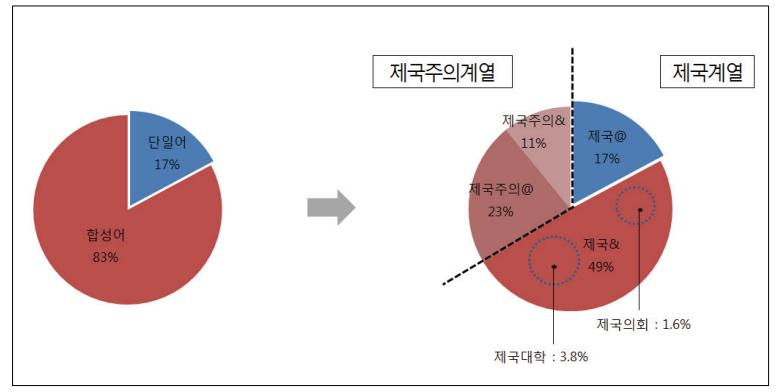

#### 어휘 연결망을 통해 본 '제국'의 의미

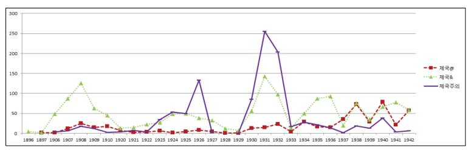

비고 : 범례의 '제국@', '제국&'은 <표 1>의 비고 설명과 동일하다.

<그림 1> '제국' 계열 및 '제국주의' 계열 용례의 연도별 추이(절대빈도)

<그림 1>은 세 갈래 용례의 연도별 빈도수 합계를 가감없이 반영하고 있다. 이 결과를 '절대빈도'라 부른다면, 이 절대빈도로는 빈도수를 연도별로 서로 비 교해서 증감을 판단하기 곤란하다. 잡지의 창간과 폐간, 압수, 증면, 합집호 발 행 등 다양한 원인으로 연도별 총 데이터 량이 균일하지 않으므로,13) 동일한 기준으로 빈도수를 비교할 수 없기 때문이다. 절대빈도를 연도별 데이터 총량 (바이트 수)으로 나누어 산출한 상대빈도 동향이 필요한데 <그림 2>와 같다.

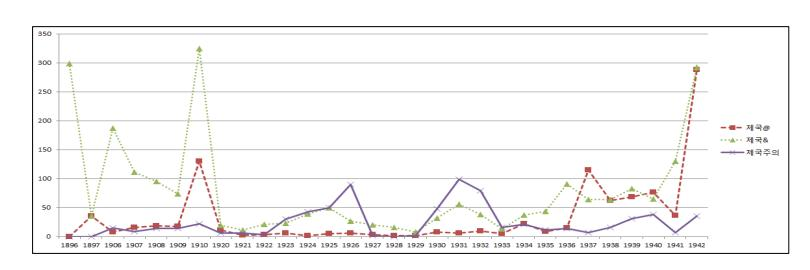

<그림 2> '제국' 계열 및 '제국주의' 계열 용례의 연도별 추이(상대빈도)

13) 연도별 정보량을 파일크기로 표현하면 다음과 같은 동향을 보인다.

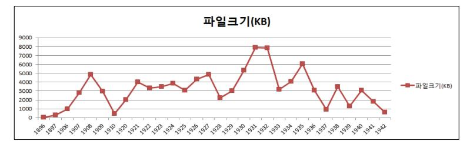

#### 大東文化研究 제87집

〈그림 2〉의 동향에서 '제국' 계열과 '제국주의' 계열의 상관관계에 유의하여 관찰하면 30년의 기간은 크게 3개 시기로 나눌 수 있다. 제1기는 1896년에서 1910년까지이다.14) '제국주의' 계열에 비하여 '제국' 계열이 상위에 있고, 특히 '제국' 계열 중에서도 합성어 용례(제국&)가 단일어 용례(제국@)보다 높은 수치를 보인다.

제2기는 1920년에서 1933년까지이다. 이 시기에는 '제국주의' 계열이 급증하여 '제국' 계열보다 빈도수가 높다.15) 그런데 '제국주의' 용례가 거의 나타나지 않는 1927\~29년의 3년간이 개입되어 있어, 이 기간을 포함시킨 14개년을 하나의 시기로 설정하는 것이 타당한가라는 의문이 제기될 수 있다. 이 기간은 『개벽』이 폐간된 직후로, 검색의 모집단이 되는 잡지는 대부분 『별건곤』이다.16) 동일기간 『동아일보』에서 '제국주의'가 들어간 용례가 상당한 수준에서 추출되는 점을 감안할 때,17) 1927\~1929년의 공백은 『별건곤』이 가진 통속적 대중월간지로서의 성격이 반영된 일시적 결과라서 이것을 시기구분의 경계선으로까지 중대하게 의미부여하기는 어렵다고 보인다. 다른 잡지의 지면이 더해지고 또 공황의 여파가 본격화되는 1930년 무렵이 되면 『별건곤』를

16) 『개벽』은 1926년 8월에 폐간되었고, 『삼천리』는 1929년 6월에 창간되었다. 『동광』도 1927년 상반기에만 발간된 후 1931년에 속간되었다. 이 세 가지 종류의 잡지와 『별건곤』의 1920년대 발간상황은 다음과 같다.

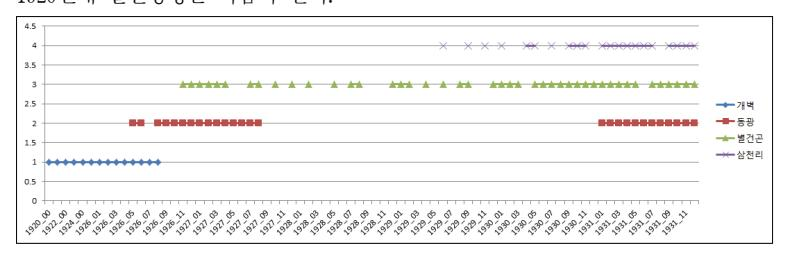

17) 『동아일보』 기사제목을 대상으로 '제국주의'가 들어간 용례를 추출하면 다음과 같다.

14) 자료의 분포상 1898년부터 1905년까지의 8년간과 1911년에서 1919년까지의 9년간은 제외 된다.

15) 빈도의 측면에서, '제국주의'가 '제국'을 추월하는 시점은 1923년이지만 제1기와 같이 '제국'이 '제국주의'를 훨씬 초과하는 경향은 이미 1920년부터 중단된 점, 그리고 1910년대의 9년간 시기적 공백이 게재되어 있는 점 등을 고려할 때 2기의 기점은 1920년으로 조금 당겨잡는 것이 합리적이라 생각된다.

비롯하여 여타 잡지에서도 '제국주의'의 용례는 급증한다.18)

제3기는 1934년에서 1942년까지이다. 다시 '제국'계열의 용례가 급증하는 데, 1기에 비해 상대적으로 단일어 용례(제국@)가 합성어 용례(제국&)보다 높은 수치를 보이는 것이 특징이다.

## Ⅲ. 민족적 자아의 다중적 표상 - '제국(주의)'

#### 1. 국제정치 행위자로서의 '제국'(1897\~1910)

이 시기의 가장 큰 특징은 '제국' 계열의 용례가 '제국주의' 계열의 용례에 비해 월등히 많다는 점이다. 합성어 성분이나 공기어의 양 방면에서 이 점을 확인할 수 있다. [9] 〈그림 3〉은 합성어 성분의 연결망을 시각화한 것인데, 20)

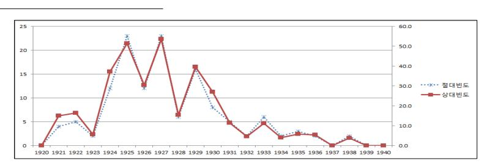

- 18) 『별건곤』을 비롯하여 『동광』과 『삼천리』에서도 1930년 무렵부터 '제국주의' 계열의 용례 가 본격적으로 나타나는 것은 공황 국면에 접어들면서 '제국주의' 계열 용례가 대중잡지에도 널리 확산된 것으로 생각된다.
- 19) 공기어의 전체 양상, 1기에서 '제국주의'의 공기어가 적게 산출된 이유 등은 〈부표 2〉의 표 내용 및 표 하단의 설명 참조.
- 20) 합성어 용례 중 '제국'이라는 단어의 앞과 뒤를 각각 하나의 단위로 나누고 더 세분화된 분절은 하지 않되, 新舊·大小·彼我 등 제국 합성어 성분의 성격을 파악하는 데 중요하다고 생각되는 단어는 그 내부에서도 다시 구분하였다. 예를 들면 '我대한제국'은 '我/대/한/제국'의 네 요소로 구분하였다. 이 구분에 따라 그 용례를 '我-대', '대-한', '한-제국'의 세 이항관계로 분해한 뒤 각각에 '我대한제국'의 빈도를 동일하게 적용하였다. 모든 용례를 이런 방식으로 한 뒤 이를 넷마이너 프로그램으로 시각화하면 '제국'이 어떤 성분들과

#### 大東文化硏究 제87집

좌측 하단의 중심인 '제국'에 비해 우측 상단의 '제국주의'는 매우 빈약한 연 결망을 가진다. 그럼 '제국'은 어떤 단어들과 긴밀하게 연결되어 있을까. <그

<그림 3> 합성어 성분 연결망(1기)

림 3>은 합성어의 구체 적인 성분과 전체적인 이미지를 보여주는 장 점이 있지만, 용례수가 개별적인 수준에서 너 무 많고 복잡하여 계통 적인 파악이 어렵다. 따 라서 우선 이 용례들을 유사한 것끼리 분류해 서 분류별 연결양상을 살펴볼 필요가 있다. 그 결과가 <그림 4>이다. 21) 그리고 여기서 가장 높 은 관계를 보이는 <국 명>에 주목하여 그 세

부 내역을 들여다본 것이 <그림 5>이다. 따라서 <그림 5>는 1기의 가장 긴밀한 연결망을 가진 범주에 속하는 단어들의 용례와 상호관계를 보여준다고 할 수

결합하여 합성어를 이루고 있는지 전체상을 한눈에 파악할 수 있다. 화살표가 굵고 진할 수록 연결정도가 강한 관계를, 가늘고 연할수록 약한 관계를 표시한다.

21) 여기에 사용된 22개의 범주는 다음과 같다. 이에 따라 표준용례를 분류한 구체적인 내용 은 <부표 3>을 참조.

정치경제 - 국명, 경제, 교통/통신, 국방/국제, 정치/행정 (5종)

사회문화 - 구성원/계층, 문화/일상, 시사/출판, 인종/민족/성별, 정체성/정신, 학술/교육 (6종)

주체/활동 - 세력, 운동/조직, 인물 (3종)

수식어 - 수량, 신구대소(新舊大小), 찬반, 피아(彼我) (4종)

시간공간 - 시공간, 지명 (2종)

기타 등 - 속성, 기타 (2종)

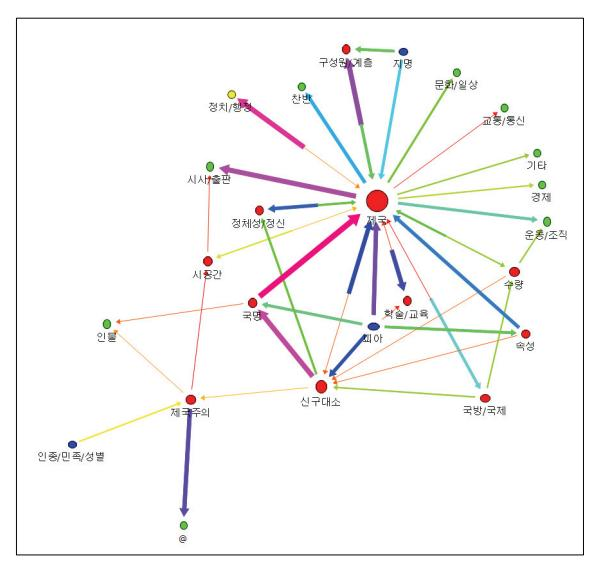

<그림 4> 합성어 성분의 분류별 연결망(1기)

있다.

<그림 5>로부터 1기 의 특징 두 가지를 관 찰할 수 있다. 첫째, '제 국'이라는 단어는 대부 분 현 국제질서를 주도 하는 강대국을 가리키 는 용어로 사용된다는 점이다. '대한'을 제외 하고 연결정도를 높은 것부터 언급하면, 독일, 러시아, 영국, 일본, 오 스트리아 순이다. 역사 상에 존재하였던 강대

국인 로마, 亞歷山(알렉산더), 스타이,22) 淸, 몽고, 무굴 등도 연결되지만 이 들은 매우 낮은 빈도로 사용되었다. 위의 현 강대국에 대해서는 해당 나라의 정치상황 등을 국내에 알리는 외신내용 등의 문맥에서 많이 사용되었다.

둘째, 그렇다면 '대한'이 '제국'과 가장 긴밀하게 연결된 것은 어떻게 볼 것 인가. '대한제국'은 국호로 사용되고 자국에 대한 지칭이라서 연결관계가 높 은 것은 당연하다고 말할 수 있다. 그렇지만 이 경우는 현 강대국에 대한 지 칭이라고 볼 수는 없다. 이 국호는 자존감의 표현이면서 그 이면에는 국제정 치의 일원으로 인정받기 위한 욕망이 투영된 것으로 해석할 수 있다. 여기에 덧붙이고 싶은 것은 '대한제국'의 잦은 발화에는 국권상실기 지식인이 가진 위기의식이 반영되어 있다는 사실이다.

합성어에서 '대한제국'에 '我', '우리' 등의 접두어가 붙거나 '我韓' 등의 형 태도 많이 사용되고, 단일어의 경우 '동포', '사랑[愛]' 등 情的 단어가 '제국' 과 높은 정도로 공기하는 현상은,23) 이런 점을 뒷받침한다. '國亡' 직전인

22) &#x27;스키타이'를 가리킨다고 보인다.

23) 공기어는 동포(1위), 관계(7위), 愛(8위), 목적(9위), 중차대(10위), 先務(22위) 순서이

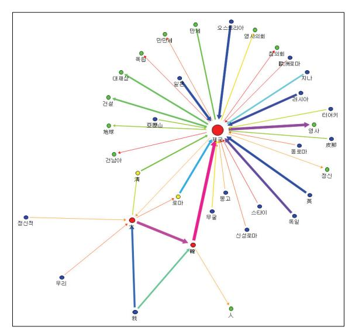

<그림 5> 합성어 성분 <국명>분류의 연결망(1기)

1910년 3월 -대한흥학 보에는 실린 다음 기 사내용이 단적인 사례 이다.

本會는 재일본 동경제 국 유학생 전체로 조직한 총 단체 … 로다. … 본 회와 유학생의 관계가 이 렇게 重且大하고 유학생 과 제국의 관계가 이처럼 더욱 중차대하니, 본회의 장래로 제국의 장래를 미 루어 알 수 있다. 그러니 본회의 흥망성쇠는 우리

유학생과 직접 관계가 있고, 유학생의 흥망성쇠는 我제국과 직접 관계가 있 으니, 내외동포를 물론하고 본회를 사랑하는 자는 대한제국을 사랑하는 자라 말할 것이다. 본회규칙 제3조에 따르면 본회회원은 제국동포 중 同志 人士로 정하되 다음 2종류가 있으니 … (강조-인용자)24)

'국명'이 제국과 결합되는 것이 가장 두드러진 양상이고 주목할 만 하지만 그렇다고 연결정도가 낮은 관계를 무시해도 좋다는 것은 아니다. 이와 관련하 여 셋째, '(我)학문제국', '정신적(대한)제국'의 용례가 주목된다. 당시의 일반 적인 '제국' 용례와 이질적이기 때문이다. 또한 '학문'과 '정신'은 '제국'의 공기 어에서도 나타나지만 각각 44위, 50위로 매우 낮은 순위이다. 이러한 합성어 성분과 공기어가 함께 들어있는 문장은 다음과 같다. "원래 我國은 우주 간 에 특별[特一]한 학문제국이라 학문으로 인하여 일어나며 학문에 의해 존

다. 특히 '愛' 등은 '동포'와 연계되어 정서적인 공감을 불러일으키는 용법으로 자주 사용 되었다.

24) 大韓興學會의 將來를 論 , -대한흥학보 11, 1910.3, 1\~2면.

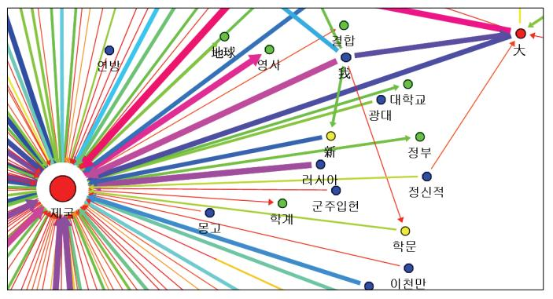

<그림 6> 합성어 성분 '정신적', '학문'의 연결망(1기)

립하니 무릇 학문은 제국 의 운명이로 다. " (강조-인용자 ) 25) 또한 내부의 단결을 강조 하는 맥락에 서 '정신적 제국의 활발

함이 제1강국'이라는 나폴레옹의 말을 인용한 것도 대동소이한 사례이다.26) 이런 용례에서도 부국강병을 지향하는 정서가 여전히 보이지만, 소수나마 '학 문'이나 '정신' 등 다소 이질적 단어를 '제국'과 연결시키는 발상은 '제국' 비판 이 가시화되는 2기가 되면 좀 더 확대된다.

넷째, '제국주의' 용어가 이를 소개하는 차원에서 사용되고 있다. 제국주의 를 "국외에 영토를 개척하여 국민의 생활상 복리를 도모"하는 것으로 보거 나,27) "산업진흥을 위해 토지를 확장하려 하는 제국주의"로 소개한다.28) '보 수주의나 먼로주의'의 반대 용어로서, '현상타파주의'의 의미도 가졌다.29) 나 아가 소수 사례나마 '제국주의'를 우호적인 눈으로 보기도 하였다. "금일 세계 에서 말하는 바 제국주의는 我韓에 적당하지 않"다고 생각하는 사람들의 입 장을 무사안일한 姑息주의로 비판하는 글이나,30) 서북학회 회관 건축비용을 일부 분담하기로 결의한 부인회를 칭찬하는 맥락에서, 이 부인회가 "금일 제

25) 李膺鍾, 學典의 敍 , -기호흥학회월보 9, 기호흥학회, 1909.4, 9면.

26) 聽天子, 海上 , -대한흥학보 11, 대한흥학회, 1910.3, 46면.

27) 會員 崔錫夏, 國家論 , -태극학보 1, 태극학회, 1906.8, 10\~11면.

28) 安國善, 政治學 (政治學 政治學硏究의 必要) , -기호흥학회월보 2, 1908.9, 30면.

29) 一歲生, 新時代의 思潮 , -태극학보 14, 태극학회, 1907.10, 17면; 碧广 金淇驩, 我의 獨立疑를 破開이라 , -대한학회월보 8, 대한학회, 1908.10, 12면.

30) 高元勳, 我韓敎育界에 對 余의 愚見 , -대한학회월보 7, 대한학회, 1908.9, 14면.

#### 大東文化硏究 제87집

국주의를 서둘러 받아들인 까닭에 이러한 옳은 일[義擧]을 서북에서 선도[首 唱]하였"다고 언급한 기사가31) 이런 사례에 해당한다.32) 이처럼 제국주의에 대해 중립적인 입장이나 약간 우호적인 용법까지 보이는 경향은 2기로 가면 크게 바뀌게 된다.

## 2. '제국주의' 비판(1920\~1933)

## 1) 비판의 세 가지 형식

2기의 첫번째 특징 은 '제국주의' 계열의 증가가 두드러져 전체 적으로 '제국' 계열과 '제국주의' 계열의 '두 중심'이 형성된 가운 데, '제국주의'의 경우 대부분 비판적이고 부 정적인 의미로 사용된 다는 점이다. <그림 7> 은 연결망의 중심이 좌상과 우하의 두 곳 에 생성된 형태로, 합 성어 성분이 1기의 '제국' 중심에서 2기의

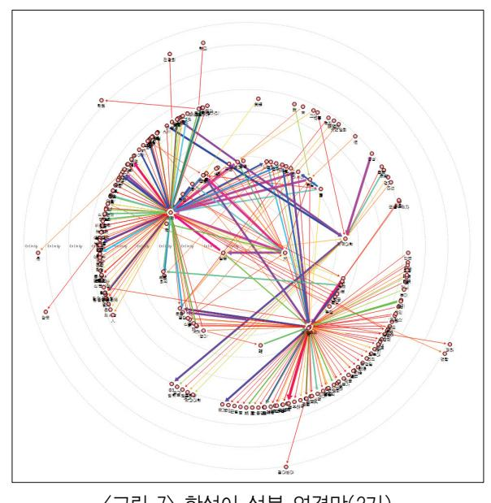

<그림 7> 합성어 성분 연결망(2기)

31) 秋醒子, 特賀三和港維新婦人會義務 , -서북학회월보 18, 서북학회, 1909.12, 41면.

32) &#x27;제국주의'를 "타 민족의 희생으로 자기 행복을 증진하는 자료를 공급하고자 하는 야심, 살벌, 쟁탈"로 설명하거나(高宜煥, 愛國心의 淵源은 愛我心에 在 , -태극학보 12, 태극학회, 1907.7, 17면), '무역 확장뿐 아니라 영토를 침탈하거나 보호 감독하는' '민족적 제국주의'를 소개하며 이를 경계하는 기사도 실렸다(韓興敎 譯, 政治上으로 觀 黃白 人種의 地位( 라인시 氏 略述) , -대한학회월보 8, 대한학회, 1908.10, 50면). 그러나 이 런 부정적인 언급은 매우 드문 사례에 속한다.

'제국-제국주의'양극 구조로 변모한 것을 잘 보여준다. '제국주의'용례에서 는 '경제적 제국주의'가 국가간 분쟁의 원인이라는 생각이 이미 1920년부터 분명하게 나타나고 있다.33) 이러한 부정적 시각은 곧 제1차 세계대전의 원인 을 제국주의로 보는 인식의 결과로, 당시에 널리 퍼진 '개조론'의 영향을 받은 것이다. 제국주의 비판은 식민지 지식인이 가진 민족의식에 기반을 두었지만. 직접적으로는 개조론에 속하는 세 갈래의 담론와 연계된 형태를 띠었다.34) 우선 정신적 요소를 중시하거나 '정신-물질이라는 이원론적 요소의 조화'를 지향하는 '문화주의적' 형태를 들 수 있다. 헨리 입센의 주장을 받아들여 "제1 의 제국은 肉의 제국, 제2의 제국은 靈의 제국이라고 하고 장차 우리가 바라는 제국은 靈과 內의 제국 즉 제3제국"이라는 언급이 여기에 속한다.35) 또한 제 국주의를 "민족 단위로 확장된 자아주의"로 보기도 한다.36) 이런 형태는 "개 벽』주도층인 천도교청년회 구성원이 주로 사용했으며.『개벽』초기에 많이 나타난다. 이런 문화주의적 입장에 선 제국주의 인식은 "개체로는 영육일치 주의이며 제삼제국주의이고, 합체로는 인내천주의이다."라고 하여 천도교의 종교사상과 연결되었으며,37) 1923년 초에 가면 '민족주의'와 '인류주의'라는 이원적 요소를 조화 · 지양하는 도식을 가진 '범인간적 민족주의'라는 정치사 상의 제시로 나아갔다.38)

다음은 유물론에 기반한 '사회주의적' 형태이다. 이런 입장에 선 용례는 『개 벽』1923\~24년 무렵부터 본격적으로 등장한다. 이 때 제국주의는 현행 학교

33) 「社說, 人道正義 發展史로 觀한 今日以後의 모든 問題」、『개벽』 4, 1920.9.

34) 개조론의 세 갈래를 국제정세 인식과 관련하여 고찰한 것은 다음을 참조. 허수, 「20세기 초 한국의 평화론」, 『역사비평』 106, 역사비평사, 2014년 봄, 45\~62면.

35) 「第三帝國主義는 무엇인가?」、『개벽』 6. 1920.12. 74면.

36) 金起瀍, 「우리의 社會的 性格의 一部를 考察하야써 同胞兄弟의 自由處斷을 促함」, 『개 벽』16, 1921.10, 14면.

37) 曉鍾, 「어찌면 罪惡에서 버서날가」, 『개벽』20, 1922.2, 7면. 효종(曉鍾)은 『개벽』 초대 학예부장을 맡았던 '현희운(玄僖運)'(필명은 玄哲)의 호이다.

38) 『개벽』의 정치사상에 관하여는 다음을 참조. 허수, 「표상공간 속의 쟁투」, 『식민지 조선, 오래된 미래』, 푸른역사, 2011, 80\~116면; 허수, 『이돈화연구』, 역사비평사, 2011, 159\~164면.

#### 大東文化硏究 제87집

제도를 계급론적 관점에서 급진적으로 비판하는 맥락에서 사용되거나,39) "제 국주의적 팽창 앞에는 정의감도 업고 人道感도 없이 … 제국주의적 중병환자 인 유럽 여러나라[歐洲列國]"처럼 서구 열강을 매우 직설적이고 감정적으로 비난하는 문맥 속에서 발화되었다.40) 같은 글에서 미국(합중국)을 "구주열강 과 함께 제국주의적 팽창병에 중독"되었다거나 "제국주의적 팽창의 競爭症" 때문에 변절하였다고 비판한 것도 동일한 맥락이다.41)

마지막으로 제국주의를 비판하면서도 '歐米' 주도의 국제질서와 민주주의 정치원리에 여전히 기대를 거는 '민주주의적' 형태이다. 미국 유학 중에 -개벽 에 세계정세에 관한 글을 2차례 연재한 김양수는 다음과 같이 언급하였다.42)

왕년의 구주대전란으로 인하여 전세계의 독재정치가 일시에 조락한 모습 은 결코 근본적으로 제국주의의 소멸을 의미하기보다, 도리어 현재 이루어 지는 '경제적 新제국주의'의 수행에 적합하지 않은 정치형식이 도태되고 조 락함에 불과하다는 사실을 단언할 뿐이다. 다시 요약하면 경제적 제국주의 의 정책을 수행하는 데 가장 유효한 정치형식은 독재정치가 아닌 일반 민주 주의적 대의정치가 最適者生存의 원리에 의해 더욱 그 기능이 발휘하게 된 것이다. 이 점에서 오늘날 제국주의의 소멸을 말하는 논자의 논의가 얼마 나 사실의 정체를 피상적으로만 관찰하는 착오에 빠져 있는가를 우리는 다시금 여기서 결론내린다.(강조-인용자)43)

여기서 김양수는 '자본주의의 붕괴'를 기대하고 선전하는 사회주의자의 논 리를 비판한다. 상이한 정치집단 간에 '제국주의' 개념을 둘러싼 논쟁이 부각 된 양상을 발견하긴 힘들지만, 김양수의 글을 통하여 식자층 내에서 '제국주

39) 八峰山人, 支配階級敎化 被支配階級敎化 , -개벽 43, 1924.1, 14면.

40) 朴衡秉, 近世植民政策의 起源과 由來(其1) , -개벽 68, 1926.4, 53\~54면.

41) 같은 글, 58면.

42) 金良洙, 兩大勢力의 昔今觀 , -개벽 67, 1926.3; 金良洙, 黃禍냐? 白禍냐? - 兩大勢 力의 昔今觀(其二) , -개벽 68, 1926.4. 김양수는 이 두 글에서 제국주의 관련 용어를 각각 45회, 26회, 도합 71회나 사용하였다.

43) 金良洙, 兩大勢力의 昔今觀 , 16\~17면.

의' 인식을 둘러싸고 상이한 정치적 입장 차이가 민감하게 서로 감지되고 있 었음을 알 수 있다.

# 2) 검열의 상흔과 대응 양상

제국주의XX 1회

2기에서도 연결망 정도나 빈도수에서 낮게 나타나는 용례 중 특별히 주목 할 만한 것이 있다. 'XX'가 그것이다.44) 이 표시는 식민당국의 검열을 통과하 지 못했거나 검열을 의식하여 애초의 내용을 지운 흔적으로 '伏字'라고도 한 다. 그렇다면 '제국주의' 합성어와 관련해서 이 표시는 어떤 내용을 담고 있었 을까? <표 2>는 총 6개 중 원 글자 추정이 가능한 용례 4개의 문맥을 살펴본 것이다.

| 형태     | 빈도 | 문맥                                                                          | 발표연월         |
|--------|----|-----------------------------------------------------------------------------|--------------|
| XX제국주의 | 3회 | 만주는 XX제국주의의 경제적 및 전략상 근거지[地 盤] 이에 의하야 XX帝國主義는 自國의 생명적 영양을 섭취하는 것이다 | 1931년 11월45) |
|        |    | 저들 토착 뿌르조아지-의 갈 길을 XX제국주의의 코 스를 줄달음질하여 그 곳에 밀착되어 가지고 달려가 야 한다.        | 1932년 03월46) |
|        |    | 吾人의 소견으로 본 日中간의 분쟁은 일본측으로 말                                                 |              |

하면 前回의 세계대전을 통해서 광범위하게 확장하였 던 세계시장의 자연적 위축은 제국주의XX으로는 참

1932년 03월47)

<표 2> 제국주의의 합성어 성분 'XX'의 주요 용례

을 수 없는 고통이었다.

44) &#x27;XX제국주의'가 3회, '제국주의XX'와 '제국주의XXXX', '反對제국주의之XX정책'이 각 각 1회이다. 모두 1931\~1932년에 집중적으로 분포한다.

45) 東亞日報社 金佑枰, [豫言?, 第二次世界大戰!!, 원제 大戰이 일어나나?, 그 相對國은 어느나라?] 3, 4년 내에 中米對 日英 , -동광 27, 1931.11, 6면.

46) 陳榮喆, 表現團體 再樹立의 正體, 安在鴻 코-쓰 批判 , -삼천리 권4-3, 1932.3, 38면.

47) 普專敎授 洪性夏, 中國을 中心으로 한 列强의 動態 -日英合作이냐 米英同盟이냐- , -동광 31, 1932.3, 5면.

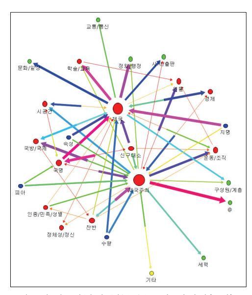

〈그림 8〉 합성어 성분 분류별 연결망(2기)

이 'XX' 자리에는 원래 '일 본'이 있었을 것으로 생각된다. '제국주의'의 합성어에 한정하 여 본다면 이 복자는 2기에만 나타난다. '일본제국주의'라는 표현은 이 시기에 높은 빈도로 검출되진 않았으나 일부에서 간헐적으로 사용되었는데, 그 중에서 일부는 검열체계에 걸 려서 이렇게 '복자'의 형태로 나타났던 것이다. 이런 양상은 동일한 기간 중국이나 만주의 한국인들이 발표한 글에서 '일 본제국주의'가 빈번하게 발화 되던 상황과 대조를 이룬다.

1926년에 『廣州民國日報』에 실린 「중·한 청년들이 발표한 아시아민족대회 반대선언」은 928자 분량으로 〈표 2〉의 'XX제국주의'를 3회 실은 기사와 분량이 동일한데, 이 글에서는 '일본제국주의'가 26회나 사용되었다.48) 1931년에 해외한인독립운동단체인 '국민부'가 3.1운동기념일을 맞아 발표한 포고문은 앞 기사의 1/3분량인데 '일본제국주의'를 12회나 사용하였다.49)'일본제국주의' 즉 일본을 '제국주의'로 발화하는 행위의 허용 여부는 식민지 검열체계 작동 공간의 안팎을 가르는 경계와 조용하고 있었던 것이다.

48) 「중·한 청년들이 발표한 아시아민족대회 반대선언」, 『廣州民國日報』1926.8.19 → 『대 한민국임시정부자료집』39권, 「중국보도기사」(국사편찬위원회'한국사데이터베이스/대 한민국임시정부자료집'에서 검색, 2014.5.24 현재).

49) (국민부 선언문), 『韓國獨立運動史』 5, 758\~759면 (국사편찬위원회 '한국사데이터베이 스/일제침략하한국36년사'에서 검색, 2014.5.24 현재). 국민부 선언문은 선언문 마지막에 7개의 구호를 제시하였는데, 그 중 첫째와 둘째가 각각 "일본제국주의를 박멸하라", "일 본제국주의의 만몽(滿蒙)침략정책을 박멸하라"였다. 일본의 한국식민통치 및 아시아 침략의 본질을 지시하는 용어로 '일본제국주의'가 빈번하게 사용된 것이다.

#### 어휘 연결망을 통해 본 '제국'의 의미

'XX'가 식민지 검열체계가 남긴 검열의 상흔이라면 이 패인 공간을 메우려 는 반작용이 없을 수 없다. <그림 8>을 보면 2기에서 '제국주의'는 '찬반' 범주 의 성분과 가장 긴밀하게 연결되었다.50)51) 그런데 1기와는 달리 79건의 용례 가 모두 '반대'를 뜻하는 단어와 결합되었고, 이 중 76건이 '제국주의'와 연결 되었다. 이런 용례는 1924년 하반기부터 나타났는데 1926년과 1931년에 전체 용례의 68% 이상이 집중되었다. 이런 용례의 문맥을 살펴보면 대부분 중국을 비롯한 식민지ㆍ피압박민족의 반제국주의 운동을 거론하고 있었다. 그 중에 서도 특히 중국의 사례가 자주 거론되었다. 중국의 운동에 특히 주목하는 이 유를 김양수의 글에서 추론할 수 있다. 그는 1925년의 국제정세에서 '중국을 비롯한 아메리카, 소아시아 등의 반제국주의 운동'을 세계적 사건으로 보았 다.52) 특히 그는 중국의 반제운동을 세계질서에 대해 피압박민족이 벌이는 '현상타파' 운동으로 보고, 나아가 그것은 '단순히 일개 제국주의 국가를 상대 로 한 것이 아니라 전체로서의 모든 제국주의 국가를 상대로 한 것'이라는 점 에 특징이 있다고 평가하였다.53) 장문에 달하는 그의 글은 '민족 내부의 단합 과 피압박민족 간의 결속'이라는 실천적 과제의 제시로 귀결되었다. 1931년에 반제운동에 주목하는 기사도 역시 대부분 중국의 사정에 관한 것이다. 2기에 서 '제국주의'의 공기어로 '중국'이 5위라는 높은 순위를 보이는 것도 바로 이 러한 '반제국주의(운동)' 소개에서 기인하는 것이라 할 수 있다.

50) &lt;그림 8>에서 '제국주의'와 '찬반'을 연결하는 선의 경우 화살표 방향이 양 방향으로 되어 있고 절반은 굵고 진하며 절반은 상대적으로 얇고 가늘다. 화살표가 양 방향으로 되어 있 는 것은 '찬/반'의 범주와 '제국주의'라는 단어가 순서를 바꾸어가면서 사용되었기 때문이 다. <그림 8>에서 이것은 '찬/반+제국주의'에 해당하는 용례는 많고, '제국주의+찬/반' 에 해당하는 용례는 상대적으로 적은 사실을 표시한다. 전자의 용례로는 '反제국주의'가 있고, 후자의 용례로는 '제국주의반대'가 대표적이다.

51) &#x27;제국주의-@'는 '제국주의'가 어떤 다른 성분과 결합하지 않고 단독으로 사용된 상태를 표시한다. '찬반' 범주가 '제국'과 '제국주의' 모두에 연결된 용례는 1,2,3기 모두 합쳐 92건 이다. 1기에는 6건이 '대한제국만세'처럼 모두 '제국'과 연결되었다. 2,3기에는 모두 '반대' 와 관련되었다. 3기에는 '米제국주의청산' 등 7건이 사용되었다. 그외 79건은 모두 2기에 속한다.

52) 金良洙, 兩大勢力의 昔今觀 , -개벽 67, 1926.3, 10면.

53) 金良洙, 黃禍냐? 白禍냐? - 兩大勢力의 昔今觀(其二) , -개벽 68, 1926.4, 15면.

#### 3) 용례의 일반화

'제국주의'라는 용어는 언제 널리 확산되었을까. 2기에 이 용례가 급증한 사실은 이미 언급한 바와 같다. 여기서는 첫째, 확산을 판단하는 또 하나의 주요지표로 용어사전 항목을 살펴볼 것이다. 용어사전에 항목이 등재된다는 것은 그만큼 그 용어를 사용하는 사람들이 많아지거나 그 용어를 널리 알릴 필요성이 있기 때문이다. 대체적인 내용은 〈표 3〉과 같다.

〈표 3〉2기에 출간·작성된 주요 용어사전의 '제국주의' 항목 설명

| 사전 (연도)                         | 주요 설명 요약                                                    | 설명분량 (글자수) | 특기사항                          |
|------------------------------------|-------------------------------------------------------------|---------------|-------------------------------|
| 現代新語釋義54) (1921)                   | 영토나 권력범위 확장, 즉 이기주의 가 국가상에 변형하여 표현될 경우 에 일어나는 주의      | 115자          |                               |
| 중요술어사전 55) (1924)    | 권리 침해를 받는 국민이 병력에 의 존하여 자신을 보호하기 위한 수단. 침략주의의 의미도 있음. | 555자          | 『개벽』에 실림                      |
| 改造新語辭典 56) (1925)    | 제정과 공화국 구별없이 자국의 영 토와 식민지를 증가시키려는 군국 주의적 의미 포함        | 299자          | 일본에서 발간                       |
| 高等警察用語集 57) (1928)   | 정책의 목표를 영토확장, 권력범위 의 확장에 두는 주의. 제국주의는 자본주의의 독점단계      | 200자          | 비밀문서임. 레닌의 정의를 많이 인용    |
| 最新百科社會語辭典 58) (1932) | 제국주의는 자본주의의 독점단계                                            | 184자          | 일본에서 발간. 레닌의 정의를 대부분 인용 |
| 社會常識術語 59) (1932)    | 발전된 자본주의가 곧 제국주의                                            | 330자          |                               |

비고: 일본어로 된 자료(일본 발간 자료 2건 및 고등경찰용어집)의 분량은 번역문 기준으로 산정하였다.

54) 崔綠東, 『現代新語釋義』, 1922.12, 文昌社, 17면.

55) 朴英熙 編, 「開闢第五年九月號附錄, 重要術語辭典」, 『개 ] 51, 1924.9, 35\~36 已.

56) 相田隆太郎, 『改造新語辭典』, 新潮社, 1925.4, 11\~12면.

《표 3》에서 알 수 있듯이 『현대신어석의』의 설명은 문화주의적 입장이 반영되었다. 「중요술어사전」의 편집자는 사회주의자로 현철의 뒤를 이어 『개벽』의 학예부장이 된 박영희였다. 그러나 딱히 경제 문제나 자본주의와의 연결점등이 그리 긴밀하게 나타나지 않는다. 이 점은 1년 뒤에 나온 『카이조신고지텐(改造新語辭典)』에서도 비슷하다. 그런데 『고등경찰용어집』과 『사이신햑가샤카이고지텐(最新百科社會語辭典)』에서는 레닌의 정의가 핵심적인 정의로 사용되는 등 큰 변화가 나타났다. 사상범을 관리·체포하는 고등경찰측 용어집 내용을 당시 한국 지식인과 민족운동가들의 사상동향을 보여주는 척도의 하나로 볼 수 있다면, 이런 변화는 무엇을 말하는가. 그것은 레닌주의의전파와 수용을 보여준다. 학계의 최근 연구에 따르면 식민지 조선에서 레닌주의의 수용은 1925년부터 본격적으로 진행되었다.60)

그렇다면 제국주의에 대한 레닌적 정의는 사회주의자에게만 영향을 끼쳤을까. 〈표 3〉의 『黨聲』은 천도교청년당의 기관지인데 여기서는 '제국주의'를 '발전된 자본주의'로 정의하였다. 여기서는 레닌을 명시적으로 인용하지 않는다. 그러나 "대자본이 소자본을 합병하여 가지고 모든 것을 독점하게 되어 모든 방면에 금융자본의 지배망이 형성하고 大資本國의 돈이 소자본국의 수출되어 몇몇 대자본국이 세계를 지배하게 되며 ··· 다른나라의 세력범위를 침해하게 되어 전쟁의 위기에까지 발전된다."라고 서술했다. 여기서 사실상 레닌적 정의의 영향을 발견하기란 어렵지 않다. 따라서 2기가 되면 레닌의 정의를 중심으로 하는 제국주의 용례가 좌우 정치세력을 막론하고 식자층에서 점차일반화되어 갔다고 할 수 있다.

57) 조선총독부경무국,「高等警察用語集」, 1928.11, 68면,

58) 改造社出版部 편, 『最新百科社會語辭典』, 개조사관, 1932.4, 29면.

59) 「社會常識術語」、『黨聲』 제12호, 1932.6.1, 5면.

60) 박종린, 「일제하 사회주의사상의 수용에 관한 연구」, 연세대 사학과 박사학위논문, 2006.12, 97\~131면 참조, 박종린은 1910년대 중반부터 1920년대 중반까지 한국의 사회주의 사상 수용을 세 단계로 나누고, 각각 '맑스주의가 급속하게 주류로 부각', '맑스주의 인식 편차를 둘러싸고 공산주의 그룹 간 논쟁 전개', '맑스주의 인식 심화되면서 레닌주의를 수용'하는 단계로 파악하였다. 여기서 그는 세 번째 단계, 즉 레닌주의의 수용 기점을 1925.6년으로 잡고 있다.

#### 大東文化硏究 제87집

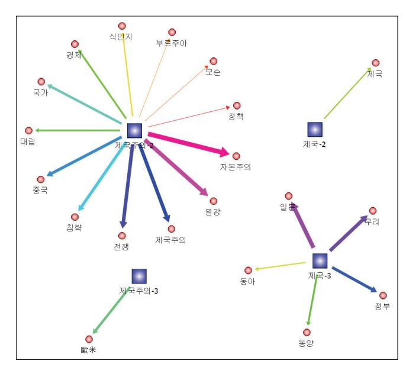

<그림 9> 2ㆍ3기 공기어 연결망 (t-점수 상위 20위)

둘째, 이러한 확산 양상은 '제 국주의'가 어떤 단어와 긴밀하 게 결합되어 있 는가를 통해서 더욱 직접적으 로 확인할 수 있 다. 1차 세계대 전의 근본 성격 은 제국주의 전 쟁이며 그 본질 은 경제적 혹은 자본주의적 열 강 간의 식민지

쟁탈이라는 언급은 갈수록 정형화된 형태로 서술된다. 이런 사례는 매우 많아 서 일일이 살펴보기 보다는 제국주의의 공기어를 살펴보는 것이 효과적이다. 순위정도보다 더 직접적인 편차를 볼 수 있는 t-점수를 기준으로 상위의 공기 어 관계를 살펴본 것이 <그림 9>이다.61) 이 그림에서는 2기의 '제국주의'가 '자본주의', '열강' 등과 공기하는 정도가 동일시기 '제국' 및 3기의 '제국주의', '제국'의 그것보다 얼마나 긴밀한지가 드러난다. 상위 20개의 공기어 가운데 2 기 '제국주의'의 공기어가 13개로 압도적이며, 그 중 '자본주의'와 '열강'이 각 각 1,2위를 차지하였다. t-점수의 값을 비교해 봐도 두 공기어는 다른 공기어 에 비하여 월등하게 높다.62)

61) &lt;그림 9>에서 좌측 상단 중심어의 '제국주의-2'는 2기의 '제국주의'라는 의미이다.

62) 공기어 중 상위 네 단어의 세부 사항은 다음과 같다. '자본주의'가 2위인 '열강'보다도 매우 높은 격차를 보이며 또 이 두 단어가 3순위 이하와도 상당한 격차가 있음을 알 수 있다.

#### 3. 주객전도의 협력 논리 (1934\~1942)

이 글 2장 〈그림 2〉의 연도별 용례추이에서 살펴보았듯이 3기가 되면 '제국주의' 계열의 용례는 크게 감소하고 반대로 '제국' 계열의 용례가 증가한다. 이와 관련하여 첫째, '제국' 계열 용례 중 가장 특징적인 점은 '피아' 범주, 특히 '我', '우리' 등 자신을 가리키는 용례에서 발견할 수 있다. 이런 용례는 2기에 비해 증가하였으며 내용 면에서 오히려 1기와 비교할 만하다. 〈그림 10〉에

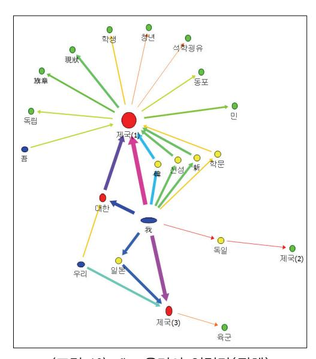

〈그림 10〉我·우리의 연결망(전체)

서 알 수 있듯이 이런 단어는 모두 '제국'계열과 결합하였다. 또한 2기에는 이런 사례가 극소수이며 1기와 3기가 많다. 1기에는 '我+제국'과 '我+대 한제국'이 가장 많고, 3기에는 역시 '我+제국'과 '我+일본 제국'이 제일 다수이다. '我+ 제국'의 경우 이때 '我'가 무엇을 가리키는지 궁금한데, 문맥을 살펴보면 1기에는 모두 대 한제국을, 3기에는 모두 대한제국을 가리키고 있음을 확인할 수 있다. 그러므로 이런합 성어는 1기와 3기가 정확히형

식은 같지만 지시대상은 정반대임을 알 수 있다. 1기와 3기의 이런 용례가 동일한 정도의 진정성을 가졌다고 보기는 힘들 것이다. 또한 3기의 경우 전시체

| 시기 | 중심어 (k) | 공기어후보 (w) | 문맥내빈도 | 문맥어절  | 전체빈도 (W) | 전체어절      | 예상빈도 (E) | t-score |
|----|------------|--------------|-------|-------|-------------|-----------|-------------|---------|
| 2  | 제국주의       | 자본주의         | 70    | 5,630 | 1,605       | 6,889,321 | 1.31        | 8.21    |
| 2  | 제국주의       | 열강           | 47    | 5,630 | 218         | 6,889,321 | 0.18        | 6.83    |
| 3  | 제국         | 일본           | 35    | 3,560 | 2,599       | 2,868,245 | 3.23        | 5.37    |
| 3  | 제국         | 우리           | 48    | 3,560 | 9,451       | 2,868,245 | 11.73       | 5.24    |

제기에 식민당국의 개입 등이 작용했을 수도 있겠다. 그러나 적어도 형식 면 에서 '我'ㆍ'우리' 등 자기 자신을 가리키는 용어는 1기의 '대한'에서 3기의 '일 본'으로 대체되었다고 할 수 있다.

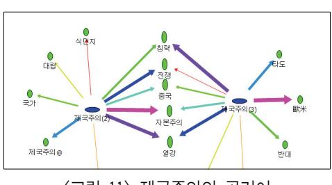

<그림 11> 제국주의의 공기어 (2,3기, 상위 10위)

둘째, 형식은 동일하나 내용 이 대체되는 현상은 '제국주의' 라는 용어에서도 일어났다. '제 국주의' 계열의 용례가 감소함 에도 불구하고 '제국주의' 관련 용어는 1939년과 1940년에 자주 사용되어 기이한 감을 준다. <그 림 11>처럼 제국주의의 공기어 도 2기와 3기 사이에 연속되는

것이 의외로 많다. 문맥을 조사해 보니 '제국주의'를 5회 이상 사용한 기사는 1939년부터 나오며 그 중 차재정, 인정식 등 전향 사회주의자의 글에서 많이 사용되고 있다. 그렇다면 이들은 어떤 맥락에서 '제국주의'와 관련 공기어 등 을 사용하였을까. 이들의 용법은 2기의 그것과 어떻게 같고 다를까.

우선 '제국주의'를 부정적인 것으로 보는 태도는 2기와 동일하다. 예컨대 차재정은 '중일전쟁을 제국주의적 침략전쟁으로 보는 자본가들의 인식은 잘 못이다.'고 언급하였다.63) 여기서 강조점은 '중일전쟁이 제국주의 침략전쟁이 아니다.'라는 데 있다. '제국주의적 침략전쟁'이라는 표현에서 볼 수 있듯이 제 국주의를 침략전쟁과 접속하는 인식은 2기 용법과 동일하다. 이런 생각의 연 장선에서 그는 자본주의를 비판한다. 그에게 일본은 더 이상 자본주의 국가도 제국주의 국가도 아니다.

'제국주의'를 부정적 함의로 사용한다는 면에서는 동일하지만, 차재정이 일 본을 제국주의에서 제외시키려 했다면 인정식은 제국주의의 지시대상을 전도 시킨다. 사상전향 직후에 쓴 글에서 그는 다음과 같이 언급하였다.64)

63) 車載貞, 녯 同志에 告함, 自然의 길 =前 左翼 諸友에게 答함 , -삼천리 10-11, 1938.11, 117\~118면.

64) 인정식은 1938년 봄 야학 사건 주모자로 체포되어 수감되었다가 1938년 11월 말 일본군이

#### 어휘 연결망을 통해 본 '제국'의 의미

赤色 제국주의의 「쏘비엣트」 연방을 ... 東亞의 맹주로서의 우리 제국은 과연 중국[支那]의 민중에 대해서 또는 亞細亞의 전 민중에 대해서 그들의 영원한 행복과 번영을 약속할 수가 없을까. 만일 이것이 불가능하다면 맹주 로서의 지위는 도리어 亞細亞에 대한 모든 죄악의 근본이 될 것이 아니 냐.65)

'우리 제국'이라는 표현에서 전향자로서의 입지를 느낄 수 있으나 '적색 제 국주의'라는 용어가 더 흥미롭다. 이것은 소련을 가리킨다. 이 인용문은 '예전 부터 영국과 소련이 중국에 대한 침략적 야심을 보여왔다.'라는 점을 언급하 는 맥락에서 사용되었다. 2기에는 '제국주의'가 대부분, 영국을 비롯한 구미열 강, 즉 자본주의 강대국을 비판적으로 부르는 경우에 사용되었고, 이런 용법 에는 직간접적으로 러시아 혁명이나 소련 사회주의에 대한 기대가 내재되어 있었다면, 이 시점 인정식은 그러한 용법을 전도시켜 사회주의 국가 소련을 제국주의로 부르기 시작하였던 것이다. 이러한 '제국주의' 지시대상의 顚倒는 국제정치적 대립구도를 '서양 제국주의 對 일본ㆍ동아시아 국가'로 설정하고 자 하는 일본의 전쟁논리에 편승한 것으로 볼 수 있다. 그러므로 인정식의 이 런 용법이 인종주의적 방향과 연결되는 것은 자연스런 귀결이다. 얼마 지나지 않아 그는 '紅毛 제국주의'라는 용어를 사용하는데, 서양 열강을 가리키는 이 용어에는 인종적 구분을 반영한 '홍모'라는 용어가 숨김없이 표현되고 있 다.66)

중국의 武漢과 廣東을 함락했다는 소식을 듣고 전향하여 출옥했다. 인정식의 전향에 관 한 최근 연구는 다음을 참조. 김인수, 이론연쇄(理論連鎖)와 전향(轉向) - 인정식(印貞 植)의 경제론을 중심으로 , -사회와 역사 96, 한국사회사학회, 2012.

65) 印貞植, 我等의 政治的 路線에 관해서 同志 諸君에게 보내는 公開狀 , -삼천리 10-11, 1938.11, 53\~54면.

66) 印貞植, 汪精衛氏에 呈하는 書, 東亞 繁榮과 貴下의 責務 , -삼천리 12-4, 1940.4, 73면.

# Ⅳ. 문명적 위계의 일상화 - '제국'

3장에서는 '제국'의 의미를 세 시기로 나누어 계기적 변화양상을 살펴보았 다. 그런데 20세기 전반 한국인이 사용한 '제국'이 사건적 층위의 의미, 즉 외 부의 사건이나 운동적 상황에 영향을 받으면서 부단히 변화하는 모습만 가졌 을까라는 의문이 든다. 이 시기 용례를 전반적으로 살펴보면 이런 모습 이외 에 좀 더 구조적이고 지속적인 의미의 연결망도 존재했음을 알 수 있다. 이런 층위에 대한 연구는 그동안 거의 없었으므로 이 장에서는 '제국'이 가진 구조 적 층위의 의미에 대해서 살펴보기로 한다.

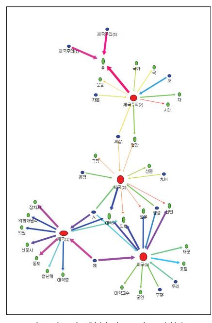

<그림 12> 합성어 고빈도 성분 ('국명'제외)

합성어 성분 중에서 <국명> 범주 는 이 분석에서 제외한다. 가장 큰 범주인 <국명>을 제외하는 이유는 이 용례를 거론하는 문맥이 주로 부 단히 변화하는 국제정세를 반영하는 외신기사 정보 등에 좌우되기 때문 이다.67)

<그림 12>는 합성어 성분 중 <국 명>을 제외한 나머지 범주의 용례를 고빈도만 추려서 표시한 것이다. 고 빈도만 선택한 것은 지나친 복잡화 를 피하고 뚜렷한 흐름 위주로 파악 하기 위해서인데, 여기서 '고빈도'의 기준을, <국명>을 제외한 용례의 전 체 빈도 중에서 평균 이상의 빈도로 정하였다. 우리의 관심은 세 시기동 안 지속적으로 나타나는 용례들인데,

67) 이런 점에서 '국명'과 다른 범주가 결합되어 있는 용례도 제외하였다.

'大', '대학', '의회'의 세 단어가 여기에 해당한다. '大'의 경우 '大제국' 용례가 세 시기에 고빈도로 사용되었다. 제국을 '대국', '큰나라', '강대국'으로 보는 인 식은 세 시기 모두 나타나는데, 이렇게 보통명사의 일부로 사용된 경우 이외 에, <국명>에 속하는 용례를 보면 더 많이 나타난다. 국명에 '大'라는 접두어 를 붙인 용례 중 1기의 양상은 이미 3장에서 살펴보았는데, 2기와 3기에도 적 용범위의 확장과 축소 등이 있긴 하지만 지속되었다.

이 장에서 좀 더 상세하게 살펴볼 것은 '대학'과 '의회'이다. 먼저 '제국대학' 관련 용례부터 살펴보자. 1기에는 17건이며 일본의 근대 고등교육을 소개하 는 기사가 많다. 그런데 학교 제도에 관한 글을 번역ㆍ소개한 글에서 박은식 은, "일본은 유신이래 온 국민이 보통교육의 수혜를 받아 국공립사학교가 2만 수천여 개라. 제국대학교는 전문적인 학업을 익혀 법과와 문과와 이과, 농과, 의과 등을 나누고"라 하면서,68) 한국 독자들에게 일본에 유학할 것을 권장하 였다. -태극학보에도 尙灝라는 인물을 소개하면서 "우리나라 유학생이 일본 에 가서 제국대학 본과를 졸업한 것은 처음"이며 이는 "일 개인에게만 행복 이 아니라 대한국가의 경사이다"라고 상찬하였다.69) 이처럼 일부 기사이지만 일본 유학 관련 기사에서 학력주의를 지향하는 사고방식의 단초가 보인다.

학력중시ㆍ일본유학 중시 경향은 2기에 일반화된다.70) 1920년대 후반 -동 광에 실린 염상섭의 소설에는 주인공인 南忠緖에 관한 이야기가 나온다. 그 는 정실부인이 아닌 일본인 어머니 소생으로 어머니 품을 떠나 아버지 집에 서 눈칫밥을 먹고 자랐다. 자기 이름도 일관되지 않아 어떤 경우에는 한국식 으로 또 어떤 경우에는 일본식으로 불리기도 하였다. 그런 그가 나중에는, "스물일곱살이 되고 동경까지 가서 제국대학 經濟科를 마치고 나와서 장가 까지 들고 훌륭한 청년 신사가 된 것이다."라고 소개된다.71) 훌륭한 청년 신 사의 요건에 '제국대학'이 중요하게 거론된 것이다. 물론 당시 김기진같은 사

68) 會員 朴殷植, 學校之制(世界進化論中抄譯) , -서우 1, 1906.12, 18\~19면.

69) 工科大學卒業生 尙灝氏 , -태극학보 1, 태극학회, 1906.8.

70) 경성제국대학을 식민지 헤게모니의 관점에서 접근한 연구로는 다음 연구가 대표적이다. 정준영, 경성제국대학과 식민지 헤게모니 , 서울대 사회학과 박사학위논문, 2009.8.

71) 廉想涉, 南忠緖(下編) , -동광 10, 1927.2, 73면.

#### 大東文化硏究 제87집

회주의자는 "소년들은 소학교라는 도가니 속에서 절반가까이 개조를 당한 뒤 에, 겨우 4,5년 동안에 단단한 부르주아의식과 제국주의의 독액을 담은 한 개 의 기계로 변해 버렸다."고 하여,72) 근대 교육제도가 가진 계급성을 '제국주 의'와 연계시켜 비판하였다. 그러나 이것은 매우 드문 사례였다.

이런 경향은 3기에 더욱 확대되었다. -삼천리 등에는 인물 소개 관련 기사 가 증대하는데 여기서 학벌은 인물 소개의 필수사항으로 정착한다. 고등문관 시험 합격자의 면면을 소개하는 기사가 출신 학교별 소개 위주로 되고,73) 특 정 인물을 소개하는 기사나 그 인물이 전문학교 교사로 부임시 교장이 학생 에게 소개할 때에도 '동경제국대학' 출신임이 제일 먼저 언급되었다.74)

다음으로 '제국의회'에 대하여 살펴보자. 1기의 14건 중 대부분은 외신의 간단한 소식을 전하는 맥락에서 사용되며 1\~2건이 외국 정치제도에 대해서 좀 자세하게 거론하고 있다. -태극학보에서는 비스마르크의 행적을 소개하 면서 그가 독일통일 후 연방회의와 국회를 합쳐서 '제국의회'를 만든 과정을 언급하였다.75) 또한 독일 제국의회는 의회라는 기구 자체에 대한 설명글에서 좀 더 상세하게 소개되기도 하였다.76) 이렇게 단편적인 용례는 식민지가 된 2기가 되면 좀 더 상세하고 내용도 다양화하는데, 이는 조선이 식민지가 되면

72) 八峰山人, 支配階級敎化 被支配階級敎化 , -개벽 43, 1924.1, 14면.

73) &quot;고등문관시험합격자 - 조선 사람으로서 官界의 등용문인 고등문관시험에 무난히 통과 하여 지금 각 방면에서 활동하고 있는 조선인 관리가 몇 사람이나 되며 또 그 직업별 내 지 학교별의 대략을 들추어보면 다음과 같은데 총수는 59명, 그 중 경성제국대학 출신이 14명이다. … 판검사에 11명 또 이외에 고등문관시험 사법과에 합격되어서 판사의 職을 가지고 있는 총 인원은 11명인데 그 중 경성제대[城大] 졸업생으로는 崔炳柱, 張厚永 2 명이오 검사는 2명이오 사법관 試補는 6名인데 그 중 성대 졸업생은 金甲洙 1명이라 한 다."( 三千里 機密室 , -삼천리 권8-11, 204\~205면)

74) &quot;문학사 金萬弼은 동경제국대학 독일문학과를 우수한 성적으로 졸업한 수재이며 … 위 엄을 차리노라고 한층 더 눈에 살기를 띄인 교장이 먼저 단우에 올나가 김만필을 동경제 국대학 출신의 보기듬은 수재라고 소개하고 …"(兪鎭午, 金講師와 T敎授 , -삼천리 권7-3, 218ㆍ220면).

75) 朴容喜, 歷史譚 第五回 (比斯麥傳 續) , -태극학보 7, 태극학회, 1907.2, 30면.

76) 法律讀書人, 議會의 性質及其組織을 論 , -대동학회월보 10, 대동학회, 1908.11, 26\~27면.

서 그 위상이 일본 제국의 한 '지방'으로 변모한 상황에 따른 것으로 생각된 다. 이 시기에도 외신 소식이나 일본의 정치적 의사결정에 대한 보도 등의 단 순기사가 가장 많지만 아래와 같은 기사는 주목할 만하다.

몹시 웃긴 권리행사 - … 어떤 연극단이 楚山에 왔더라나. 극중에 풍속에 저촉되는 사항이 있더라고. 그래서 관중에서 어떤 사람이 일어나서 「여보 그것은 풍속방해요」하고 야유를 하였겠다. 참석[臨席]하였던 경관(그것도 警部) 모씨가 칼자루를 짚고 벌떡 일어서더니 「여보 그대는 그런 말을 할 권리가 없소. 경관이 여기 있는데 경관이 으레 알아서 할 터인데」하고 경 관이 주의를 주지 않은 것을 아무 권리 없는 관중이 한다고 톡톡이 꾸짓더 라나. 그래서 야유하던 이는「여보- 이보다 더-한 제국의회장에서도 야유를 한다오. 경관만 야유하고 관중은 못한다는 법-어디 있소」하고 대항을 하니 까 그는 어찌나 화가 났던지 그 이튿날 경관의 권리침해, 경관의 훈계 불복 이라는 명목으로 호출을 하였더라고77)

이 기사는 연극내용에 불만을 가져 야유를 보낸 어느 관중과, 이를 자신의 풍속단속권 침해로 받아들인 경관 사이에 벌어진 다툼을 보여준다. 여기서 "이보다 더-한 제국의회장"이라는 관중의 주장이 흥미롭다. 이 표현은 '지방 연극무대보다 제국의회장이 더 엄숙하고 조심스런 공간'이라는 의미이다. '제 국의회'가 엄숙하고 권위있는 공간의 상징으로 사용된 사례이다. 다음 인용문 도 거의 동일한 경우이다. "에라 故 勞農黨의 국회의원[代議士] 山本宣治는 제국의회 개원식에도 平服으로 갔다 하거늘 연회에 야회복쯤 못 입은 것이 그다지 실례될 것이 무엇이냐."라는 기사가 그것이다.78)

이처럼 20세기 전반기 한국인의 '제국' 계열 용례에서 '大제국'은 강대국이 라는 위계적 인식을, '제국대학'은 학력주의를, '제국의회'는 엄숙한 권위ㆍ권 력을 각각 담고 있었으며, 이런 의미를 가진 용례는 어느 한 시기에 국한되지 않고 전체적으로 지속되는 양상을 보였다. 그렇다고 하더라도 시기별로 정도

77) 국경에서 어든 雜同散異 , -개벽 38, 1923.8, 101면.

78) 東京 梁在廈, 東京, 帝國 「호텔」의 一夜, ―記者生活의 日記 一片―」, -삼천리 4-8, 1932.8, 55면.

#### 大東文化研究 제87집

의 차이가 없지 않으며, 또 제국대학이나 제국의회는 매우 가시적인 대상에 대한 지칭인데 이와 관련한 용례의 의미를 '구조적 층위'로 보고 3장 용례의 '사건적 층위'와 대비하는 것은 지나치지 않은가라는 의문을 가질 수 있다. 이글에서 '구조적 층위'는 '상대적 지속'이란 뜻과 함께 '잘 인식되지 않음'이란 뜻도 담고 있다. 일례로 『개벽』주도층이자 편집주간인 小春 김기전은 『개벽』 초기의 농촌계몽적인 글에서 주인공 입을 빌려 다음과 같이 말한다.

"내 자식은 금년에 21세인데 벌써 제국대학 법과 2학년이며 그 다음 여식은 금년 16세인데 지금 경성여자고등보통학교의 4학년이 되었어!" 하면 말하는 그이는 과연 자녀의 교육을 상당히 한 셈이지오. 동시에 우리의 교육문제도 다 해결된 셈입니다.79)

역시 여기서도 '제국대학'은 자녀 교육을 제대로 한 척도로 언급된다. 그런데 동일한 제2기, 특히 김기전이 주도했던 『개벽』기사를 전체적으로 보면,한편에서는 '제국주의'를 비판하고 다른 한편에서는 '제국'이라는 용례를 가급적 사용하지 않으려는 경향이 병존했다. 전자에 대해서는 3장에서 살펴보았으므로, 후자의 경우를 '제국의회'로써 살펴보면 〈표 4〉와 같다. 1기에서 2기로의 변화양상에 주목하여 이 표를 보면, 1기에는 '제국의회'가 다양한 열강의의회를 가리키는 용어로 많이 사용된 데 반해,800 2기가 되면 '국명'을 함께 사용한 합성어 용례 비중이 크게 증가하였다.810 흥미로운 점은 『개벽』에서 이런 현상이 특히 두드러졌다는 사실이다. 2기에서 '제국의회'의 다수가 일본을가리키는 점은 전체적으로 동일하지만, 『개벽』에선 '제국의회'를 보통명사처럼 단독으로 사용하는 용례보다 여기에 국명을 특기해서 합성어로 사용하는용례가 훨씬 많아서 『삼천리』의 경우와 대조적이다. 이는 『개벽』 주체들의의도가 들어간 것으로도 생각되는데, 그 이유는 '일본의회'라는용례 사용에

79) 金起廛, 『農村改善의 緊急動議」, 『개벽』 5, 1920.11, 19면.

80) 물론 앞 뒤 어절에서 국가명이 거론되는 경우도 있지만, 여기서는 한 어절 내에서 합성어 의 형태로 형성된 용례들에 주목하였다.

81) 2기에 '제국'과 결합한 '국명'에 '일본'이 다수인 것은 식민지 상황에서 기인한 것이다.

#### 어휘 연결망을 통해 본 '제국'의 의미

서 확인된다. '일본의회'를 '제국의회'나 '일본제국의회'의 대체용어로 선호한 혐의가 짙다. 이런 양상을 종합하면 1기에 각 열강의 입법기관을 '제국의회'라 는 용어로 별 거부감 없이 사용하는 데에서, 2기, 특히 -개벽의 경우 '제국의 회'를 특정 국가의 그것으로 명기하는 의식적 노력으로 변화하였는데, 이는 '제국'이 식민지 조선을 포함하는 것으로 보편화하는 식민당국의 입장에 대한 거부감과 민족적 자의식을 반영한 것으로 생각된다. 말하자면 '제국이라는 기 표의 타자화'를 추구한 것이다.

<표 4> 제국의회 관련 용례의 1,2기 변동양상

(빈도단위 : 개)

| 시기      |        | 1기                                      |       | 2기           |                                 |
|---------|--------|-----------------------------------------|-------|--------------|---------------------------------|
| 용례      | 빈도     | 국가별                                     | 빈도    | 국가별          | 잡지별                             |
| 제국의회    | 12 82) | 4-독일 3-러시아 2-일본 2-터어키 1-프랑스 | 883)  | 7-일본 1-독일 | 2-개벽 1-동광 5-삼천리           |
| 국명+제국의회 | 2      | 2-독일                                    | 8     | 5-일본 3-독일 | 7-개벽 1-동광                    |
| 일본의회    | 0      |                                         | 1884) |              | 15-개벽 1-동광 1-별건곤 1-삼천리 |

그런데 이처럼 -개벽에서 '제국' 기표를 타자화하는 의식적 노력을 기울이 면서도, 다른 한편에서 편집주간 김기전은 앞의 예에서 보듯이 '제국대학'을 자녀교육의 척도로 보는 글을 싣고 있다. '제국의회'의 경우에도 1923년 지방 연극장에서의 '야유' 기사에서 볼 수 있듯이 하나의 일화이자 우스갯소리로

82) &#x27;貴제국주의', '제국의회개원식', '제국의회의장'이 각각 1개씩 포함되어 있다.

83) &#x27;제국의회장' 1개가 포함되어 있다.

84) &#x27;일본의회소집'과 '일본의회해산'이 각각 1개씩 포함되어 있다.

#### 大東文化硏究 제87집

소개할 뿐 이에 대한 심각한 비평은 하지 않는다. 이런 상반된 모습의 공존을 어떻게 이해할 수 있을까. 2기에 민족의식을 강하게 견지하였던 -개벽 주체 들이 강한 민족적 자의식 아래 일제의 식민통치에 비판적 태도를 보였고 그것 이 '사건적 층위'의 의미를 형성하였지만, 그러한 의식적 비판이 일제를 매개 해서 들어온 서구 문명적 가치에 내재된 - 특히 교육ㆍ정치 제도 등에 물질화 된 - 위계성을 인식하고 이를 비판하는 데까지 나아갈 수 없었던 것으로 보인 다. 학교를, '소년을 부르주아 의식과 제국주의적 독액을 담은 기계로 개조하 는 곳'으로 본 사회주의자의 비판도 있었지만 이는 매우 드문 사례에 그쳤다.

# Ⅴ. 맺음말

이 글에서는 오늘날 새로운 국제질서 논의에서 중심 개념으로 부각되고 있 는 '제국'을 동아시아의 역사적 경험 속에서 고찰하는 노력의 하나로, 어휘 연 결망 분석을 활용하여 20세기 전반 한국인이 발화한 '제국'의 의미를 살펴보 았다. 어휘 연결망 분석은 단어와 단어의 관계를 측정하고 수량화하여 핵심어 의 의미를 파악하는 연구방법이다.

이를 위하여 다음 네 가지의 사전 작업을 하였다. 우선 19세기 말부터 1942 년까지 전산화된 잡지 19종의 자료에서 489종 3,098건의 '제국' 용례를 검출하 였다. 다음으로 이를 형태의 측면에서 '단일어'와 '합성어'로 구분한 뒤, '제국' 의 의미를 추적할 때 전자는 共起語 분석을, 후자는 합성어 성분 분석을 실시 하였다. 셋째로는 '제국' 용례의 양적 분포를 고려하여 용례를 '제국주의' 계열 과 좁은 의미의 '제국' 계열로 구분하였다. 넷째, 용례의 연도별 빈도수 동향 을 특히 '제국' 계열과 '제국주의' 계열의 상호 관계에 중점을 두고 고찰하여 그것을 1896\~1910년, 1920\~1933년, 1934\~1942년의 세 시기로 구분하였다.

본격적인 분석은 크게 '사건적 층위'와 '구조적 층위'로 나누어 수행하였다. 전자는 시기별 변화양상을, 후자는 세 시기에 걸쳐 지속되는 양상에 초점을 두었다. 사건적 층위의 경우, 제1기에는 '제국' 계열의 용례가 월등하였고 주

로 '국제정치 행위자'로서의 의미가 두드러졌다. '제국주의' 용례는 빈도가 낮 았으며 비교적 중립적 견지에서 그 의미를 소개하는 수준이었다. 제2기에는 '제국주의' 계열의 증가가 가장 두드러졌다. 내용은 주로 제국주의를 비판하 는 내용이었다. 이와 관련한 양상은 세 가지로 요약할 수 있다. 우선, 제국주 의 비판은 개조론의 세 갈래, 즉 '문화주의', '사회주의', '민주주의' 담론과 결 합한 형태로 제시되었다. 다음으로 빈도는 낮으나 'XX'처럼 伏字와 결합된 용례가 주목되는데 이는 검열의 흔적으로 보인다. 이에 대해 한국인들은 이웃 중국의 反제국주의 운동을 소개하면서 대응하였다. 셋째, 당시의 용례사전과 '제국주의'의 공기어를 살펴본 결과 레닌주의적 관점에서 '제국주의'를 비판하 는 용례는 1920년대 후반에 일반화 되어 갔음을 알 수 있었다. 제3기에는 '제 국주의' 계열의 감소, '제국' 계열의 증가가 특징적이라는 점에서는 1기와 유 사하나, 그 내용은 정반대였다. '我제국'에서 '我'는 모두 '일본'을 가리켰다. 또한 '제국주의'를 부정적으로 보는 점에서는 2기와 유사했지만, '제국주의'라 는 용어가 일본을 제외시키고 소련을 포함한 구미열강을 지칭한 점에서 2기 와는 정반대의 면모를 보였다.

한편, 구조적 층위에서 '제국'의 의미는 근대 문명적 위계의 일상화ㆍ내면 화와 결부되어 있었다. 합성어 성분 중에서 세 시기 모두 고빈도로 출현하는 것은 '大', '대학', '의회'의 셋 뿐이다. '大제국'은 강대국이라는 위계적 인식을, '제국대학'은 학력주의를, '제국의회'는 엄숙한 권위ㆍ권력을 각각 담고 있었 으며, 대체로 한 인물이나 집단에게서 이러한 의미는 사건적 층위에서 존재했 던 민족적 자의식과 공존하고 있었다.

이상의 고찰은 결국 당시 한국인의 '제국' 인식이 그 심층에서 '민족-문명' 간 상호의존 구도에 기반하였음을 말해준다. 그렇다면 이 사실은 오늘날의 '제국' 논의에 어떤 시사점을 줄 수 있는가. 이하에서는 이에 관한 단편적 구 상을 제시하려 한다.

우선 구조적 층위로 본다면 '제국대학'과 '제국의회'라는 용어는 대한민국 수립 이후 자취를 감추었다. 그러나 이 두 용어가 가진 의미 중 일부는 '국립 대학'과 '국회'로 이월된 것은 아닐까. 주체가 '일본'에서 '대한민국'으로 대체 되었지만, 이 글에서 살펴보았던 문명적 위계에 해당하는 의미 층위는 상당부

분 지속되었다고 말할 수 있을 것 같다. 반면 사건적 층위의 의미는 해방과 대한민국 수립을 거치면서 거의 사라졌다고 보인다. '赤色제국주의' 등이 반 공주의 이데올로기 영향 아래 사용되었으며, 한반도 차원에서 '제국주의' 용례 등이 휴전선 이북의 '북한' 사회주의 체제에서 지속되었을 뿐이다. '제국주의' 사용의 복원은 1980년대 '북한바로알기'와 학계의 '사회주의 운동 연구' 등을 계기로 이루어졌고, '제국'용례의 본격적 사용은 냉전체제가 붕괴된 1990년대에 나타났다. 1990년대 이후 서구 근대문명에 대한 발본적 비판을 담은여러 이론적·학문적 경향도 전파되었지만, 오늘날 한국의 '제국' 논의에서이에 관한 성찰이 얼마나 투영되어 있는지 의문이다.

혹자는 최근의 '제국' 개념이 '제국적 지배 대상의 탈영토성'과 '제국적 주체의 탈영토성'이라는 양 측면을 가지므로,85) 이것에 20세기 전반 한국인의 '제국' 논의를 접속하기는 어렵다고 질문할지 모른다. 과연 이 차이가 본질적인 것일까. 오히려 문제는 오늘날의 '제국' 논의에 정작 우리가 소외되어 있다는 실감일 것이다. 이때 '우리'는 일제의 식민지 경험을 가진 한국인일 수도있고, 나아가 그러한 경험을 공유하는 '제3세계'일 수도 있겠다. 이런 견해가 '무턱대고 피해자의 지분을 요구하는 행위'로 받아들여지지 않았으면 좋겠다. 오히려 이것은 '민족-문명'의 '공모관계'가 형성되고 이 구조가 해방 이후의다양한 변동 속에서도 크게 침식되지 않은 데 대한 인식과 자기 성찰 요구를 담고 있다. 그러므로 오늘날의 '제국' 논의에 약소국의 입장이 고려될 뿐 아니라 문명적 대안에 관한 성찰이 함께 추구되어야 하는 것 아닐까.

그래도 마지막 질문이 남는다. 이렇게 제시된 과제에, 그럼 우리의 역사적 경험은 무슨 쓸모가 있을까. 지극히 21세기적 과제를 20세기의 역사에 부당하게 '요구'하고 '심문'하는 것 아닐까. 1931년 3월, 잡지『혜성』에 어느 구식 村夫가 '學校無用論'이라는 글을 올렸다.86) 늦게 얻은 獨子에게 부부는 힘들게 농사지으며 보통학교에서 일본의 대학 유학까지 15년간 근대교육을 시켰지

85) 이 용어 자체는 이삼성의 『제국』중「Part6: 전후 세계와 제국: 개념의 이중적 횡단』에 서 차용하였다.

86) 남영희, 「학교무용론」, 『혜성』 1931.3 → 김진송, 『서울에 딴스홀을 許하라』, 현실문화연구, 1999, 139\~141면에서 재인용.

#### 어휘 연결망을 통해 본 '제국'의 의미

만, 자식은 부모 공양은 고사하고 조강지처를 버리고 서울서 첩을 얻어 살고 있다는 내용이다. 그의 글은 다음과 같이 끝맺는다. "나는 쌓인 울화에 발광 할 지경이요. … 이러한 것이 신식이요 학교교육의 성과라면 나는 온 학교에 불이라도 지르고 싶소. 여러분은 다 신식양반이니 잘 사리를 살펴 어느 편에 잘못이 있는지 알아보오." 물론 이 기사는 '제국'을 직접 언급한 글이 아니다. 그러나 학교교육의 계급성을 고발한 사회주의자의 어떤 비판보다도 더 큰 울 림으로 다가온다. '제국'을 둘러싼 과거와 현재의 접속도 이 지점에서 시작되 어야 하지 않을까.

투고일: 2014.7.3 심사일: 2014.8.10 게재확정일: 2014.8.22

# 첨부자료

〈부표 1〉 근대전산자료 19종에 관한 기본 정보

| 굨  | 사료명           | 자료설명_기초                                                 | 전산자료 및 원본 상황                                                             | 기사수 (개) | 자일크기 (bite) | 텍스트화 정도 및 특징  |
|----|---------------|---------------------------------------------------------|--------------------------------------------------------------------------|------------|----------------|------------------|
|    | 대조선독립협회 회보 | 독립협회 발행 1896-11\~1987\~08의 제1호\~제17호                    | 한국학문헌연구소편집 아세이문화시간행 영인본으로 추정. 원본은 서울대도서관, 국립중앙도서관 등 소장.               | 230        | 350,176        |                  |
| 2  | 대한자강희월보       | 대한자강희 발행 1906-07\~1907-07의 제1호\~제13호                   | 한국학문헌연구소 편집 아세이문화사 간행 영인본으로 추정.                                          | 333        | 1,151,826      |                  |
|    | 태극학보          | 배극학회 발행 1906-08\~1908-11의 제1호\~제26호                    | 한국학문헌연구소 편집 아세이문화사 간행 영인본으로 추정. 원본은 서울대도서관, 국립중앙도서관 등 소장.             | 658        | 2,238,502      |                  |
| -  | 상수            | 서우학회(서북학회)발행 1906-12\~1908-05의 제1호\~제17호 서북학회월보로계승. | 한국학문헌연구소 편집 아세이문화사 간행 영인본으로 추정. 원본은 서울대 도서관, 국립중앙도서관 소장.              | 378        | 1,172,622      |                  |
| 2  | 대한유학생회 학보  | 대한유학생회 발행 1907-03\~1907-05의 제1호\~제3호                   | 한국학문헌연구소 편집 아세이문화사 간행 영인본으로 추정.                                          | 122        | 374,126        |                  |
| 9  | 대동학회월보        | 미동학회 발행 1908-02\~1909-09의 제1호\~제20호                    | 한국학문헌연구소 편집 아세이문화사 간행 영인본으로 추정.                                          | 458        | 1,502,828      | 본문 전체. 이미 그래의 |
| 7  | 대한학회월보        | 대한학회 발행 1908-02\~1908-11의 제1호\~제9호                     | 한국학문헌연구소 편집 아세이문화사 간행 영인본으로 추정.                                          | 287        | 807,384        | 는 스페스 1       |
| \~  | 대한협회회보        | 대한협회 발행 1908-04\~1909-03 제1호\~제12호                     | 한국학문헌연구소 편집 아세이문화사 간행 영인본으로 추정.                                          | 446        | 1,214,144      |                  |
| 6  | 서북학회월보        | 서북학회 발행 1908-06\~1910-01의 제1호\~제19호                    | 한국학꾼헌연구소 편집 아세이문화사 간행 영인본으로 추정. 원본은 국립중앙도서관 등 소장. 23호가 중간이나 19호까지 확인. | 483        | 1,469,150      |                  |
| 01 | 百ね유호          | 호남학회 발행 1908-06\~1909-03의 제1호\~제9호                     | 한국학문헌연구소 편집 아세이문화사 간행 영인본으로 추정.                                          | 179        | 532,000        |                  |
|    | 기호총학회월보       | 기호홍학회 발행 1908-08\~1909-07의 제1호\~제12호                   | 한국학문헌연구소 편집 아세이문화사 간행 영인본으로 추정. 원본은 국립중앙도서관 등 소장.                     | 396        | 896,482        |                  |
| 7] | 대한충학보         | 대한홍학회 발행 1909-03\~1910-05의 제1호\~제13호                   | 한국학문헌연구소 편집 아세이문화사 간행 영인본으로 추정.                                          | 335        | 1,142,596      |                  |
|    |               |                                                         |                                                                          |            | 1)             | (다음면에 계속)        |

#### 어휘 연결망을 통해 본 '제국'의 의미

| 연번  | 자료명   | 자료설명_기초                                                                                | 전산자료 및 원본 상황                                                                                                                                                                            | 기사수 (개) | 파일크기 (bite) | 텍스트화 정도 및 특징                                                    |
|-----|-------|----------------------------------------------------------------------------------------|-----------------------------------------------------------------------------------------------------------------------------------------------------------------------------------------|------------|----------------|--------------------------------------------------------------------|
| 13  | 게벽    | 개박사(開闢社) 발행 1920-06\~1926-08의 제1호\~제72호 <u>.</u> 1834-11\~1935-03의 신간 제1호\~신간 제4호 | 개박사(開闢社) 발행 8호(1922-10) 미입력. 1920-06\~1926-68의 제1호\~제72호, 개벽사 영인본이 저본으로 추정. 오성사본, 영신아카데미 간 개 1934-11\~1935-68의 신간 벽 압수원본 등도 참고하였을 것으로 보임. 제1호\~신간 제4호 해방 후 복간 개벽(73호\~81호)은 본문 미입력. | 2,295      | 24,335,640     |                                                                    |
| 14  | 予     | 동광사 발행 1926-05\~1933-01의 제1호\~제40호 수양동우회 기관지                                       | 아세아문화사 간행 영인본을 저본. 단 3호는 원고 압수로 미발행.                                                                                                                                                 | 1,426      | 10,043,192     | 원문 그대로 입력되 10.043,192 지 않았다. 아래아나 경음(W)등은 현대한 고시자의로 되겠었다. |
| 15  | 별건곤   | 개뵥사(開闢社) 발행 1926-11\~1934-06의 제1호\~제73호                                               | 경인문화사 간행 영인본을 서본. 고려대 도서관에 71호(중간호)까지 있으나 영인본을 저본으로 한 관계로 73호까지 디비화.                                                                                                              | 2,506      | 17,884,492     | 자어표기도 마구있고 원문의 한자표기도 17,884,492 경우에 따라 한글로 표기하였다.         |
| 16  | 삼천리   | 삼천리사(三千里社) 발행 1929-06\~1942-01의 제1호\~제14권 제1호                                      | 김영식편 한빛 간행 영인본 및 국편소장 복시본을 져본. 전체 88개 호를 전산화, 이후 대동이로 개체.                                                                                                                            | 3,917      | 29,487,718     | 29,487,718 판독불가능자 기호 등에 일관성이 없으                                 |
| 17  | 단국부의  | 삼천리사(三千里社) 발행 1932-10 \~1932-10의 제1호                                                 | 김영식 편 한빛 간행 영인본                                                                                                                                                                         | 40         | 167,138        | 대 특히 한자 표기가 167,138 편의적이다. 텍스트 자해의 스트로 그의                    |
| 18  | 삼천리문학 | 삼천리사(三千里社) 발행 1938-01 \~1938-04의 제1집 \~제2집                                            | 김영식 편 한빛 간행 영인본                                                                                                                                                                         | 93         | 738,808        | 738,808 높지 못하다.                                                    |
| 19  | や暑怕   | 삼천리사(三千里社) 발행 1942-03\~1943-03의 제14권 제3호\~제15권 제3호                                 | 김영식 편 한빛 간행 영인본 3개 호를 전산화.                                                                                                                                                           | 117        | 441,408        |                                                                    |
|     |       |                                                                                        | 함계                                                                                                                                                                                      | 14,582     | 95,508,824     |                                                                    |
| H 7 |       |                                                                                        |                                                                                                                                                                                         |            |                |                                                                    |

#### 大東文化硏究 제87집

<부표 2> 제국ㆍ제국주의의 공기어

| 시기 | 중심어(k) | 공기어후보(w) | t-순위 | t-score |
|----|--------|----------|------|---------|
| 1  | 제국     | 동포       | 1    | 3.20    |
| 1  | 제국     | 장래       | 2    | 2.55    |
| 1  | 제국     | 본회       | 3    | 2.19    |
| 1  | 제국     | 유학생      | 4    | 2.19    |
| 1  | 제국     | 都城       | 5    | 1.99    |
| 1  | 제국     | 교육계      | 6    | 1.96    |
| 1  | 제국     | 관계       | 7    | 1.94    |
| 1  | 제국     | 愛        | 8    | 1.92    |
| 1  | 제국     | 목적       | 9    | 1.88    |
| 1  | 제국     | 중차대      | 10   | 1.73    |
| 1  | 제국     | 獨逸       | 11   | 1.70    |
| 1  | 제국     | 금일       | 12   | 1.69    |
| 1  | 제국     | 我        | 13   | 1.63    |
| 1  | 제국     | 우리       | 14   | 1.62    |
| 1  | 제국     | 我韓       | 15   | 1.54    |
| 1  | 제국     | 我한성부     | 16   | 1.41    |
| 1  | 제국     | 주거민      | 17   | 1.41    |
| 1  | 제국     | 한성부민     | 18   | 1.41    |
| 1  | 제국     | 청년회      | 19   | 1.41    |
| 1  | 제국     | 在일본      | 20   | 1.41    |
| 1  | 제국     | 친목회      | 21   | 1.41    |
| 1  | 제국     | 先務       | 22   | 1.41    |
| 1  | 제국     | 智德       | 23   | 1.41    |
| 1  | 제국     | 제국       | 24   | 1.39    |
| 1  | 제국     | 本報       | 25   | 1.38    |
| 1  | 제국     | 황제       | 26   | 1.38    |
| 1  | 제국     | 계발       | 27   | 1.38    |
| 1  | 제국     | 鞏固       | 28   | 1.38    |
| 1  | 제국     | 今        | 29   | 1.35    |

어휘 연결망을 통해 본 '제국'의 의미

| 1 |      |      | t-순위 | t-score |
|---|------|------|------|---------|
|   | 제국   | 외국인  | 30   | 1.35    |
| 1 | 제국   | 留學   | 31   | 1.34    |
| 1 | 제국   | 諸公   | 32   | 1.34    |
| 1 | 제국   | 대표   | 33   | 1.34    |
| 1 | 제국   | 기후   | 34   | 1.34    |
| 1 | 제국   | 德國   | 35   | 1.33    |
| 1 | 제국   | 명칭   | 36   | 1.30    |
| 1 | 제국   | 現象   | 37   | 1.30    |
| 1 | 제국   | 主義   | 38   | 1.29    |
| 1 | 제국   | 기초   | 39   | 1.27    |
| 1 | 제국   | 법    | 40   | 1.18    |
| 1 | 제국   | 교육   | 41   | 1.18    |
| 1 | 제국   | 문명   | 42   | 1.17    |
| 1 | 제국   | 자연   | 43   | 1.16    |
| 1 | 제국   | 학문   | 44   | 1.15    |
| 1 | 제국   | 영국   | 45   | 1.15    |
| 1 | 제국   | 조직   | 46   | 1.14    |
| 1 | 제국   | 회원   | 47   | 1.09    |
| 1 | 제국   | 세계   | 48   | 1.07    |
| 1 | 제국   | 정부   | 49   | 1.07    |
| 1 | 제국   | 精神   | 50   | 0.94    |
| 1 | 제국주의 | 민족   | 1    | 2.19    |
| 1 | 제국주의 | 실행   | 2    | 1.95    |
| 1 | 제국주의 | 국가주의 | 3    | 1.73    |
| 1 | 제국주의 | 一變   | 4    | 1.72    |
| 1 | 제국주의 | 식민주의 | 5    | 1.41    |
| 1 | 제국주의 | 판도확장 | 6    | 1.41    |
| 1 | 제국주의 | 支那대륙 | 7    | 1.41    |
| 1 | 제국주의 | 熱中   | 8    | 1.41    |
| 1 | 제국주의 | 國是   | 9    | 1.40    |

大東文化硏究 제87집

| 시기 | 중심어(k) | 공기어후보(w) | t-순위 | t-score |
|----|--------|----------|------|---------|
| 1  | 제국주의   | 주창       | 10   | 1.40    |
| 1  | 제국주의   | 열강       | 11   | 1.39    |
| 1  | 제국주의   | 금일       | 12   | 1.37    |
| 1  | 제국주의   | 확장       | 13   | 1.36    |
| 1  | 제국주의   | 범위       | 14   | 1.34    |
| 1  | 제국주의   | 心        | 15   | 1.30    |
| 1  | 제국주의   | 사상       | 16   | 1.24    |
| 1  | 제국주의   | 필요       | 17   | 1.09    |
| 1  | 제국주의   | 국가       | 18   | 0.81    |
| 2  | 제국     | 제국@      | 1    | 4.00    |
| 2  | 제국     | 일본       | 2    | 3.47    |
| 2  | 제국     | 肉        | 3    | 2.43    |
| 2  | 제국     | 靈        | 4    | 2.43    |
| 2  | 제국     | 세계       | 5    | 2.15    |
| 2  | 제국     | 獨逸       | 6    | 2.07    |
| 2  | 제국     | 경제       | 7    | 2.04    |
| 2  | 제국     | 皇城       | 8    | 2.00    |
| 2  | 제국     | 헌법       | 9    | 1.99    |
| 2  | 제국     | 호텔       | 10   | 1.98    |
| 2  | 제국     | 건설       | 11   | 1.91    |
| 2  | 제국     | 자본주의     | 12   | 1.88    |
| 2  | 제국     | 제3제국     | 13   | 1.73    |
| 2  | 제국     | 老大       | 14   | 1.73    |
| 2  | 제국     | 신민       | 15   | 1.73    |
| 2  | 제국     | 愛蘭       | 16   | 1.71    |
| 2  | 제국     | 황제       | 17   | 1.70    |
| 2  | 제국     | 英        | 18   | 1.70    |
| 2  | 제국     | 土耳其      | 19   | 1.70    |
| 2  | 제국     | 王        | 20   | 1.65    |
| 2  | 제국     | 독립       | 21   | 1.64    |

어휘 연결망을 통해 본 '제국'의 의미

| 시기 | 중심어(k) | 공기어후보(w) | t-순위 | t-score |
|----|--------|----------|------|---------|
| 2  | 제국     | 印度       | 22   | 1.60    |
| 2  | 제국     | 조선       | 23   | 1.53    |
| 2  | 제국     | 신문       | 24   | 1.52    |
| 2  | 제국     | 문제       | 25   | 1.50    |
| 2  | 제국     | 영국       | 26   | 1.49    |
| 2  | 제국     | 잉카       | 27   | 1.41    |
| 2  | 제국     | 무형제국     | 28   | 1.41    |
| 2  | 제국     | 시몬스      | 29   | 1.41    |
| 2  | 제국     | 식량문제     | 30   | 1.41    |
| 2  | 제국     | 융합       | 31   | 1.40    |
| 2  | 제국     | 조선인      | 32   | 1.40    |
| 2  | 제국     | 붕괴       | 33   | 1.40    |
| 2  | 제국     | 통치       | 34   | 1.39    |
| 2  | 제국     | 西班牙      | 35   | 1.38    |
| 2  | 제국     | 멸망       | 36   | 1.38    |
| 2  | 제국     | 수립       | 37   | 1.37    |
| 2  | 제국     | 몰락       | 38   | 1.37    |
| 2  | 제국     | 원만       | 39   | 1.37    |
| 2  | 제국     | 군대       | 40   | 1.35    |
| 2  | 제국     | 정책       | 41   | 1.34    |
| 2  | 제국     | 維持       | 42   | 1.33    |
| 2  | 제국     | 우리       | 43   | 1.29    |
| 2  | 제국     | 露西亞      | 44   | 1.28    |
| 2  | 제국     | 운명       | 45   | 1.27    |
| 2  | 제국     | 美國       | 46   | 1.26    |
| 2  | 제국     | 지위       | 47   | 1.26    |
| 2  | 제국     | 도덕       | 48   | 1.24    |
| 2  | 제국     | 중심       | 49   | 1.24    |
| 2  | 제국     | 일본인      | 50   | 1.23    |
| 2  | 제국주의   | 자본주의     | 1    | 8.21    |

大東文化硏究 제87집

| 시기 | 중심어(k) | 공기어후보(w) | t-순위 | t-score |
|----|--------|----------|------|---------|
| 2  | 제국주의   | 열강       | 2    | 6.83    |
| 2  | 제국주의   | 전쟁       | 3    | 4.94    |
| 2  | 제국주의   | 제국주의     | 4    | 4.91    |
| 2  | 제국주의   | 중국       | 5    | 4.53    |
| 2  | 제국주의   | 침략       | 6    | 4.43    |
| 2  | 제국주의   | 국가       | 7    | 4.37    |
| 2  | 제국주의   | 대립       | 8    | 4.24    |
| 2  | 제국주의   | 경제       | 9    | 4.04    |
| 2  | 제국주의   | 식민지      | 10   | 3.87    |
| 2  | 제국주의   | 부르주아     | 11   | 3.85    |
| 2  | 제국주의   | 모순       | 12   | 3.82    |
| 2  | 제국주의   | 정책       | 13   | 3.72    |
| 2  | 제국주의   | 세계       | 14   | 3.69    |
| 2  | 제국주의   | 군국주의     | 15   | 3.58    |
| 2  | 제국주의   | 발전       | 16   | 3.48    |
| 2  | 제국주의   | 전세계      | 17   | 3.35    |
| 2  | 제국주의   | 압박       | 18   | 3.27    |
| 2  | 제국주의   | 투쟁       | 19   | 3.09    |
| 2  | 제국주의   | XX       | 20   | 3.04    |
| 2  | 제국주의   | 반대       | 21   | 2.99    |
| 2  | 제국주의   | 자본       | 22   | 2.94    |
| 2  | 제국주의   | 일본       | 23   | 2.91    |
| 2  | 제국주의   | 각국       | 24   | 2.91    |
| 2  | 제국주의   | 문제       | 25   | 2.90    |
| 2  | 제국주의   | 세력       | 26   | 2.77    |
| 2  | 제국주의   | 군벌       | 27   | 2.77    |
| 2  | 제국주의   | 발달       | 28   | 2.76    |
| 2  | 제국주의   | 세계대전     | 29   | 2.76    |
| 2  | 제국주의   | 타파       | 30   | 2.75    |
| 2  | 제국주의   | 獨逸       | 31   | 2.69    |

어휘 연결망을 통해 본 '제국'의 의미

| 시기 | 중심어(k) | 공기어후보(w) | t-순위 | t-score |
|----|--------|----------|------|---------|
| 2  | 제국주의   | 근대       | 32   | 2.63    |
| 2  | 제국주의   | 식민정책     | 33   | 2.62    |
| 2  | 제국주의   | 타도       | 34   | 2.62    |
| 2  | 제국주의   | 민족주의     | 35   | 2.54    |
| 2  | 제국주의   | 기초       | 36   | 2.53    |
| 2  | 제국주의   | 오늘날      | 37   | 2.52    |
| 2  | 제국주의   | 지배       | 38   | 2.47    |
| 2  | 제국주의   | 농민       | 39   | 2.45    |
| 2  | 제국주의   | 국가주의     | 40   | 2.43    |
| 2  | 제국주의   | 영국       | 41   | 2.42    |
| 2  | 제국주의   | 첨예       | 42   | 2.40    |
| 2  | 제국주의   | 동양       | 43   | 2.40    |
| 2  | 제국주의   | 쟁투       | 44   | 2.38    |
| 2  | 제국주의   | 충돌       | 45   | 2.38    |
| 2  | 제국주의   | 계급       | 46   | 2.37    |
| 2  | 제국주의   | 최후       | 47   | 2.35    |
| 2  | 제국주의   | 야심       | 48   | 2.34    |
| 2  | 제국주의   | 타협       | 49   | 2.32    |
| 2  | 제국주의   | 나라       | 50   | 2.26    |
| 3  | 제국     | 일본       | 1    | 5.37    |
| 3  | 제국     | 우리       | 2    | 5.24    |
| 3  | 제국     | 정부       | 3    | 4.60    |
| 3  | 제국     | 동양       | 4    | 4.20    |
| 3  | 제국     | 동아       | 5    | 3.98    |
| 3  | 제국     | 英米       | 6    | 3.67    |
| 3  | 제국     | 支那       | 7    | 3.45    |
| 3  | 제국     | 금일       | 8    | 3.45    |
| 3  | 제국     | 신민       | 9    | 3.43    |
| 3  | 제국     | 국민       | 10   | 3.14    |
| 3  | 제국     | 군사       | 11   | 3.07    |

大東文化硏究 제87집

| 시기 | 중심어(k) | 공기어후보(w) | t-순위 | t-score |
|----|--------|----------|------|---------|
| 3  | 제국     | 충실       | 12   | 2.86    |
| 3  | 제국     | 조합원      | 13   | 2.82    |
| 3  | 제국     | 평화       | 14   | 2.80    |
| 3  | 제국     | 세력       | 15   | 2.78    |
| 3  | 제국     | 국책       | 16   | 2.57    |
| 3  | 제국     | 국가       | 17   | 2.55    |
| 3  | 제국     | 협력       | 18   | 2.55    |
| 3  | 제국     | 태도       | 19   | 2.53    |
| 3  | 제국     | 사명       | 20   | 2.51    |
| 3  | 제국     | 제국@      | 21   | 2.48    |
| 3  | 제국     | 병참기지     | 22   | 2.44    |
| 3  | 제국     | 正義       | 23   | 2.36    |
| 3  | 제국     | 건설       | 24   | 2.35    |
| 3  | 제국     | 我        | 25   | 2.27    |
| 3  | 제국     | 불확대방침    | 26   | 2.23    |
| 3  | 제국     | 맹주       | 27   | 2.21    |
| 3  | 제국     | 반도       | 28   | 2.20    |
| 3  | 제국     | 眞意       | 29   | 2.19    |
| 3  | 제국     | 완전       | 30   | 2.16    |
| 3  | 제국     | 행복       | 31   | 2.16    |
| 3  | 제국     | 교육       | 32   | 2.16    |
| 3  | 제국     | 聖戰       | 33   | 2.16    |
| 3  | 제국     | 식민지      | 34   | 2.15    |
| 3  | 제국     | 지위       | 35   | 2.13    |
| 3  | 제국     | 확립       | 36   | 2.11    |
| 3  | 제국     | 조선인      | 37   | 2.00    |
| 3  | 제국     | 중대       | 38   | 2.00    |
| 3  | 제국     | 동아신질서건설  | 39   | 1.99    |
| 3  | 제국     | 만주국      | 40   | 1.99    |
| 3  | 제국     | 新정권      | 41   | 1.98    |

어휘 연결망을 통해 본 '제국'의 의미

|   | 중심어(k) | 공기어후보(w) | t-순위 | t-score |
|---|--------|----------|------|---------|
| 3 | 제국     | 指導       | 43   | 1.97    |
| 3 | 제국     | 협동       | 44   | 1.95    |
| 3 | 제국     | 蔣介石      | 45   | 1.95    |
| 3 | 제국     | 보장       | 46   | 1.94    |
| 3 | 제국     | 신질서      | 47   | 1.93    |
| 3 | 제국     | 후원       | 48   | 1.93    |
| 3 | 제국     | 반항       | 49   | 1.93    |
| 3 | 제국     | 만주       | 50   | 1.89    |
| 3 | 제국주의   | 歐米       | 1    | 4.34    |
| 3 | 제국주의   | 침략       | 2    | 3.45    |
| 3 | 제국주의   | 열강       | 3    | 3.31    |
| 3 | 제국주의   | 타도       | 4    | 3.16    |
| 3 | 제국주의   | 자본주의     | 5    | 3.14    |
| 3 | 제국주의   | 반대       | 6    | 3.09    |
| 3 | 제국주의   | 중국       | 7    | 3.01    |
| 3 | 제국주의   | 일본       | 8    | 2.68    |
| 3 | 제국주의   | 동아       | 9    | 2.58    |
| 3 | 제국주의   | 전쟁       | 10   | 2.47    |
| 3 | 제국주의   | 정책       | 11   | 2.39    |
| 3 | 제국주의   | 반봉건제     | 12   | 2.23    |
| 3 | 제국주의   | 英米人      | 13   | 1.99    |
| 3 | 제국주의   | 驅逐       | 14   | 1.99    |
| 3 | 제국주의   | 대외       | 15   | 1.99    |
| 3 | 제국주의   | 제국주의     | 16   | 1.98    |
| 3 | 제국주의   | 强化       | 17   | 1.96    |
| 3 | 제국주의   | 국내       | 18   | 1.96    |
| 3 | 제국주의   | 목표       | 19   | 1.94    |
| 3 | 제국주의   | 근본       | 20   | 1.93    |
| 3 | 제국주의   | 발전       | 21   | 1.84    |
| 3 | 제국주의   | 獨逸       | 22   | 1.74    |

大東文化硏究 제87집

| 시기 | 중심어(k) | 공기어후보(w) | t-순위 | t-score |
|----|--------|----------|------|---------|
| 3  | 제국주의   | 침략정책     | 23   | 1.73    |
| 3  | 제국주의   | 백인       | 24   | 1.72    |
| 3  | 제국주의   | 新彊       | 25   | 1.72    |
| 3  | 제국주의   | 공산주의     | 26   | 1.70    |
| 3  | 제국주의   | 모순       | 27   | 1.69    |
| 3  | 제국주의   | 자본       | 28   | 1.68    |
| 3  | 제국주의   | 대립       | 29   | 1.68    |
| 3  | 제국주의   | 극동       | 30   | 1.68    |
| 3  | 제국주의   | 완전       | 31   | 1.51    |
| 3  | 제국주의   | 紅毛       | 32   | 1.41    |
| 3  | 제국주의   | 침략주의     | 33   | 1.41    |
| 3  | 제국주의   | 東亞人      | 34   | 1.41    |
| 3  | 제국주의   | 粉碎       | 35   | 1.41    |
| 3  | 제국주의   | 불가피      | 36   | 1.41    |
| 3  | 제국주의   | 백색       | 37   | 1.40    |
| 3  | 제국주의   | 항쟁       | 38   | 1.40    |
| 3  | 제국주의   | 결탁       | 39   | 1.40    |
| 3  | 제국주의   | 배제       | 40   | 1.40    |
| 3  | 제국주의   | 군벌       | 41   | 1.40    |
| 3  | 제국주의   | 파시즘      | 42   | 1.40    |
| 3  | 제국주의   | 소멸       | 43   | 1.39    |
| 3  | 제국주의   | 지반       | 44   | 1.39    |
| 3  | 제국주의   | 찬미       | 45   | 1.39    |
| 3  | 제국주의   | 貴國       | 46   | 1.38    |
| 3  | 제국주의   | 식민지      | 47   | 1.37    |
| 3  | 제국주의   | 수립       | 48   | 1.37    |
| 3  | 제국주의   | 대륙       | 49   | 1.37    |
| 3  | 제국주의   | 계급       | 50   | 1.36    |

비고: 1기의 경우 '제국'의 공기어는 50개인데 비해 '제국주의'의 공기어가 18개밖에 없다. 이는 공기어 후보를 산정할 때 절대빈도가 2회 이상인 용례만 포함시켰기 때문이다. 1회만 나온 단어를 공기 어 후보로 산정할 경우 그 단어의 출현에 우연성이 더 많이 개입되어 통계적 신뢰성이 크게 낮아 진다고 판단해서이다. 이는 1기에 '제국주의' 계열의 용례가 적게 분포한 사실과 관계 깊다.

〈부표 3〉합성어 성분 분류 범주와 계열별 표준용례

|                                                                                                                                                                                                                                                                                                                                                                                                                                                                                                                                                                                                                                                                                                                                                                                                                                                                                                                                                                                                                                                                                                                                                                                                                                                                                                                                                                                                                                                                                                                                                                                                                                                                                                                                                                                           | 제국주의 제국주의 . 제 경제제국주의, 금융제국주의, 보호관세제도-제국주의, . 표 의 의 의 의 기본주의제국주의, 제국주의적자본주 . 교 의 의 歐米제국주의, 라시아제국주의, 米國제국주의, 米제 의제 歐米제국주의, 러시아제국주의, 米國제국주의, 米예 해제 국주의, 아메리카제국주의, 英제국주의, 英佛伊제 해제 국주의, 토미제국주의, 英제국주의, 이미리제국주의, . 스 일본제국주의, 日제국주의, 프랑스제국주의 | 제국 계열 금융제국, 지본제국, 지본주의제국, 제국경제회의, 국내 통상문제, 제국農林家富强, 제국논회, 제국부 협회, 제국비행협회, 제국산업정책, 제국식량문제, 국은행, 제국탄광주식회사, 제국탄업주식회사, 제국 업회사, 제국통상과 경제제국시대 제국주민, 제국통진, 제국통신사 제국구민, 제국통진, 제국통신사 제국구민, 제국통진, 제국통신사 제국구민, 제국통진, 제국통신사 대제국, 歐洲로마제국, 策氏제국, 唐제국, 독일 국, 사라센제국, 어로마제국, 隋제국, 스타이제국, 폐인제국, 선정로마제국, 아라비아제국, 판歷山초 英領인도제국, 英領印度제국, 英州국, 발 子, 사라센제국, 共建대제국, 유제국, 발 국, 사라센제국, 보인제국, 두의제국, 관계국, | 변류 범주 @ 경제 시광간 경제 시왕간 경제 인물 교통/통신 구성원/계층 | 日 2 8 4 2 2 7 |
|-------------------------------------------------------------------------------------------------------------------------------------------------------------------------------------------------------------------------------------------------------------------------------------------------------------------------------------------------------------------------------------------------------------------------------------------------------------------------------------------------------------------------------------------------------------------------------------------------------------------------------------------------------------------------------------------------------------------------------------------------------------------------------------------------------------------------------------------------------------------------------------------------------------------------------------------------------------------------------------------------------------------------------------------------------------------------------------------------------------------------------------------------------------------------------------------------------------------------------------------------------------------------------------------------------------------------------------------------------------------------------------------------------------------------------------------------------------------------------------------------------------------------------------------------------------------------------------------------------------------------------------------------------------------------------------------------------------------------------------------------------------------------------------------|---------------------------------------------------------------------------------------------------------------------------------------------------------------------------------------------------------------------------------------------------------------|------------------------------------------------------------------------------------------------------------------------------------------------------------------------------------------------------------------------------------------------------------------------------------------------------------------------------------------------------------------------------------------------------------------------------|------------------------------------------------------------|---------------|
| 제국 계열  제국주의 금융제국, 자본제국, 자본주의제국, 제국경제회의, 제 경제제국주의, 금융제국주의, 국사본제국, 자본주의제국, 제국경제회의, 제 경제제국주의, 금융제국주의, 국사 통청헌, 제국반광학, 제국반광학, 제국반광학, 제국반광학, 제국반광학, 제국반광학, 제국단업주식회사, 제국단업주식회사, 제국단업주식회사, 제국단업주식회사, 제국단업주식회사, 제국인민, 제 지국인민, 제 제국수포, 제국동신, 제국동신사 제국동신, 제국동신사 제국인민, 제 국인민, 제 국정년 구미제국, 歐洲로마제국, 또다제국, 면제국, 말해제 국주의, 학 미제국주의, 국, 사라에제국, 무굴제국, 米제국, 말해제 국주의, 학 미제국주의, 국, 사라에제국, 나라에지국, 근환에제국, 스성로마제국, 여라비아제국, 교歷山제국, 스성로마제국, 사로마제국, 英제국, 보해제 국주의, 英 미제국주의, 권행인제국, 스성로마제국, 학리 제국, 그 교歷山제국, 소성로마제국, 학교제국, 英제국, 보해제 국주의, 본 미제국주의, 포 취업인지국, 소성로마제국, 학교제국, 英제국, 보해제 국주의, 보세국, 첫 제국, 오토마제국, 英 세국, 첫 제국, 오토마제국, 그 교제국, 전 의로 마제국, 프로토미제국, 연기 등 인도에 등 전 등 인도제국, 본 인도제국, 본 인도제국, 본 인도제국, 본 인도제국, 본 인도제국, 본 인도제국, 본 인도제국, 본 인도제국, 연기 등 인도제국, 본 인도제국, 본 인도제국, 본 인도제국, 본 인도제국, 본 인도제국, 본 인도제국, 본 인도제국, 본 인도제국, 본 인도제국, 본 인도제국, 본 인도제국, 본 인도제국, 본 인도제국, 본 인도제국, 본 인도제국, 본 인도제국, 본 인도제국, 본 인도제국, 본 인도제국, 본 인도제국, 본 인도제국, 본 인도제국, 본 인도제국, 본 인도제국, 본 인도제국, 본 인도제국, 본 인도제국, 본 인도제국, 본 인도제국, 본 인도제국, 본 인도제국, 본 인도제국, 본 인도제국, 본 인조제국, 본 인조제국, 본 인조교육, 인조교육, 인조교육, 인조교육, 인조교육, 인조교육, 인조교육, 인조교육, 인조교육, 인조교육, 인조교육, 인조교육, 인조교육, 인조교육, 인조교육, 인조교육, 인조교육, 인조교육, 인조교육, 인조교육, 인조교육, 인조교육, 인조교육, 인조교육, 인조교육, 인조교육, 인조교육, 인조교육, 인조교육, 인조교육, 인조교육, 본 단체국, 본 전체국, 본 전체국, 본 전체국, 본 전체국, 본 전체국, 본 전체국, 본 전체국, 본 전체국, 본 전체국, 본 전체국, 본 전체국, 본 전체국, 본 전체국, 본 전체국, 본 전체국, 본 전체국, 본 전체국, 본 전체국, 본 전체국, 본 전체국, 본 전체국, 본 전체국, 본 전체국, 본 전체국, 본 전체국, 본 전체국, 본 전체국, 본 전체국, 본 전체국, 본 전체국, 본 전체국, 본 전체국, 본 전체국, 본 전체국, 본 전체국, 본 전체국, 본 전체국, 본 전체국, 본 전체국, 본 전체국, 본 전체국, 본 전체국, 본 전체국, 본 전체국, 본 전체국, 본 전체국, 본 전체국, 본 전체국, 본 전체국, 본 전체국, 본 전체국, 본 전체국, 본 전체국, 본 전체국, 본 전체국, 본 전체국, 본 전체국, 본 전체국, 본 전체국, 본 전체국, 본 전체국, 본 전체국, 본 전체국, 본 전체국, 본 전체국, 본 전체국, 본 전체국, 본 전체국, 본 전체국, 본 전체국, 본 전체국, 본 전체국, 본 전체국, 본 전체국, 전체국, 전체국, 전체국, 전체국, 전체국, 전체국, 전체국, | बान, बान,                                                                                                                                                                                                                                                  | 국, 일본제국, 日제국, 지나제국, 淸제국, 터어키제국, 프랑스제국, 皮那제국, 漢제국, 韓제국, 형가리제국,                                                                                                                                                                                                                                                                                                                                                             |                                                            |               |
|                                                                                                                                                                                                                                                                                                                                                                                                                                                                                                                                                                                                                                                                                                                                                                                                                                                                                                                                                                                                                                                                                                                                                                                                                                                                                                                                                                                                                                                                                                                                                                                                                                                                                                                                                                                           | , 스 일본제국주의, 日제국주의, 프랑스제국주의 에국, . 오 도제 에국,                                                                                                                                                                                                         | 국, 사라센제국, 서로마제국, 隋제국, 스타이제국, 스 페인제국, 신성로마제국, 아라비아제국, 亞歷山제국, 英領인도제국, 英領印度제국, 英米제국, 英제국, 오 스트리아헝가리제국, 오토만제국, 二元제국, 인도제 국, 일본제국, 日제국, 지나제국, 清제국, 티어키제국,                                                                                                                                                                                                                                                             | ઋ                                                          |               |
|                                                                                                                                                                                                                                                                                                                                                                                                                                                                                                                                                                                                                                                                                                                                                                                                                                                                                                                                                                                                                                                                                                                                                                                                                                                                                                                                                                                                                                                                                                                                                                                                                                                                                                                                                                                           | 일제 [歐米제국주의, 러시아제국주의, 米國제국주의, 米제 : 滿 국주의, 아메리카제국주의, 英米제국주의, 英佛伊제 해제 국주의, 英日제국주의, 英제국주의, 이미리제국주의,                                                                                                                                                         | 구미제국, 歐洲로미제국, 策氏제국, 唐제국, 독영국, 동로마제국, 리시아제국, 로마제국, 만주제국, 清제국, 明제국, 몽고제국, 무골제국, 米제국, 발현지국, 미제국, 몽고제국, 무글제국, 사제국, 발                                                                                                                                                                                                                                                                                                             |                                                            |               |
|                                                                                                                                                                                                                                                                                                                                                                                                                                                                                                                                                                                                                                                                                                                                                                                                                                                                                                                                                                                                                                                                                                                                                                                                                                                                                                                                                                                                                                                                                                                                                                                                                                                                                                                                                                                           | , স্বা                                                                                                                                                                                                                                                        | 제국국민, 제국동포, 帝國民, 제국신민, 제국인민 국청년                                                                                                                                                                                                                                                                                                                                                                                           | 구성원/계층                                                     |               |
|                                                                                                                                                                                                                                                                                                                                                                                                                                                                                                                                                                                                                                                                                                                                                                                                                                                                                                                                                                                                                                                                                                                                                                                                                                                                                                                                                                                                                                                                                                                                                                                                                                                                                                                                                                                           |                                                                                                                                                                                                                                                               | 제국우표, 제국통신, 제국통신사                                                                                                                                                                                                                                                                                                                                                                                                            | 교통/통신                                                      |               |
|                                                                                                                                                                                                                                                                                                                                                                                                                                                                                                                                                                                                                                                                                                                                                                                                                                                                                                                                                                                                                                                                                                                                                                                                                                                                                                                                                                                                                                                                                                                                                                                                                                                                                                                                                                                           | 자본제국주의자                                                                                                                                                                                                                                                       |                                                                                                                                                                                                                                                                                                                                                                                                                              |                                                            |               |
| K -                                                                                                                                                                                                                                                                                                                                                                                                                                                                                                                                                                                                                                                                                                                                                                                                                                                                                                                                                                                                                                                                                                                                                                                                                                                                                                                                                                                                                                                                                                                                                                                                                                                                                                                                                                                       |                                                                                                                                                                                                                                                               | 경제제국시대                                                                                                                                                                                                                                                                                                                                                                                                                       | 경제_시공간                                                     |               |
| 产                                                                                                                                                                                                                                                                                                                                                                                                                                                                                                                                                                                                                                                                                                                                                                                                                                                                                                                                                                                                                                                                                                                                                                                                                                                                                                                                                                                                                                                                                                                                                                                                                                                                                                                                                                                         | , 제 경제제국주의, 금융제국주의, 보호관세제도-제국주의, 발명 지본제국주의, 지본주의제국주의, 제국주의정지본주 , 제 의 국단                                                                                                                                                                              | 금융계국, 지본제국, 지본주의제국, 제국경제회의, 국내 통상문제, 제국農林家富强, 제국농회, 제국학 협회, 제국비행협회, 제국산업정책, 제국식량문제, 국은행, 제국탄광주식회사, 제국탄업주식회사, 제국                                                                                                                                                                                                                                                                                                     | % ™                                                     |               |
| 범주 제국 계열 제국 계열                                                                                                                                                                                                                                                                                                                                                                                                                                                                                                                                                                                                                                                                                                                                                                                                                                                                                                                                                                                                                                                                                                                                                                                                                                                                                                                                                                                                                                                                                                                                                                                                                                                                                                                                                                            | 제국주의                                                                                                                                                                                                                                                          |                                                                                                                                                                                                                                                                                                                                                                                                                              | @                                                          |               |
|                                                                                                                                                                                                                                                                                                                                                                                                                                                                                                                                                                                                                                                                                                                                                                                                                                                                                                                                                                                                                                                                                                                                                                                                                                                                                                                                                                                                                                                                                                                                                                                                                                                                                                                                                                                           | 제국주의 계열                                                                                                                                                                                                                                                       | 제국 계열                                                                                                                                                                                                                                                                                                                                                                                                                        | 분류 범주                                                      |               |

- 549 -

## 大東文化研究 제87집

|               |                                                                                                                                                                                            | 제국주의 계열                  |
|---------------|--------------------------------------------------------------------------------------------------------------------------------------------------------------------------------------------|--------------------------|
| 국명경제          | 英제국자유무역, 인도제국은행                                                                                                                                                                            |                          |
| 국명_교통/통신      | 일본제국비행협회                                                                                                                                                                                   |                          |
| 구성원/계 충    | _구성원/계 만주제국신민, 일본제국신민 충                                                                                                                                                                 |                          |
| 국방/국제         | 英제국함대, 오스트리아헝가리제국군, 二元제국군대 英米國諸제국주의국가                                                                                                                                                      | 英米國諸제국주의국가               |
| 국명_시공간        | 동로마제국시대, 로마제국시대, 만주제국시대, 滿清 米제국주의권 제국末代, 일본제국영내                                                                                                                                         | 米제국주의권                   |
| 국명_시사/출판      |                                                                                                                                                                                            | 아메리카제국주의問題               |
| 국명_인물         | 일본제국인                                                                                                                                                                                      | 米國제국주의자, 英제국주의자, 일본제국주의자 |
| 국명_정체성/정 신 | 독일제국건설, 만주제국구성                                                                                                                                                                             | 英제국주의고취                  |
| 국명_정치/행정      | 독일제국대재상, 독일제국영사, 독일제국영사의회, 독일제국의회, 러시아제국정부, 러시아제국참의회, 만주제국협화회, 신성로마제국황제, 英제국극동군사회의, 英제국자치령, 英제국정부, 英제국회의, 오스트리아제국영사, 二元제국행정당국, 일본제국의회, 일본제국정부, 일본제국의회, 일본제국정부, 일본제국의회, 일본제국정부, 일본제국의회, 일본제 |                          |
| 국명_찬반         |                                                                                                                                                                                            | 米제국주의청산                  |
| 국명_학술/교육      | 만주제국교육회, 일본제국대학, 조선제국대학                                                                                                                                                                    |                          |
| 국명-수광         | 日英兩利子                                                                                                                                                                                      |                          |

| 제국주의 계열 | 제국주의러시아시대 |                     | 세계제국, 식민제국, 연방제국, 열강제국, 제국국방, 세계제국주의, 열강제국주의, 열국제국주의, 제국주의, 제국주의, 제국주의대, 제국군인, 제국군학, 제국大使, 제국무적함 국, 제국주의국가, 제국주의軍, 제국주의군발, 제국주 대, 제국방위, 제국尙武會, 제국연방, 제국열강, 제국 의世界系, 제국주의열강, 제국주의열국, 제국주의戰, 외국유의학, 제국주의전광, 제국주의청국, 제국주의학학, | 세계제국주의국가        | 4국제국주의자  |          |                       | 제국주의전쟁절대반대 | 繆輩제국주의, 某제국주의, 제국주의경쟁, 제국주의 면영 | 某세국주의국가  | 미술관전람회,                                            | 제국주의사회, 제국주의세력, 제국주의작용, 제국주의 |
|---------|-----------|---------------------|------------------------------------------------------------------------------------------------------------------------------------------------------------------------------------------------------------------------------|-----------------|----------|----------|-----------------------|------------|-----------------------------------|----------|----------------------------------------------------|------------------------------|
| 제국 계열   |           | 로마대제국, 신라大제국, 인도舊제국 | 세계세국, 식민제국, 연방제국, 열강세국, 제국군대, 제국군인, 제국군함, 제국大使, 저 대, 제국방위, 제국尙武會, 제국연방, 제국왕 외고, 제국육군, 제국총영사관, 제국해군                                                                                                                  |                 |          | 만국—제국    | 식민大제국                 |            | 帝國館, 제국의존                         |          | 제국극장, 제국문학, 제국미술관, 제국미술관전람회, 제국박람회, 제국호텔, 제국홍신소 |                              |
| 분류 범주   | 국명-시공간    | 국명-신구대소             | 국방/국제                                                                                                                                                                                                                        | 국방/국계_국방/ 국제 | 국방/국제_인물 | 국방/국제-수량 | 국방/국제-신구대  식민大제국 소 | 국방/국제-찬반   | 기타                                | 기타_국방/국제 | 문화/일상                                              | 사                            |
| 연변      | 20        | 21                  | 22                                                                                                                                                                                                                           | 23              | 24       | 23       | 56                    | 27         | 28                                | 53       | 30                                                 | 31                           |

| 제국주의 계열 | 당당제국, 島제국, 무형제국, 문명제국, 世界上頭等제 武裝제국주의, 赤色제국주의, 제국주의제국, 侵略제 | <u> </u> 전체   국주의                  | -                             |         |    | 新進제국주의국가 |                          |            |       | 제삼제국주의, 諸제국주의              | 諸제국주의세력         | ─-제국주의세력 |         |          | 반도계국, 인방제국, 인접제국, 全球上계국, 戰時제 제국주의期, 제국주의시대, 제국주의적 시기 | 11 में अ                       |                             |         |        |          |     |
|---------|-----------------------------------------------------------|------------------------------------|-------------------------------|---------|----|----------|--------------------------|------------|-------|----------------------------|-----------------|----------|---------|----------|------------------------------------------------------|--------------------------------|-----------------------------|---------|--------|----------|-----|
| 제국 계열   | 당당계국, 島제국, 무형제국, 문명제국, 世界上頭                               | 국, 신성제국, 鳥제국, 왕국제국, 專制제국, 정신적제 국주의 | 국, 志제국, 靑제국, 청춘제국, 학문제국, 혈철제국 | 무형제국시민  |    |          | 무형제국황실, 무형제국황제폐하, 赤色제국정책 | 정신적대한제국    |       | 삼계국, 쪄제국, 이천만제국, 一제국, 제삼계국 | <u>삼</u> 제국신성동맹 |          | 2대제국    | 제국의 일단체  | 반도제국, 인방제국, 인접제국, 全球上제국, 戰                           | 국, 제국四圍, 제국산창, 제국시대, 제국영내, 제국영 | 원, 제국영토, 제국의 금일, 제국전토, 제국주위 | 前刘子時代   | 全英國제국  | 前터어키제국首府 |     |
| 분류 범주   |                                                           | ₩ ₩                             |                               | 속성_구성원/ | 계층 | 속성_국방/국제 | 속성_정치/행정                 | 속성-신구대소-   | 국명    | 수량                         | 수량_국방/국제        | 수량_세력    | 수량-신구대소 | 수량-운동/조직 |                                                      | 시공간                            |                             | 시공간_시공간 | 시공간-국명 | 시공간-국명   | 시공간 |
| 연번      |                                                           | 32                                 |                               | ٤       | 3  | 34       | 35                       | <i>3</i> 6 |  8 | 37                         | 88              | 33       | 40      | 41       |                                                      | 42                             |                             | 43      | 44     | Ą        | 7   |

| 연번 | 눈타 불급                       | 제국 계열                                                                                                                                                                                                      | 제국주의 계열                     |
|----|-----------------------------|------------------------------------------------------------------------------------------------------------------------------------------------------------------------------------------------------------|-----------------------------|
| 46 | 시공간-시사출판                    | 제국금일대환                                                                                                                                                                                                     |                             |
| 47 | 시사출판                        | 帝國社, 제국상황, 제국신문, 제국신문사, 제국신문사 장, 제국신문잡보란, 제국잡지사, 제국잡지사원                                                                                                                                                 |                             |
| 48 | 신구대소                        | 광대제국, 舊제국, 大제국, 老大제국, 老제국, 新제국, [舊제국주의, 大제국주의, 新제국주의, 신홍제국주의 신홍大제국, 신홍제국                                                                                                                                | 舊제국주의, 大제국주의, 新제국주의, 신흥제국주의 |
| 49 | 신구대소 <u>국방/</u> 국제       |                                                                                                                                                                                                            | 大제국주의국, 大제국주의열강             |
| 55 | 신구대소_시공간 舊제국時代              | <b>万山子時代</b>                                                                                                                                                                                               |                             |
| 51 | 신구대소 <u>정치/</u> 함정 행정 | 舊刈子政府                                                                                                                                                                                                      |                             |
| 25 | 신구대소-국명                     | 고대로마대제국, 古로마제국, 舊노석아제국, 舊독일 舊러시아제국주의, 大英제국주의, 신흥독일제국주의 제국, 舊露제국, 大금제국, 大당제국, 大독일제국, 大 로마제국, 大遼제국, 大만주제국, 大왕고제국, 大무굴 제국, 大불열전제국, 大브리른제국, 大徐제국, 大英제 국, 大元제국, 大일본제국, 大청제국, 대한제국, 老英 제국, 신흥독일제국 | 舊러시아제국주의, 大英제국주의, 신흥독일제국주의  |
| 53 | 신구대소-국명 교통/통신            | 大英제국항공자                                                                                                                                                                                                    |                             |
| 54 | 신구대소-국명 구성원/계층           | 大英제국민, 大일본제국신민, 대한제국건남아                                                                                                                                                                                    |                             |
|    |                             |                                                                                                                                                                                                            | (다음면에 계속)                   |

| 제국주의 계열 |               |                   |                   |                  |                 |                      |                | 제국주의조직               |          | 제국주의자, 제국주의자군벌주의자 | 레닌제국주의론  | 민족제국주의, 양키-제국주의  | 박인제국주의세계          |
|---------|---------------|-------------------|-------------------|------------------|-----------------|----------------------|----------------|----------------------|----------|-------------------|----------|------------------|-------------------|
| 제국 계열   | 대한제국地球        | 舊노서아제국수부, 舊독일제국시대 | 대한제국독립, 대한제국정신    | 大英제국연방, 大英제국회의   | 대한제국만만세, 대한제국만세 | <b>刘</b> 子大韓人        | 대혁명제국          | 제국청년회, 제국청년회회보, 제국靑會 | 제국운동자    | 제국인사              |          | 여성제국, 여왕제국, 흑인제국 |                   |
| 분류 범주   | 신구대소-국명 기타 | 신구대소-국명 시공간    | 신구대소-국명 정체성/정신 | 신구대소-국명 정치/행정 | 신구대소-국명 찬반   | 신구대소-국명-인 제국大韓人 물 | 신구대소-운동/조 적 | 운동/조직                | 운동/조직-인물 | 인물                | 인물_학술/교육 | 인종/민족/성별         | 인종/민족/성별 국방/국제 |
| 여번      | 32            | 26                | 57                | 58               | 59              | 09                   | 61             | 29                   | 63       | 64                | 65       | 99               | 29                |

| 제국주의 계열 | 민족제국주의비약시대      | <u></u> 맥인제국주의자                                                                                                                                                                                                                                                                                                                                                                                                                                                                                                                                                                                                                                                                                                                                                                                                                                                                                                                                                                                                                                                                                                                                                                                                                                                                                                                                                                                                                                                                                                                                                                                                                                                                                                                                                                                                                                                                                                                                                                                                                                                                                                                | 국주의사상                                                                                                  | 국주의정책                                                                                                                                                               | 미제국주의                                               |        |                 |                |          |          | (다음면에 계속) |
|---------|-----------------|--------------------------------------------------------------------------------------------------------------------------------------------------------------------------------------------------------------------------------------------------------------------------------------------------------------------------------------------------------------------------------------------------------------------------------------------------------------------------------------------------------------------------------------------------------------------------------------------------------------------------------------------------------------------------------------------------------------------------------------------------------------------------------------------------------------------------------------------------------------------------------------------------------------------------------------------------------------------------------------------------------------------------------------------------------------------------------------------------------------------------------------------------------------------------------------------------------------------------------------------------------------------------------------------------------------------------------------------------------------------------------------------------------------------------------------------------------------------------------------------------------------------------------------------------------------------------------------------------------------------------------------------------------------------------------------------------------------------------------------------------------------------------------------------------------------------------------------------------------------------------------------------------------------------------------------------------------------------------------------------------------------------------------------------------------------------------------------------------------------------------------|--------------------------------------------------------------------------------------------------------|---------------------------------------------------------------------------------------------------------------------------------------------------------------------|-----------------------------------------------------|--------|-----------------|----------------|----------|----------|-----------|
| 제국 계열   | P. Company      | (Haraman Andrews Andrews Andrews Andrews Andrews Andrews Andrews Andrews Andrews Andrews Andrews Andrews Andrews Andrews Andrews Andrews Andrews Andrews Andrews Andrews Andrews Andrews Andrews Andrews Andrews Andrews Andrews Andrews Andrews Andrews Andrews Andrews Andrews Andrews Andrews Andrews Andrews Andrews Andrews Andrews Andrews Andrews Andrews Andrews Andrews Andrews Andrews Andrews Andrews Andrews Andrews Andrews Andrews Andrews Andrews Andrews Andrews Andrews Andrews Andrews Andrews Andrews Andrews Andrews Andrews Andrews Andrews Andrews Andrews Andrews Andrews Andrews Andrews Andrews Andrews Andrews Andrews Andrews Andrews Andrews Andrews Andrews Andrews Andrews Andrews Andrews Andrews Andrews Andrews Andrews Andrews Andrews Andrews Andrews Andrews Andrews Andrews Andrews Andrews Andrews Andrews Andrews Andrews Andrews Andrews Andrews Andrews Andrews Andrews Andrews Andrews Andrews Andrews Andrews Andrews Andrews Andrews Andrews Andrews Andrews Andrews Andrews Andrews Andrews Andrews Andrews Andrews Andrews Andrews Andrews Andrews Andrews Andrews Andrews Andrews Andrews Andrews Andrews Andrews Andrews Andrews Andrews Andrews Andrews Andrews Andrews Andrews Andrews Andrews Andrews Andrews Andrews Andrews Andrews Andrews Andrews Andrews Andrews Andrews Andrews Andrews Andrews Andrews Andrews Andrews Andrews Andrews Andrews Andrews Andrews Andrews Andrews Andrews Andrews Andrews Andrews Andrews Andrews Andrews Andrews Andrews Andrews Andrews Andrews Andrews Andrews Andrews Andrews Andrews Andrews Andrews Andrews Andrews Andrews Andrews Andrews Andrews Andrews Andrews Andrews Andrews Andrews Andrews Andrews Andrews Andrews Andrews Andrews Andrews Andrews Andrews Andrews Andrews Andrews Andrews Andrews Andrews Andrews Andrews Andrews Andrews Andrews Andrews Andrews Andrews Andrews Andrews Andrews Andrews Andrews Andrews Andrews Andrews Andrews Andrews Andrews Andrews Andrews Andrews Andrews Andrews Andrews Andrews Andrews Andrews Andrews Andrews Andrews Andrews Andrews Andrews Andrews Andrews Andrews Andre | 독립제국, 제국건설, 제국결합, 제국국기, 제국旗章, 제국주의사상 제국基地天城, 제국부홍과, 제국성립, 제국의 독립, 제국의 명칭, 제국자립, 제국자신, 제국정신, 제국宗社 | 군주입헌제국, 입헌제국, 제국都府, 제국법, 제국법원, 제국주의정책제국의사당, 제국의원, 제국의회, 제국의회개원식, 제국의회의사록, 제국의회의장, 제국의회장, 제국제관소. 제국全權, 제국정장, 제국정권, 제국정부, 제국정책, 제국정치, 제국정청, 제국항원, 제국정원, 제국정원, 제국정의 | 九州제국, 동경제국, 동방제국, 東제국, 발틱제국, 유 복미제국주의 법제국, 한반도제국 | 동경제국농회 | 한반도제국국민         | 동경제국극장, 동경제국호텔 | 全米계국연맹   | 동경제국의사당  |           |
| 눈타 불곱   | 인종/민족/성별 시공간 | 인종/민족/성별 인물                                                                                                                                                                                                                                                                                                                                                                                                                                                                                                                                                                                                                                                                                                                                                                                                                                                                                                                                                                                                                                                                                                                                                                                                                                                                                                                                                                                                                                                                                                                                                                                                                                                                                                                                                                                                                                                                                                                                                                                                                                                                                                                 | 정체성/정신                                                                                                 | 정치/행정                                                                                                                                                               | 対関                                                  | 지명_경제  | 지명_구성원/계   충 | 지명_문화/일상       | 지명_운동/조직 | 지명_정치/행정 |           |
| 연번      | 89              | 69                                                                                                                                                                                                                                                                                                                                                                                                                                                                                                                                                                                                                                                                                                                                                                                                                                                                                                                                                                                                                                                                                                                                                                                                                                                                                                                                                                                                                                                                                                                                                                                                                                                                                                                                                                                                                                                                                                                                                                                                                                                                                                                             | 70                                                                                                     | 71                                                                                                                                                                  | 72                                                  | 73     | 74              | 72             | 92       | 77       |           |

| ĺ  |                      |                                                                                                                                                                                                                      |                                                                                                                |
|----|----------------------|----------------------------------------------------------------------------------------------------------------------------------------------------------------------------------------------------------------------|----------------------------------------------------------------------------------------------------------------|
| 연번 | 분류 범주                | 제국 계열                                                                                                                                                                                                                | 제국주의 계열                                                                                                        |
| 82 | 지명_학술/교육             | 京畿제국대학, 京都제국대학, 京都제국대학의과대학, 경성제국대학, 경성제국대학교수, 경성제국대학문학 부, 경성제국대학예과, 경성제국대학창설위원회, 경성 제국대학충장, 九州제국대학, 九州제국대학조수, 동 경제국대, 동경제국대학, 동경제국대학교, 동경제국대 학교법학부법률학과, 동경제국여자의학교, 동경제국 학교법학부법률학과, 동경제국여자의학교, 동경제국 |                                                                                                                |
| 79 | 썇                    | 仙臺제국대학, 非제국적, 제국만세                                                                                                                                                                                                   | 反제국주의, 제국주의薗, 제국주의族, 제국주의一捷, 제국주의자반항, 제국주의X對, 제국주의XX, 제국주 의XXXXXX, 타도제국주의, XX제국주의                        |
| 98 | 찬반_시공간               |                                                                                                                                                                                                                      | 非제국주의시대                                                                                                        |
| 81 | 찬반_운동/조직             | 反제국공산연합, 혁명적 反제국투쟁                                                                                                                                                                                                   | 反제국주의團, 反제국주의대동맹, 反제국주의연맹, 反제국주의연맹회, 反제국주의운동, 反제국주의운동 대연맹회, 反제국주의운동聯盟社, 反제국주의운동축 진, 反제국주의전쟁일, 反제국주의투쟁 |
| 82 | 찬반_인물                |                                                                                                                                                                                                                      | 反제국주의자                                                                                                         |
| 83 | 찬반 <u>정체성/정</u> 신 |                                                                                                                                                                                                                      | 反제국심리                                                                                                          |
| 84 | 찬반_정치/행정             |                                                                                                                                                                                                                      | 反對제국주의之XX정책                                                                                                    |
| 85 | 찬반-운동/조직             |                                                                                                                                                                                                                      | 제국주의배척운동                                                                                                       |
|    |                      |                                                                                                                                                                                                                      |                                                                                                                |

- 557 -

| 제국주의 계열 | 제국주의론                                                                                                                                                         | 계국주의론자   |
|---------|---------------------------------------------------------------------------------------------------------------------------------------------------------------|----------|
| 제국 계열   | 제국교육종지, 제국대학, 제국대학강습회, 제국대학 교, 제국대학령, 제국대학문과대학, 제국대학법과, 제 국대학본과, 제국도서관, 제국神權說, 제국音繁举, 제 국晋樂出, 제국음악학교, 제국음악학원, 제국중앙학 회, 제국학계, 제국학사원, 제국학사원賞, 제국학사원 |          |
| 분류 범주   | 학술/교육                                                                                                                                                         | 학술/교육-인물 |
| 연번      | 100                                                                                                                                                           | 101      |

비고: 아래줄(´\_`)은 '제국' 혹은 '제국주의'가 위치한 곳을 표시하기 위한 부호이며, 하이폰('-')은 '제국(주의)' 앞이나 뒷부분 내부를 범주별로 구분하 기 위한 부호이다.

#### 어휘 연결망을 통해 본 '제국'의 의미

#### •참고문헌

## 1. 자료

- ․한말 학회잡지
- ․-개벽, -동광, -별건곤, -삼천리 등
- ․국사편찬위원회 한국근현대잡지자료:한국사데이터베이스 (http://db.history.go.kr)
- ․국사편찬위원회 대한민국임시정부자료집:한국사데이터베이스 (http://db.history.go.kr)
- ․국사편찬위원회 일제침략하한국36년사:한국사데이터베이스 (http://db.history.go.kr)
- ․ '21세기 세종계획' 완료. 2억어절 말뭉치 구축 , -연합뉴스 2007.12.11. (http://news.naver.com/main/read.nhn?mode=LSD&mid=sec&sid1=103&oid =001 &aid=0001923463)

#### 2. 저서

- ․김용학, -(개정판) 사회 연결망 이론, 博英社, 2004
- ․김진송, -서울에 딴스홀을 許하라, 현실문화연구, 1999, 139\~141면
- ․송호근ㆍ김우식ㆍ이재열 편저, -한국사회의 연결망 연구, 서울대 출판부, 2004
- ․이삼성, -한국개념사총서8: 제국, 小花, 2014

#### 3. 논문

- ․강동국, 한국 국제정치학과 개념사 매개항 '문명'의 방법론적 재구축 , -개념과소통 13, 한림대 한림과학원, 2014, 61\~65면
- ․강범모, 공기 명사에 기초한 의미/개념 연관성의 네트워크 구성 , -한국어 의미학 32, 한국어의미학회, 2010
- ․김인수, 이론연쇄(理論連鎖)와 전향(轉向) 인정식(印貞植)의 경제론을 중심 으로 , -사회와 역사 96, 한국사회사학회, 2012
- ․김학이, 롤프 라이하르트의 개념사 , 박근갑 외, -개념사의 지평과 전망, 小 花, 2009
- ․박종린, 일제하 사회주의사상의 수용에 관한 연구 , 연세대 사학과 박사학위 논문, 2006, 97\~131면

#### 大東文化硏究 제87집

- ․정준영, 경성제국대학과 식민지 헤게모니 , 서울대 사회학과 박사학위논문, 2009
- ․허 수, 20세기 초 한국의 평화론 , -역사비평 106, 역사비평사, 2014, 45\~62면
- ․허 수, 표상공간 속의 쟁투 , -식민지 조선, 오래된 미래, 푸른역사, 2011

# The Meaning of 'Jegook(帝國)' in Corpus N etw orks

― Centering on the analysis of 'Imperialism' and 'Empire' ―

Hur, Soo

The essay analyzes the relevant corpus networks, exploring the meaning of 'Jegook' shown in Korean people's language acts in the early 20th century. On the level of public events, the core meaning of 'empire' changed from 'agent in international politics'(the Great Han Empire period) through 'criticism of imperialism'(the 1920s) to 'preposterous logic of cooperation'(the 1930s\~40s). While this changes reveal 'national self-consciousness' in a multiple way, 'empire' was associated with the institutionalization and internalization of modern hierarchy of civilization on the structural level. The fact that the consciousness of 'empire' was based on the structure of mutual dependence between nation and civilization suggests that the discussion about 'empire' today should respect the situation of weak states and grope for alternative civilization at the same time.

Key W o rds : im pe rialism , em pire, Jegook(帝國), co rpus netw o rks analysis, p reposte rous logic of coope ration, m ultiple rep resentation of national self, institutionalization of the hierarchy of civilization
