# 언어연결망 분석으로 본 20세기 초 한국의 '문명'과 '문화' \*

— 주요 언론 기사에서의 논의 맥락을 중심으로 —

허수\*\*

### 목차

- 1. 머리말
- 2. '문명'과 '문화'의 교차와 연결망 지도
- 3. '문명'과 '문화'의 의미연관
- 4. 맺음말

20세기 초 한국에서 '문명'과 '문화'에 관한 논의가 서로 어떤 관계에 있었는가라 는 주제는 아직 학문적으로 충분히 규명되지 못했다. 본 논문은 이 주제에 접근 하는 단서로, 언어연결망 분석을 통해 두 키워드의 논의 맥락과 그 시기별 양상 을 신문과 잡지의 경우로 구분해서 살펴보았다. 연구는 세 단계로 이루어졌다. 첫째, 1900년대 후반의 황성신문과 11종의 학회지, 1920년대 전반의 동아일 보 사설과 개벽을 선택해서 각 언론 기사에서 키워드가 사용된 문맥을 코퍼 스 자료로 가공했다. 이어서 30개의 공기어로 구성된 '공기어연결망 지도'를 키워 드별·시기별·매체별로 산출했다.

둘째, 이 8개의 공기어연결망 지도를 서로 비교하기 위한 핵심적 조처로, 지도의 '점'(node)에 해당하는 공기어를 15개의 범주로 정돈해서 '의미스펙트럼'을 만들 었다. 이 의미스펙트럼 '구성마디'의 종류와 그 '크기'를 근거로 의미스펙트럼 간 유사도를 산출한 결과, 신문과 잡지 모두 1900년대 후반의 '문명'과 1920년대 전 반의 '문화' 사이에서 유사성이 가장 높았다.

셋째, 이러한 분석을 한 단계 진전시키기 위해, 의미스펙트럼 구성마디 간 관계 를 '선'(link)으로 표현한 '의미연결망 지도'를 작성했다. 이 지도는 앞에서 설명한 15개 범주를 공기어연결망 지도에 적용해서 산출한 것이다. 이 의미연결망 지도 를 서로 비교한 결과, 신문의 용례에서 1900년대 후반 '문명'의 논의 맥락이 1920년 대 전반 '문화'의 논의 맥락으로 이어지는 양상을 확인할 수 있었다.

논문분야 사상사, 개념사, 네트워크 분석

주 제 어 문명, 문화, 공기어, 공기어연결망 지도, 의미스펙트럼, 의미연결망 지도

\* 이 논문은 2018년도 서울대학교 인문대학 교수 장기해외연수 지원에 의해 작성되었음.

\*\* 서울대학교 인문대학 국사학과 부교수, crctaper@snu.ac.kr

# 1. 머리말

'문명'과 '문화'는 한국 근대사에서 서구 근대문물의 도입과 전개, 그리고 한국인의 세계 인식과 자기 이해 양상 등을 살펴보는 데 핵심적인 개념이 다. 이런 중요성 때문에 그동안 많은 연구가 이루어졌는데, 대체로 개항 이 후 19세기 말까지는 지식인의 논의가 '문명'을 중심으로 하다가 1910년대 후반부터 '문화'에 대한 관심이 생겼으며, 1920년대 초에는 논의의 중심이 '문화'로 옮겨 갔다고 보았다. 그리고 1920년대 지식인 담론에서는 '문명'과 '문화'의 동질성보다는 차이가 부각되었다고 보는 이해가 일반적이다.

확실히 1920년 무렵부터 지식인 담론에서 '문화'의 사용이 급증하면서 '문 명'과 차별화된 용례가 두드러진 것은 사실이다. 이른바 문명론적 '선배 세대' 에 대한 당시 한국 신지식층의 차별화 전략, 일본 문화주의 사조의 전파, 조 선 총독의 '문화정치' 표방 등이 서로 맞물리면서 '문화'는 그 시대를 대표하 는 유행어가 되었다. 당시 다수 식자층이 남긴 글에서 '문명'과 '문화'의 대구 법이나 '문명'과 '문화'의 종합을 지향한다는 논의, 나아가 '문화의 시대가 왔 다'는 인식 등을 자주 볼 수 있다. 또한 두 키워드에 대한 다양한 입장 차이 에도 불구하고 전체적으로는 '문화'를 '문명'보다 우위에 놓고 양자 간의 차 이를 부각하는 태도가 주류였음을 발견하기도 어렵지 않다.

그렇지만 이러한 '의도적 차이화'보다 더 심층적 수준에서는 어떤 일이 일 어나고 있었을까? 본 논문이 살펴보고자 하는 것은 바로 이 지점이다. '문 명'은 개항 후 번역어로 사용되기 시작해서 대한제국기인 1900년대에는 그 용례가 급증했는데, 1920년대 전반에는 이전에 비해 사용빈도가 많이 줄었 으나 여전히 상당 정도로 쓰였다. 1920년대 초에 '문화'의 용례가 급증한 사 실을 염두에 둘 때, 과연 두 키워드에 관한 논의 사이에 공통요소는 별로 없었을까, 있다면 어느 정도였을까, 그 유무와 정도는 어떻게 살펴볼 수 있 을까 등이 궁금해진다.

이 주제를 탐구할 필요성은 주요 연구의 엇갈린 시선을 통해서도 역설적

으로 부각된다. 1920년대 '문화'를 주로 '조선의 고유한 것'·'민족적인 것'과 의 관련성을 중심으로 바라보는 인식이 있는가 하면, 1) 1920년대 '문명'과 '문화'의 용례가 유사하게 사용된 경우에 주목한 연구도 있다. 2) 후자의 관점 과 같은 맥락에서 개념사 연구의 문제의식과 접근방법을 활용한 연구도 있 다. 1900년대 '문화'의 의미들 중 이전의 '문명'과 동일한 의미도 공존해 있 었음을 밝힌 이 연구는, 3) 검토 자료의 범위를 주요 지식인의 핵심 저작 중 심에서 언론 기사 일반 등으로 확장함으로써 당대의 의미를 종합적으로 살 펴볼 수 있도록 자극을 주었다. 이런 성과들은 '문명'과 '문화'의 의미를 지나 치게 단순화하여 바라본 기존의 인식을 교정하는 의의가 있다.

본 논문은 이러한 최근의 경향과 유사한 문제의식을 가지면서도, 지금까 지 시도하지 않은 세 가지 점에 특히 유의하고자 한다. 첫째, '문명'과 '문화' 의 관계를 키워드의 논의 맥락 간 비교를 통해 살펴보고자 한다. 4) 최근 한 연구는 기존의 개념사 연구가 대체로 '하나의 개념'에 국한되었다는 적절한 지적을 했으나, 5) 관심의 초점이 '문명-문화'와 '종교'의 연관성에 있었고 '문

1) 이지원의 다음 언급이 여기에 해당한다. "민족 주체성의 근거로서 민족의 고유한 문화는 '文 明'적 가치를 비판하는 '文化'가치로서 그 의미가 부상하였다"(이지원, 2007, 한국 근대 문화 사상사 연구, 혜안, 176쪽).

2) &quot;1920년대에 간행된 교과서에서는 '문화정치'라는 슬로건에 맞추기 위해서인지 '문명'이라는 용어를 일부 '문화'로 바꾸었다. 그러나 내용 면에서는 변화가 없었다. ……이것은 역으로 문화정치라는 말이 종래 일컬어지던 문명화 이념과 비교할 때 실제로 그만큼 다른 이념을 제시한 것이 아님을 보여 준다"[고마고메 다케시(2008), 식민지제국 일본의 문화통합, 오성 철·이명실·권경희 역, 역사비평사, 257쪽(駒込武, 1996, 植民地帝国日本の文化統合, 東京:岩波書店)].

3) 김현주, 2015, 「계몽기 문화 개념의 운동성과 사회이론」, 개념과 소통 제15호, 5\~45쪽.

4) 이후 서술에서 필요한 경우에는 '문명'과 '문화'를 '두 키워드'로 표현한다.

5) &quot;현 단계에서 한국의 개념사 연구는 중요하다고 여겨지는 하나의 개념을 선정하고, 그 역사적 맥락을 검토하는 데 치중하고 있다고 보인다. 개념들 사이의 상호 연관관계를 탐구하는 작업 은 아직 두드러지게 나타나지 않는다. 이제 연구의 이런 빈 곳을 채우는 일이 필요하다. 이 논문에서 개념들의 네트워크에 주목하는 것은 이런 문제의식 때문이다. 여기에서 구체적으로 다루고자 하는 것은 문명-문화와 종교와의 개념적 연관성이다"(장석만, 2015, 「식민지 조선 에서 "문명-문화-종교"의 개념적 네트워크 형성」, 종교문화비평 제28호, 216\~217쪽).

명'과 '문화'의 관계를 해명하는 데 주안점을 두지는 않았다.

둘째, 앞에서 거론한 1900년대 '문화'의 다양한 의미를 해명한 연구도 분 석시기를 1920년대까지 넓히지 않았으며 '문화'의 의미를 '문명'의 의미와 함 께 파악하지는 않았다. 6) 본 논문에서는 두 키워드의 논의 맥락을 1900년대 와 1920년대를 포괄하고 두 시기별 차이도 고려하면서 살펴보고자 한다.

셋째, 전산화된 1차 자료의 가공물로써 언어연결망 분석을 통해 두 키워 드의 논의 맥락을 파악하되, 개별 단어의 형태에 바탕을 둔 연결망구조를 주요 의미 단위로 통합해서 살펴보기 위해 '의미스펙트럼'이라는 발상을 고 안했다.7) 기존에 계량적 방법을 이용한 개념사 연구가 개별 '기표'에 한정된 의미를 주로 다루었으므로, 본 논문은 상이한 두 기표 간 논의 맥락과 그 의미연관성을 살펴본다는 점에서 좀 더 진전된 시도라 할 수 있다.

# 2. '문명'과 '문화'의 교차와 연결망 지도

# 1) '문명'과 '문화'의 교차

본 논문이 주목하는 20세기 초, 즉 1900년대 후반과 1920년대 전반에 두 키워드가 얼마나 사용되었는가를 살펴보면 [그림 1]과 같다.

[그림 1]에서 살펴본 시기는 1900년대의 경우 '을사조약'이 체결된 1905년 부터 대한제국이 일본에 병합되던 1910년까지의 6년을 설정했으며, 1920년 대에도 이 기간에 준해서 1920년부터 1925년까지의 6년을 설정했다. 두 키 워드의 용례를 추출하는 데 사용한 자료는, 해당 시기의 주요 언론에 게재된 기사 중 비교적 균질적이면서 획득 가능한 전산 자료를 선택했다. 8) 자료 규

6) 김현주, 2015, 앞의 논문, 5\~45쪽.

7) 이 부분에 관한 상세한 내용은 본 논문 제3장에서 언급하겠다.

8) 언론 자료 중에서 신문은 발행 주체의 연속성과 기사의 대표성을 고려해서 동아일보 사설

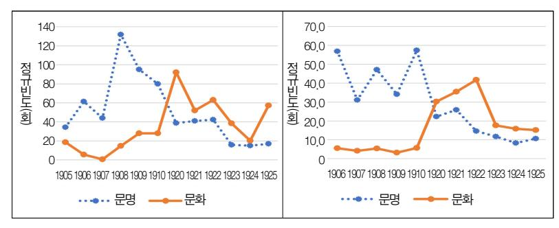

[그림 1] 키워드의 연도별 정규빈도 동향(왼쪽:신문, 오른쪽:잡지)

모는 8,931개 기사에 공백을 제외한 글자 수 기준으로 약 1,630만 자이다.9) [그림 1]의 그래프에 표시된 연도별 값은 키워드의 실제 빈도가 아닌 '정 규빈도'로서, 이 값은 연도별 비교를 동일한 조건에서 할 수 있도록 연도별 모집단 크기를 10만 자로 통일하고 그에 비례하도록 실제 빈도를 환산한 값이다. 이 연도별 정규빈도를 보면 신문과 잡지 모두에서 1900년대 후반에는 '문명'이 높은 빈도로 사용되었으나, 1920년대 초에는 절반 이하 수준으로

#### 9) 자료의 세부 사항은 다음과 같다.

| 7171      |        | 신문         |       | 잡지           | 계     |              |  |  |
|-----------|--------|------------|-------|--------------|-------|--------------|--|--|
| 기간        | 기사 수 기 |            | 기사 수  | 기사 크기        | 기사 수  | 기사 크기        |  |  |
| 1905\~1910 | 1,192  | 117만 835   | 3,958 | 473만 6,589   | 5,150 | 590만 7,424   |  |  |
| 1920\~1925 | 1,897  | 287만 210   | 1,884 | 751만 9,155   | 3,781 | 1,038만 9,365 |  |  |
| 계         | 3,089  | 404만 1,045 | 5,842 | 1,225만 5,744 | 8,931 | 1,629만 6,789 |  |  |

\* &#x27;기사 크기'는 공백을 제외한 글자 수이며 단위는 '개'이다

기사를 중심으로 했으며, 창간 이전 시기인 제1기에는 『황성신문』의 사설을 활용했다. 『황성신문』의 경우 '사설'의 성격을 가진 글 중 상당수는 '논설'로도 분류되었으므로 사설 기사에는 '논설'도 포함시켰다. 잡지는 1900년대에는 11중 학회지의 기사 본문 전체를, 1920년대에는 『개벽』의 기사 본문 전체를 활용했다. 11중 학회지의 중류와 발행 기간은 다음과 같다. 『기호흥학회월보』(1908\~1909), 『대동학보』(1908\~1909), 『대한유학생회학보』(1907), 『대한 자강회월보』(1906\~1907), 『대한학회월보』(1908\~1909), 『대한협회회보』(1908\~1909), 『대한흥학보』(1908\~1909), 『대한혁회월보』(1908\~1909), 『대한혁회월보』(1906\~1908), 『태극학보』(1906), 『호학보』(1908\~1909), 《대한흥학보』(1908\~1909), 《대한흥학보』(1908\~1909), 《대한흥학보』(1908\~1910), 《대한흥학보』(1908\~1910), 《대한흥학보』(1908\~1910), 《대한흥학보』(1908\~1910), 《대한흥학보』(1906\~1908), 《대학학보』(1906\~1908), 《대학학보』(1906\~1908), 《대한흥학보』(1908\~1910), 《대한흥학보』(1908\~1909), 《대한흥학보』(1908\~1909), 《대한흥학보』(1908\~1909), 《대한흥학보』(1908\~1909), 《대한흥학보』(1908\~1909), 《대한흥학보』(1908\~1909), 《대한흥학보』(1908\~1909), 《대한흥학보』(1908\~1909), 《대한흥학보』(1908\~1909), 《대한흥학보』(1908\~1909), 《대한흥학보』(1908\~1909), 《대한흥학보』(1908\~1909), 《대한흥학보』(1908\~1909), 《대한·유학생회학보』(1908\~1909), 《대한·유학생회학보』(1908\~1909), 《대한·유학생회학보』(1908\~1909), 《대한·유학생회학보』(1908\~1909), 《대한·유학생회학보』(1908\~1909), 《대한·유학생회학보』(1908), 《대한·유학생회학보』(1908\~1909), 《대한·유학생회학보』(1908\~1909), 《대한·유학생회학보』(1908\~1909), 《대한·유학생회학보』(1908\~1909), 《대한·유학생회학보』(1908\~1909), 《대한·유학생회학보』(1908\~1909), 《대한·유학생회학보』(1908\~1909), 《대한·유학생회학보』(1908\~1909), 《대한·유학생회학보』(1908\~1909), 《대한·유학생회학보』(1908\~1909), 《대한·유학생회학보』(1908\~1909), 《대한·유학생회학보』(1908\~1909), 《대한·유학생회학보』(1908\~1909), 《대한·유학생회학보』(1908\~1909), 《대한·유학생회학보』(1908\~1909), 《대한·유학생회학보』(1908\~1909), 《대한·유학생회학보』(1908\~1909), 《대한·유학생회학보』(1908\~1909), 《대한·유학생회학보》(1909), 《대한·유학생회학보》(1909), 《대한·유학생회학보》(1909), 《대한·유학생회학보》(1909), 《대한·유학생회학보》(1909), 《대한·유학생회학보》(1909), 《대한·유학생회학보》(1909), 《대한·유학생회학보》(1909), 《대한·유학생회학보》(1909), 《대한·유학생회학보》(1909), 《대한·유학생회학보》(1909), 《대한·유학생회학보》(1909), 《대한·유학생회학보》(1909), 《대한·유학생회학보》(1909), 《대한·유학생회학보》(1909), 《대한·유학생회학보》(1909), 《대한·유학생회학보》(1909), 《대한·유학생회학보》(1909), 《대한·유학생회학보》(1909), 《대한·유학생회학보》(1909), 《대한·유학생회학보》(1909), 《대한·유학생회학보》(1909), 《대한·유학생회학보》(1909), 《대한·유학생회학보》(1909), 《대한·유학생회학보》(1909), 《대한·유학생회학보》(1909), 《대한·유학생회학보》(1909), 《대한·유학생회학보》(1909), 《대한·유학생회학보》(1909), 《대한·유학생회학보》(1909), 《대한·유학생회학보》(1909),

급감하고 1923년 무렵부터는 저빈도 수준으로 더욱 감소했다. 이에 비해 '문화'는 1900년대 중반부터 1922년까지는 '문명'의 동향과 정반대 움직임을 보였다. 그러다가 1923년부터 하락하는 듯하나, 신문의 경우 1925년에 다시 반등하기도 해서 이 자료만으로는 '문화'의 연도별 빈도를 거시적으로 파악하기는 힘들다. 그러나 [그림 1]과 유사한 방식으로 일제시기 말까지를 잡지자료로 살펴보고, 10) 6년 단위의 『동아일보』 사설로 20세기 후반까지의 주요 구간별 동향을 살펴보면[1] '문명'의 빈도는 해방 직후부터 사실상 제로

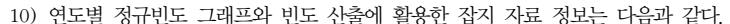

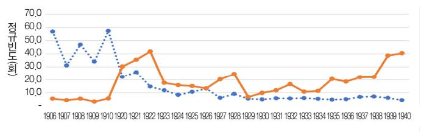

#### ⋯•⋯문명 ━━문화

| 기간        | 기사 수  | 기사 크기        |
|-----------|-------|--------------|
| 1926\~1930 | 2,462 | 728만 2,708   |
| 1931\~1940 | 5,160 | 1,443만 4,618 |

1925년 이후의 동향을 파악하는 데 활용한 잡지 종류와 해당 발간 연도를 제시하면 다음과 같다. 『개벽』(1926)、『동광』(1926\~1927, 1931\~1933)、『별건곤』(1926\~1934)、『삼천리』(1930\~1940)이다.

11) 연도별 정규빈도 그래프와 빈도 산출에 활용한 신문 자료 정보는 다음과 같다.

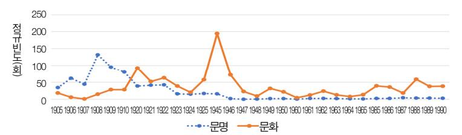

| 기간        | 기사 수  | 기사 크기      |
|-----------|-------|------------|
| 1945\~1950 | 910   | 126만 3,496 |
| 1960\~1965 | 2,835 | 416만 1,813 |
| 1985\~1990 | 3,707 | 436만 7,852 |

추가로 살펴본 세 개의 시기는 이전과 동일 하게 6개년을 단위로 삼았고, 기간은 해방 이후 20세기 말까지의 장기적 빈도 동향을 개관하기 위한 실용적 목적 이래 다소 임의 적으로 정했다. 그러나 가급적 한국사회에

서 사회운동이 특히 활동화된 시기, 즉 해방공간, 4 · 19에서 한일회담 반대운동에 이르는

수준으로 떨어진 데 반해, '문화'는 주기적 변동을 거치면서도 일정한 수준 을 유지했고 20세기 말에는 소폭 증가했다. 따라서 두 키워드의 빈도가 급 격하게 상호 교차하는 1900년대 후반과 1920년대 전반이 두 키워드의 영향 력이 가장 컸던 시기로 생각되며, 양자의 논의 맥락 간 연관성 여부를 파악 하기에 가장 적절한 시기라고 볼 수 있다.

### 2) 공기어연결망 지도

이 절에서는 앞 절에서 선택한 전산 자료를 본 논문의 분석 목적에 알맞 은 기초 자료로 가공하고 이를 활용해서 두 키워드의 공기어를 획득한 뒤, 이어서 '공기어연결망 지도'를 산출할 것이다. 12)

첫째, 전산화된 신문·잡지 기사를 가공해서 언어연결망 분석에 활용할 기초 자료와 키워드의 공기어를 산출해 보자. 편의상 이 기초 자료를 '문 명·문화 코퍼스'(이하 '코퍼스')로 부르는데, 이 코퍼스의 규모와 이로부터 추출한 공기어 수를 <표 1>에 제시했다.

<표 1>의 '공기어'는 "① 전산 입력물 획득13) →② '문명'·'문화'의 문맥 추출14) →③ 문맥 수를 10분의 1로 축소15) →④ 형태 분석16) →⑤ 공기어

시기, 정치적 민주화운동기에 상응하도록 잡았다.

12) 본 논문에서는 '공기어연결망 지도'와 '의미연결망 지도'라는 용어를, 서로 밀접하지만 상이 한 대상을 가리키는 용어로 사용한다. '공기어연결망 지도'는 '연결망 지도'로 줄여서 표기할 것이며 이에 관한 내용은 제2장 제2절에서 자세히 설명한다. '의미연결망 지도'는 제3장 제2절에서 자세히 설명한다.

13) 신문의 출처는, 황성신문은 한국언론진흥재단에서 운영하는 빅카인즈(Bigkinds)의 '고신 문' 사이트이며, 동아일보는 네이버의 '뉴스라이브러리'이다. 참고로 2017년 11월부터 빅 카인즈의 고신문 서비스는 국립중앙도서관 '대한민국 신문 아카이브'로 이관되었으며, 일부 고신문은 '한국역사정보통합시스템'에서만 검색할 수 있다. 잡지의 경우에는 모두 한림대학 교 한림과학원이 국사편찬위원회로부터 학술적 분석에 한정하여 사용할 것을 서약하고 제공 받은 전산 자료를 출처로 했으나, 자료 획득 이후 마지막 단계까지(즉 본문에 제시된 공기어 획득과정의 ②에서 ⑤까지)는 본 논문의 목적을 고려하면서 필자가 독자적으로 진행했다.

14) 키워드 검색과 문맥 추출에는 프로그래밍 언어 '파이선(Python) 3.0'을 사용했다. 두 키워드

#### <표 1> 키워드의 코퍼스 규모와 공기어 수

(단위:개)

|     |     |       | 신문   |       |       | 잡지   |       | 계     |      |       |  |
|-----|-----|-------|------|-------|-------|------|-------|-------|------|-------|--|
| 시기  | 키워드 | 문맥    | 1/10 | 공기어   | 문맥    | 1/10 | 공기어   | 문맥    | 1/10 | 공기어   |  |
|     | 문명  | 864   | 87   | 783   | 1,958 | 195  | 1,682 | 2,822 | 282  | 2,465 |  |
| 제1기 | 문화  | 153   | 15   | 140   | 217   | 22   | 183   | 370   | 37   | 323   |  |
|     | 소계  | 1,017 | 102  | 923   | 2,175 | 217  | 1,865 | 3,192 | 319  | 2,788 |  |
|     | 문명  | 818   | 82   | 632   | 1,143 | 113  | 769   | 1,961 | 195  | 1,401 |  |
| 제2기 | 문화  | 1,499 | 150  | 1,237 | 1,957 | 194  | 1,379 | 3,456 | 344  | 2,616 |  |
|     | 소계  | 2,317 | 232  | 1,869 | 3,100 | 307  | 2,148 | 5,417 | 539  | 4,017 |  |
|     | 합계  | 3,334 | 334  | 2,792 | 5,275 | 524  | 4,013 | 8,609 | 858  | 6,805 |  |

- \* '문맥'에 해당하는 값은 총기사 중 키워드가 들어 있는 문맥 수를 가리킨다. '1/10'에 해 당하는 값은 '문맥' 수를 10분의 1로 줄인 것이다.
- \* 공기어로 산정된 수는 문맥별 공기어 수를 단순 합산한 결과라서 문맥과 문맥 간에 동 일 단어가 중복된 경우를 포함하고 있다.
- \* '문명'과 '문화'라는 단어가 키워드로 사용된 경우는 공기어에서 제외했으나, 키워드 이 외의 자리에서 사용된 경우는 공기어로 간주했다.

선별17)"의 순서를 거쳐 획득했다. 여기에서 ④의 형태 분석과정은 두 단계

가 사용된 지점에서 앞뒤 각각 20개 음절까지를 해당 키워드의 '문맥'으로 설정하고, 키워드 를 포함한 42개 음절을 하나의 문맥으로 추출했다. 앞뒤 20개 음절이라는 기준은 공백을 제외한 것이다. 동일한 문맥 내에서 앞 문장이 종결되고 뒤 문장이 시작하더라도 텍스트 내에서 논지의 전개는 이어진다고 간주했으므로, 문맥 추출 시 문장이 끊어지는 곳의 유무 에 구애받지는 않았다.

15) 추출한 문맥 수는 <표 1>에서 볼 수 있듯이 모두 8,609개인데, 통상 1개 문맥에서 공기어가 8\~10개 나오므로 이 규모의 문맥을 모두 활용할 경우 공기어가 8만 개 수준으로 증가하여 검토하기에 너무 방대해진다. 그래서 일정한 규칙으로 10개의 문맥마다 1개씩 선별하여 검토 대상을 10분의 1로 축소했다. 이렇게 축소된 858개 문맥의 단어들을 '형태 분석'해서 6,805개의 공기어를 얻었다.

16) 본 논문에서 선정한 언론 전산 자료는 원사료 자체가 국한문을 섞어서 작성한 기사도 많고, 띄어쓰기가 되어 있지 않거나 매우 불규칙적인 경우도 많아, 전자사전 등을 사용하지 않고 필자가 일일이 문맥을 확인하면서 수작업으로 형태 분석을 진행했다.

17) 동일한 문맥 안에서 동일한 단어가 두 번 이상 사용되었을 때에는 하나만 공기어로 남겼다.

를 거쳤다. 첫 번째 단계에서는 분석에 필요한 단어를 선별했다. 주로 명사 를 중심으로 했고, 고유명사는 국가명·외국지명 등 두 키워드의 의미 특성 과 관계가 깊다고 판단한 것 외에는 가급적 제외했다. '발전하다'처럼 '명사 +하다'의 형태를 띤 경우에는 '명사' 부분만 남겼다. 복합어의 경우에는 가 급적 세부 단위로 쪼개는 것을 원칙으로 했다. 두 번째 단계에서는 이렇게 선별한 단어 중에서 기표는 비록 다르지만 사실상 같은 대상을 가리킨 경우 는 하나의 단어로 통합했다. 18) 이후 본 논문에서는 8,931개 기사, 1,600여 만 자의 자료에서 획득한 858개의 용례와 6,805개의 공기어를 분석의 기초 자료로 활용한다. 19)

둘째, 이러한 공기어를 구성 요소로 하는 공기어연결망 지도를 작성해 보 자. 이 지도는 공기어 간의 관련성을 '점'(node)과 '선'(link)으로 이루어진 연 결망형태로 표현한 것으로, 공기어는 '점', 관련성은 '선'으로 표시된다. 관련 성의 정도는 두 개의 공기어가 동일한 문맥에서 얼마나 자주, 함께 사용되 었는가에 좌우되는데, 그 정도를 숫자값으로 나타내기 위해 통상 '유사도'(類 似度)라는 지표를 사용한다. 본 논문에서는 두 키워드의 논의 맥락을 시기 별·매체별로 상호 비교하려 하므로, 모두 8개의 공기어연결망 지도가 필요 하다.

공기어연결망 지도를 산출할 때 적용한 기준과 절차는 <표 2>와 같다. 연 결망 지도 산출과정을 제2기 신문의 '문화'를 사례로 살펴보면, "① '문맥-공기어'로 이루어진 2항(2-mode) 연결 자료 입력20) →② 공기어 절삭 기준

18) 한자로 된 형태와 동음의 한글로 된 형태가 혼재할 경우에는 한자나 한글 어느 한쪽으로 통일했다. 동일한 국가명이 서로 달리 표기되었을 경우에도 표기를 통일했다. 오래된 한문 투의 표현과 그에 상응하는 현대적 표현이 혼재하면 가급적 현대적 표현으로 통일했다. 한편 대동소이한 의미를 가진 기표가 둘 이상 있어서 각각이 상이한 단어로 인식될 우려가 있는 경우, 그러한 단어들은 하나의 기표로 통일했다. 이에 해당하는 사례로서 '國'·'국 가'·'나라'·'一國'은 '국가'로, '겨레'와 '동포'는 '민족'으로 그리고 '변동'·'변천'·'변화'·'추 이'는 '변천'으로 각각 통일했다. 또한 문맥을 검토해서 '家', '民', '사람', '生', '員', '人', '인간', '者'는 '사람'으로 통일했다.

19) 문맥별로 중복되는 단어를 제외하면 공기어 수는 2,495개이다.

설정21) →③ 41개의 공기어 획득→④ 294개의 1항(1-mode) 연결 관계 획 득22) →⑤ 유사도 값 0.22 이상에 해당하는 39개의 연결 관계 남김23) → ⑥ 최 종 공기어 32개로 이루어진 연결망 지도 산출24)" 순이다.

이런 과정을 거쳐 산출한 공기어연결망 지도를 [그림 2]에 제시했다. 제1기 에는 '문화'의 빈도가 너무 낮아서 연결망 지도의 최종 공기어도 당초 설정 수준인 30개에 크게 못 미치는 수준 즉 신문은 10개, 잡지는 18개를 확보하 는 데 그쳤다.

[그림 2]의 연결망 지도에서 공기어를 나타내는 '점'은 해당 공기어가 다

20) 연결망 시각화 및 분석 소프트웨어로는 넷마이너(NetMiner) 4.3을 사용했다. <표 2>의 제2기 신문에서 '문화'의 '공기어' 수 585개는 <표 1>의 해당 부분 값인 1,237개와 크게 차이 가 나지만 앞에서 설명했듯이 이는 실제상의 차이가 아니라 개수 산정방식의 차이에 따른 결과이다. 예를 들어 '문화'가 키워드로 있는 3개의 문맥에서 '발전'이라는 단어가 각각 사용 되면 문맥과 공기어 간에는 '문맥1-발전', '문맥2-발전', '문맥5-발전'이라는 세 개의 이항 관계가 성립한다. 이 경우 <표 1>에서는 필자가 공기어를 3개로 산정한 반면, 넷마이너의 경우 이 이항관계의 좌측항과 우측항을 각각 통합하여 관리하면서 중복되는 단어는 1개로 표시했다.

21) 여러 방법을 통해 공기어연결망 지도를 그린 뒤 이를 서로 비교해 본 결과, 상이한 입력값을 가진 둘 이상의 집단을 비교할 때 최종 공기어의 개수를 동일하게 하는 것이 가장 효과적인 '정규화' 조처라고 판단했다. 본 논문에서는 그 개수를 빈도가 높은 공기어 30개 수준으로 설정했다. 한편 공기어 절삭 기준이 '5'인 것은, 최소한 5개 문맥 이상에서 출현한 공기어만 남긴다는 뜻이다.

22) &#x27;문맥-공기어'의 2항 연결 관계를 '공기어-공기어'로 된 1항(1-mode) 연결 관계로 전환하면, 41개 공기어 사이에 두 공기어의 유사도를 나타내는 '선'(이때 동일한 공기어 간의 연결선도 생성되는데 이 연결선은 제외) 294개가 형성된다. 여기에서 유사도 산출에는 '코사인 유사 도'를 사용했는데 이 값은 1에 가까울수록 두 공기어가 서로 밀접하다는 뜻이다. 이 지표의 적용과정에 관한 좀 더 상세한 설명은 허수, 2016, 「네트워크분석을 통해 본 1980년대 '민 중':동아일보의 용례를 중심으로」, 개념과 소통 제18호, 66\~70쪽 참조.

23) &#x27;1항 연결'에 해당하는 294개의 '선'은 그 수가 너무 많아서 이대로는 공기어 간의 연결 관계 를 식별할 수 없으므로 일정한 값 이상만 남겼다. 절삭값은 앞에서 설명했듯이 최종 공기어 수가 30개에 근접하도록 설정했다. 여기에서는 절삭 기준을 유사도 값 0.22로 설정해서 그 값 이상을 가진 39개의 선을 얻었다.

24) 41개의 공기어와 39개의 연결 관계를 가진 공기어연결망 지도에서 최종 공기어 수가 30개 안팎이 되도록, 작은 규모의 연결망 덩어리는 제거했다. 이렇게 해서 [그림 2]에 제시되듯이 32개의 최종 공기어를 가진 연결망 지도를 얻었다.

#### <표 2> 키워드의 공기어연결망 지도 산출 기준

(단위:개)

| 언론 | 기간명키워드 |    | 문맥 (MN) | 공기어 (SN) | 2항연결 (NT) | 공기어 절삭기준 | 생존 공기어 | 1항 연결 | 1항연결 절삭기준 | 생존 1항연결 | 최종 공기어 |
|----|--------|----|------------|-------------|--------------|-------------|-----------|----------|--------------|------------|-----------|
|    |        | 문명 | 87         | 482         | 1.744        | 3           | 34        | 202      | 0.2603       | 36         | 31        |
|    | 제1기    | 문화 | 15         | 122         | 1.135        | 2           | 10        | 11       | -            | 11         | 10        |
| 신문 |        | 문명 | 82         | 363         | 1.594        | 3           | 43        | 223      | 0.3333       | 31         | 29        |
|    | 제2기    | 문화 | 150        | 585         | 1,148        | 5           | 41        | 294      | 0.22         | 39         | 32        |
|    |        | 문명 | 195        | 984         | 1,576        | 5           | 47        | 327      | 0.222        | 34         | 31        |
|    | 제1기    | 문화 | 22         | 154         | 1.182        | 2           | 18        | 36       | 0.348        | 26         | 18        |
| 잡지 |        | 문명 | 113        | 438         | 1.703        | 3           | 51        | 214      | 0.31         | 47         | 31        |
|    | 제2기    | 문화 | 194        | 629         | 1,250        | 5           | 41        | 312      | 0.19         | 44         | 31        |

\* 'MN'은 Main Node, 'SN'은 Sub Node, 'NT'는 Network를 줄인 표현이다.

른 공기어와 '선'으로 많이 연결될수록 크게 나타난다. 그러므로 키워드의 문맥 전체에서 단어 A와 함께 사용된 단어의 종류가 다양할수록, 단어 A에 해당하는 '점'은 굵게 표시된다. 한편 단어 A와 B가 동일한 문맥에서 사용되 는 경우가 많을수록 단어 A와 B에 해당하는 '점'을 연결하는 '선'은 굵게 표 시된다.

이렇게 산출한 공기어연결망 지도는 다음과 같은 특성을 가진다. 첫째, 이 지도에서 '점'의 크기가 굵고 연결선이 많으며 중앙에 위치할수록, 해당 공기어가 키워드의 논의 맥락에서 가지는 중요성은 커진다. 또한 지도에서 두 '점' 사이의 연결거리가 '1'의 관계에 있는 경우, 즉 두 공기어가 직접 연 결되어 있는 경우는, 25) 동일한 문맥에서 두 공기어가 실제로 함께 사용되고 있는지 여부를 직접 확인할 수 있다. 그러나 '국가-社會-민족'처럼 일렬로 이어진 관계에서 '국가'와 '민족'은 '社會'를 매개로 형성된 2촌 관계이므로,

\* '생존 공기어', '최종 공기어' 등의 표현은 이해를 돕기 위해 필자가 정한 것이다.

\* 제1기의 '문화'에서 '1항연결 절삭기준' 값이 없는 것은, 이미 '생존 공기어' 수가 10개에 불과하고 연결 관계 수도 적어서 '선'을 절삭할 필요가 없었기 때문이다.

25) 이하에서는 편의상 '거리 1'의 관계를 '1촌'으로 표현한다.

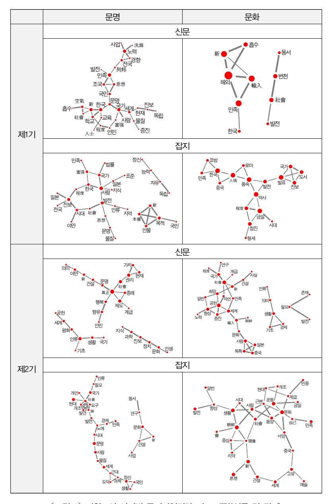

[그림 2] 키워드의 시기별 공기어연결망 지도 개략(신문 및 잡지)

두 단어는 텍스트의 실제 문맥에서 함께 발견되지 않는다. 그렇지만 공기어 연결망 지도는 경험적 관찰로 파악하기 힘든 매개적인 연결 관계까지 포함 하여 우리에게 키워드의 논의 맥락을 시각적으로 드러내는 이점이 있다.

둘째, 공기어연결망 지도에서는 어떤 공기어가 비록 주변부에 위치해 있 더라도 키워드의 논의 맥락을 나타내는 데 중요한 요소가 된다. 왜냐하면 지도에 표시된 공기어는 여러 번의 절삭과정을 거치면서도 살아남은 '최종 공기어'이므로, 그 존재 자체로 키워드의 논의 맥락을 드러내는 중요한 요소 가 될 자격을 갖추고 있기 때문이다.

# 3. '문명'과 '문화'의 의미연관

### 1) '의미스펙트럼'의 유사성

제2장에서 산출한 8개의 공기어연결망 지도는 해당 공기어가 사용된 실 제 문맥을 검색하는 데 유용하며 키워드의 논의 맥락을 구조화된 형태로 드 러내는 이점이 있다. 그러나 연결망의 '점'을 이루는 공기어가 단어의 형태 를 띠므로, 서로 비슷한 의미를 가지지만 기표가 상이한 두 단어를 소프트 웨어는 별개로 인식해 버린다. 그러므로 이 차원에 머문다면 키워드의 논의 맥락을 효과적으로 살펴보는 데 한계가 있다.

이 한계를 넘어서기 위해 공기어를 적절한 범주로 분류해서 비슷한 의미 를 가진 단어들은 통합할 필요가 있다. 이런 목적을 위해 필자는 '의미스펙 트럼'이라는 발상을 해보았다. 26) 서술의 편의상 이런 관점을 적용한 결과를

26) 필자가 사용하는 '의미스펙트럼'은 '스펙트럼'(spectrum)' 용어에 본래 내장된 두 가지 뜻, 즉 '분해'와 '판별'이라는 함의를 담고 있다. 즉 20세기 '문명'·'문화'의 논의 맥락을 단어 차원을 넘어서는 여러 개의 의미로 구분한다는 측면과, 이렇게 나눈 의미를 비교·검토해서 키워드의 논의 맥락이 가진 변별적 특징을 살펴보려는 측면을 갖고 있다.

먼저 제시하면 <표 3>, <표 4>와 같다.

<표 3> 키워드의 의미스펙트럼(신문)

| 분류   | 시기 제1기       |                                          |            |                                          | 제2기                                                     |
|------|-----------------|------------------------------------------|------------|------------------------------------------|---------------------------------------------------------|
| 대분류  | 소분류             | 문명(31개)                                  | 문화(10개)    | 문명(29개)                                  | 문화(32개)                                                 |
|      | 1) 진보의식         | 발전, 증진, 진보 발전                            |            | 진보                                       | 발전, 증진, 향상                                              |
|      | 1) 긍정판단         | 富强, 新                                    | 新          | 공헌, 新                                    | 공헌, 新, 희망                                               |
| 1.인식 | 1) 보편가치         | -                                        | -          | 가치, 권리, 평화, 행복                        | -                                                       |
|      | 1) 정체성          | 독립                                       | -          | 종래, 眞正                                   | -                                                       |
|      | 2) 집합주체         | 국민, 사람, 인민, 人士                        | -          | 계급, 인민                                   | 계급, 사람                                                  |
|      | 2) 운동·사상        | 思想                                       | -          | -                                        | -                                                       |
|      | 2) 국가명          | 한국                                       | 한국         | -                                        | 일본, 朝鮮, 중국                                              |
| 2.활동 | 2) 정치체a         | 국가, 민족, 社會, 조국                        | 민족, 社會     | 국가, 社會                                   | 국가, 민족, 社會                                              |
|      | 2) 정치체b         | 세계, 列邦                                   | 동서         | 세계, 인류                                   | 세계, 인류                                                  |
|      | 2) 대외교류         | 흡수                                       | 輸入, 해외, 흡수 | -                                        | 輸入                                                      |
|      | 3) 정치·외교        | -                                        | -          | 정치                                       | -                                                       |
|      | 3) 법률·행정 전국     |                                          | -          | 제도                                       | -                                                       |
| 3.제도 | 3) 사회·경제        | -                                        | -          | 생활                                       | 경제, 생활                                                  |
|      | 3) 교육·학술 교육, 학교 |                                          | -          | 과학, 지식                                   | 연구                                                      |
|      | 3) 예술·종교        | -                                        | -          | -                                        | -                                                       |
|      | 9)기타            | 경향, 空氣, 노력, 문명, 물질, 사업, 洗滌, 程度, 현재 | 변천         | 건설, 기초, 문명, 문화, 야만, 의미, 인생, 향유, 현재 | 건설, 기초, 노력, 독특, 문화, 사실, 의미, 일반, 자연, 程度, 존재, 필요 |

\* 두 키워드 바로 뒤의 괄호 속 숫자는 해당 시기의 공기어 총개수이다.

\* 편의상 일국 내의 정치체는 '2. 정치체a'로, 그 바깥의 정치체는 '2. 정치체b'로 구분했다.

<표 4> 키워드의 의미스펙트럼(잡지)

| 분류   | 시기          | 제1기                                                     |                                      |                                                                                  | 제2기                                                    |
|------|-------------|---------------------------------------------------------|--------------------------------------|----------------------------------------------------------------------------------|--------------------------------------------------------|
| 대분류  | 소분류         | 문명(31개)                                                 | 문화(18개)                              | 문명(31개)                                                                          | 문화(31개)27)                                             |
|      | 1) 진보의식     | 발전, 진보                                                  | 발전, 점진, 진보 발전                        |                                                                                  | 발전, 향상                                                 |
|      | 1) 긍정판단     | 富强, 新                                                   | -                                    | 新                                                                                | 新                                                      |
| 1.인식 | 1) 보편가치     | 자유                                                      | -                                    | -                                                                                | -                                                      |
|      | 1) 정체성      | 독립                                                      | 역사                                   | -                                                                                | 고유                                                     |
|      | 2) 집합주체     | 국민, 사람                                                  | -                                    | 국민,사람                                                                            | 계급, 민중, 사람                                             |
|      | 2) 운동·사상    | 思想                                                      | -                                    | -                                                                                | 思想, 운동                                                 |
| 2.활동 | 2) 국가명      | 일본, 한국                                                  | 로마, 중국, 한국                           | -                                                                                | 동양, 서양, 朝鮮, 중국                                      |
|      | 2) 정치체a     | 국가, 민족, 社會                                              | 국가, 민족                               | 국가, 민족, 社會                                                                       | 민족, 社會                                                 |
|      | 2) 정치체b     | 인류                                                      | -                                    | 동서, 세계, 인류 세계                                                                    |                                                        |
|      | 2) 대외교류     | -                                                       | -                                    | -                                                                                | -                                                      |
|      | 3) 정치·외교    | -                                                       | -                                    | -                                                                                | -                                                      |
|      | 3) 법률·행정    | 법률, 전국, 지 역                                    | -                                    | -                                                                                | 지역                                                     |
| 3.제도 | 3) 사회·경제    | -                                                       | -                                    | 경제, 생활                                                                           | 생활                                                     |
|      | 3) 교육·학술 지식 |                                                         | 도서                                   | 과학, 연구                                                                           | -                                                      |
|      | 3) 예술·종교    | -                                                       | -                                    | -                                                                                | 예술                                                     |
|      | 9) 기타       | 능력, 목적, 문명, 물질, 本會, 시대, 야만, 인물, 일반, 程度, 정신, 표준 | 금일, 발표, 시대, 人情, 程度, 표방, 풍속, 형세 | 개인, 개조, 건설, 근대, 노예, 도덕, 論, 문명, 문화, 물질, 발견, 사업, 시대, 요구, 정신, 필요, 현대 | 개조, 건설, 근본, 금일, 문화, 시대, 일반, 自己, 중심, 현대, 現象, 會 |

\* 두 키워드 바로 뒤의 괄호 속 숫자는 해당 시기의 공기어 총개수이다.

\* 편의상 일국 내의 정치체는 '2. 정치체a'로, 그 바깥의 정치체는 '2. 정치체b'로 구분했다.

27) 제2기의 두 키워드를 검색하는 데 사용한 자료는 본 논문 제2장 제1절에서 밝혔듯이 창간부 터 1925년 말까지의 개벽 자료를 가공한 코퍼스로서, 이를 이용하여 '문화'의 공기어 31개 를 추출했다. 그런데 송인재는 '문화'에 관한 연구에서 한림과학원 제작 코퍼스 중 개벽 전체 시기(1920\~1926)의 기사에서 '문화'의 공기어 상위 20개를 추출한 바 있다(송인재, 2017, 「개 벽의 '문화' 관련 기사를 통해 본 천도교의 문화관」, 시대와 철학 제80호, 168쪽). 이 20개를 본 논문에서 추출한 30개와 비교하면, 14개(발전·사람·思想·운동·동양·서양·시대·朝 鮮·조선·민족·社會·세계·생활·건설)가 겹치며 6개(우리·정치·이상·의미·알다· 인류)는 겹치지 않는다. 그런데 후자 중에서 '우리'와 같은 대명사나 '알다'와 같은 동사는

<표 3>과 <표 4>는 본 논문에서 가장 핵심적인 내용을 담고 있는데, 그것 은 공기어들을 15개의 '소분류'로 구분한 대목이다. 표에서 소분류로 명명한 15개의 범주가 키워드의 논의 맥락을 드러내는 기초적인 성분이 되기에 적 절한가, 28) 그리고 각 범주에 맞게 공기어들을 합리적으로 분류했는가 등이 중요하다.

먼저 15개 범주의 적절성 문제부터 언급해 보자. 15개 범주는 기본적으로 키워드의 공기어 109개의 단어를 의미상 비슷한 것끼리 구분하는 과정에서 여러 시행착오를 거쳐 도출한 귀납적인 결과물이다. 29) 이 점에서 '문명'과 '문화'에 관한 사전적 정의나 권위 있는 선행연구의 분류에서 이끌어 온 연 역적 구분은 아니다.

그러나 연역적이 아니라 귀납적이라는 사실이 이 분류 범주의 적절성을 보증한다고 단정할 순 없다. 귀납적인 만큼 키워드의 논의 맥락 탐구라는 당초 목적에서 더 멀어져 특수하고 개별적인 현상에 고착된 구분이 될 위험 도 있고, 그 결과 짜임새 있는 분류 범주에서 더 멀어질 수 있기 때문이다. 또한 귀납적이라는 언급에 대해서도 어떤 독자는 이 설명에 의구심을 품 을 수 있다. 왜냐하면 <표 3>과 <표 4>에서 어떤 공기어도 포함하지 않은 범주가 있기 때문이다. <표 3>의 '3) 예술·종교'와 <표 4>의 '2) 대외교류' 및 '3) 정치·외교'가 여기에 해당한다. 물론 신문과 잡지의 숫자를 범주별로

통합해서 생각한다면, 이 세 범주도 최소 1개 이상의 공기어를 가지므로, 이 범주들이 공기어를 구분하는 실제적 분류로서 의미가 있다고 말할 수 있다.

본 논문의 형태 분석에서는 제외했으므로 실제로는 4개의 공기어가 차이 난다. 이러한 차이 는 형태 분석방법을 포함한 코퍼스 자료의 산출방식, 분석에 사용한 개벽 자료의 시기적 범위의 차이 등에 따른 것이라 생각된다.

28) 위 표에서는 '9) 기타'라는 범주도 있어서 분류 범주를 16개로 볼 수도 있지만, '9) 기타'는 나머지 15개의 범주에 넣기 힘들다고 판단한 공기어를 모아 둔 것이라 실질적으로는 유의미 한 분류에서 제외한 것이다. 이런 이유로 '9) 기타'는 분류 범주로 간주하지 않았다.

29) 두 키워드의 공기어는 신문에서 102개, 잡지에서 111개가 산출되어 합계가 213개이지만, 이 213개에는 중복되어 있는 단어가 많다. 이를 제거하면 109개의 단어가 남는다.

그러나 각 범주에 속한 공기어의 수에 범주 간 불균형이 심해서, 각 범주의 개수와 그들 간 위상이 과연 적절한가라는 의문을 제기할 수는 있다. 예컨대 앞에서 설명한 세 범주에 비해 '1) 진보의식', '1) 긍정판단', '2) 국가명', '2) 정 치체a', '2) 정치체b', '3) 교육·학술' 등은 공기어 수를 훨씬 많이 포함하고 있는 것이 사실이다.

이상의 의문에 대한 필자의 견해를 밝히자면, 먼저 이런 분류 범주를 처 음 고안하는 입장에서는 확보한 공기어를 선입관 없이 분류하는 귀납적 방 식이 더 필요하다고 생각했다. 귀납과 연역을 종합해서 보편적 함의를 가지 면서도 20세기 초 한국의 특수한 상황을 담을 수 있는 분류를 설정하는 것 이 더 바람직하겠으나, 필자의 역량상 그 과제는 뒤로 미루고 여기에서는 차선책을 취했다고 할 수 있다.

범주의 규모 차이나 위상의 상이함 여부에 대해서는 우선, 이 범주들이 단지 1900년대 후반과 1920년대 전반이라는 제한된 시기의 키워드 논의 맥락 을 고찰하기 위한 것이 아니라는 점을 들어 독자들의 양해를 구하고자 한다. 이 15개의 범주는 당초 분석시기를 20세기 전체, 즉 1900년대부터 1980년대 말까지 넒힌 상태에서 주요 시기별 키워드 용례를 선별하고 관련 공기어들을 분류할 목적에서 설정한 것이다. 그래서 앞에서 설명한 세 범주처럼 20세기 초에는 해당 공기어가 적지만, 그중에는 20세기 중·후반에 해당 공기어가 많아지는 경우도 있어, 전체적으로 보면 <표 3>과 <표 4>만 보아서 우려되 는 분류상의 불균형은 실제로 그리 심각하지 않다. 30)

다음으로 공기어를 각 범주에 맞게 합리적으로 분류했는가라는 문제에 대해 검토해 보자. 이 문제 역시 첫 시도부터 완벽을 기할 수 없다는 전제 위에서, 필자의 의도와 그 적용방식을 언급하면 다음과 같다. '1) 진보의식' 은 두 키워드의 공기어에서 자주 보이는 '향상적 시간의식'의 의미를 포괄하 고자 설정했다. '증진', '점진', '진보' 등의 단어도 여기에 포함될 수 있다고

30) 20세기 전체를 대상으로 한 연구는 지면을 달리해서 후속 연구로 진행하고자 한다.

보았다. 반면에 '程度'는 양적 표현에도 자주 사용되므로 이 범주에서 제외 했고, 31) 시간의식을 나타내지만 '나아진다'는 의미를 가지지 않은 '시대', '금 일', '현대' 등도 이 범주에 넣지 않았다. '1) 긍정판단'에는 두 키워드를 긍정 적으로 수식하거나 설명하는 단어를 포함시켰다. 그러나 '노력'은 '富强', '新', '공헌', '희망' 등에 비해 실제 해당 문맥에서 긍정적 의미가 크게 희석 되거나 중립적 맥락에서 사용된 경우가 많아 제외했다. 32) '1) 보편가치'에는 전 세계 사람이 누구나 가치 있다고 인정할 만한 단어를 담았으며, '1) 정체 성'에는 이와 달리 한국의 문화적 전통이나 이에 연동한 민족적 개성을 가 리키는 단어를 넣고자 했다. '1) 정체성'에 '고유'를 넣은 것은 이런 이유에서 인데, '독특'도 이와 유사한 듯하나 이 단어는 전통적인 것과 관련한 맥락보 다는 그냥 특성 자체를 단순 지시하는 경우가 훨씬 많아 제외했다. 또한 공 기어연결망 지도상에서도 '독립'은 '자유'나 '진보'와 1촌 관계에 있으므로 '독립'은 '1) 정체성'보다 '1) 보편가치'에 더 어울린다고 볼 수도 있는데, 이 경우도 해방 직후 '자주 독립 국가' 건설과 관련한 용례가 다수 나오는 점을 참고하여 '1) 정체성'으로 분류한 것이다. 이와 같은 네 범주는 모두 두 키워 드에 관한 가치판단이나 핵심적 지향을 드러낸다고 판단해서 '1.인식'이라는 대분류로 묶었다.

31) &#x27;문명'의 상대어로 자주 사용된 '야만'도 '진보'와 관련을 가진다고 볼 수 있으나, '진보의식'의 공통분모를 향상적 시간의식으로 설정했으므로 부적당하다고 판단했다.

32) 예를 들어 "오늘날 의무교육이 실시되려 하니 그 <문명>부강의 발전을(今日義務敎育이 行將實施니 其文明富强의 發展을)"(「淸廷의 義務敎育實施」, 황성신문 1908. 4. 7)이 라는 대목에서 '부강'의 위상을 염두에 둘 때, '노력'이 가진 위상은, "위선 할 일로서는, 각양 의 <문화>적 노력에 의하야 朝鮮민중의 실생활 조건을 향상"[미상, 1924, 「皆自新乎-最近 一年中의 社會相」, 개벽 제43호(1924. 1), 131쪽]에서는 '긍정판단'에 속한다고 볼 수 있 으나, 다음의 두 경우에는 그렇게 보기 힘들다고 판단했다. "물론 이상의 노력을 요구할 줄 안다. 다시 말하면 <문화>운동이라는 무엇인가"[在東京 申湜, 1921, 「文化의 發展 及 其 運動과 新文明」, 개벽 제14호(1921. 8), 27쪽], "노력하는 중에 잇다하리라. 二. 開化, 文明, <文化>. 대개 우리 朝鮮사람이 처음으로 과도적 혼돈기에"[李敦化, 1921, 「混沌으로 부터 統一에」, 개벽 제13호(1921. 7), 4쪽]. 이상의 문맥을 인용할 때 키워드에는 '< >'를 붙여서 표시했고, 주목할 공기어에는 굵게 강조한 뒤 밑줄을 붙였다.

'2) 집합주체'는 특기할 만한 내용은 없고 '집합'적 주체인만큼 '개인'은 제 외했다. '2) 정치체' 범주에 '국가'·'민족'·'社會'·'조국'·'세계'·'동서'·'인 류' 등을 포함시킨 것에는 이견이 있을 수 있는데, 사실 '社會'나 '동서'·'세 계'·'인류'를 정치적 공동체로 보기는 어렵다. '민족'도 문화적 공동체로 부 르는 것이 더 타당할 수 있다. 이러한 표현상의 어색함은 있지만 이 범주를 '여러 층위에서 존재하는 보편적인 사회 공동체'로 이해한다면 큰 무리는 없 을 듯하다. 그런데 이 범주에 해당하는 공기어가 여타 범주보다 너무 많아 서, 국민국가 경계선 안과 바깥을 경계로 '정치체a'와 '정치체b'로 구분하여 그 범주의 크기를 여타 범주와 균질화했다. '2) 국가명'은 '정치체a'의 '국가' 와 비슷한 맥락에서 사용되기도 하지만, 어느 한두 국가의 이름을 특별하게 지정한 경우이며, 빈도 면에서도 높은 편이므로 별도의 범주를 설정했다. '동양'과 '서양'은 국가명이 아니라 지역명으로 보아야 하므로 '2) 정치체'에 더 어울릴 수 있지만, 두 단어를 분리하여 하나씩 살펴보면 '2) 정치체'의 '보편적' 단위보다는 '2) 국가명'에 더 가깝다고 판단해서, 조금 어색하지만 '2) 국가명'에 배치했다. 이와 달리 '동서'는 대부분 동양과 서양을 아우르는 함의를 가졌으므로 '세계'와 동일하다고 생각하여 '2) 정치체b'로 귀속시켰 다. 이상의 6개 범주는 대체로 개인이나 사회 차원의 '주체' 및 그 주체들의 활동에 관한 것이다. 따라서 '2. 활동'이라는 용어에 그러한 내용을 담아 대 분류로 묶었다.

마지막으로 대분류 '3. 제도'에 해당하는 범주들은, 위의 두 대분류에 포함 되지 않은 경우이기도 하지만, 해방 후 민족국가가 수립된 이후 두 키워드 에 관한 논의가 사회나 국가기구 및 제도화 수준에서 많이 이루어지는 양상 과 밀접한 관련을 가졌다. 그러나 그 이전에도 그러한 제도 차원과 관련한 논의가 없지 않았으므로 사례는 많지 않으나, 이 역시 20세기 전체를 조망하 면서 20세기 초에 존재했던 관련 공기어를 배치한 것이다. 5개 범주 중에서 특기할 것은 '3) 법률·행정'인데, '전국'과 '지역' 등 공간적 의미를 가진 단 어와 '제도' 등은 키워드 논의에서 주로 행정체계와 밀접한 관계를 가진다고 보아 여기에 포함시켰다.

결국 <표 3>과 <표 4>에 제시된 8개의 의미스펙트럼은, 제2장의 공기어 연결망 지도에서 '선'으로 표현된 연결 관계를 생략하고 구성 요소인 '점'에 해당하는 공기어를 추출한 뒤, 이를 주요 의미성분으로 재구성한 것이다. 이 절의 후반부에서는 이런 의미스펙트럼이 서로 어느 정도의 유사성을 가 지는지 그 스펙트럼의 구성 요소를 근거로 살펴볼 것이다. 먼저 신문의 경 우를 살펴보기 위해 <표 5>를 만들었다.

| 구성마디 비교단위 |   |   |   |   |   |   |   | 진보 긍정 보편 정체 집합 운동 국명 정치a | 정치b 교류 정외 법행 사경 교학 예종 |   |   |   |   |   |   |
|--------------|---|---|---|---|---|---|---|--------------------------|-----------------------|---|---|---|---|---|---|
| 문명(1)        | 3 | 2 | - | 1 | 4 | 1 | 1 | 4                        | 2                     | 1 | - | 1 | - | 2 | - |
| 문화(1)        | 1 | 1 | - | - | - | - | 1 | 2                        | 1                     | 3 | - | - | - | - | - |
| 문명(2)        | 1 | 2 | 4 | 2 | 2 | - | - | 2                        | 2                     | - | 1 | 1 | 1 | 2 | - |
| 문화(2)        | 3 | 3 | - | - | 2 | - | 3 | 3                        | 2                     | 1 | - | - | 2 | 1 | - |

<표 5> 의미스펙트럼의 구성마디 및 크기(신문)

<표 5>는 <표 3>에서 제시된 소분류별 공기어의 개수를 숫자로 치환한 것이다. 33) 그런데 <표 5>의 '구성마디'가 가리키는 대상은 '소분류'나 '범주' 와 조금 다르다. '구성마디'는 공기어에 15개의 범주라는 틀을 적용해서 시 기별 키워드의 의미스펙트럼을 형성할 때, 최소 1개 이상의 공기어를 포함 하여 그 스펙트럼의 일부로 편성된 것을 가리킨다. 따라서 각 비교 단위별

\* '구성마디' 우측의 용어들은 <표 3>의 소분류를 줄여서 표현했다.

\* 숫자는 <표 3>의 '소분류'별 단어 개수를 나타낸 것이다. '9) 기타'는 제외했다.

\* '문명(1)'은 '제1기의 문명'이라는 뜻이다.

33) 이미 <표 3>의 의미스펙트럼에서 '1) 진보의식'에 속한다고 분류한 단어들은 각 기표가 상이 함에도 불구하고 기의, 즉 의미 차원에서는 서로 동일하다고 간주한 바 있다. 이런 관점에 설 경우 '1) 진보의식'은 단순한 소분류에 그치는 것이 아니라, 그 자체가 각 시기 '문명'과 '문화'의 논의 맥락을 구성하는 중요한 의미성분이 된다. 이에 따라 <표 3> 제1기의 '문명'은 '진보의식'이라는 의미를 '3'만큼 가졌다고 볼 수 있으므로, <표 5>에서 '문명(1)'의 '진보의식' 값을 3으로 표시한 것이다.

의미스펙트럼의 구성마디는 그 종류와 규모가 상이하기 마련이다. 예컨대 '문명(1)'은 11개의 구성마디를, '문화(1)'은 6개의 구성마디를 가진다. 비교 단위별 구성마디의 종류와 수, 그리고 각 구성마디의 값은 비교 단위별 의 미스펙트럼을 특징짓는 자질이라고 할 수 있다.

그렇다면 이런 자질들은 어떤 이유로 두 키워드의 시기별 의미스펙트럼 을 서로 비교할 수 있는 근거가 될 수 있을까. <표 5>를 참고하면, '문명(1)' 즉 제1기 '문명'의 의미스펙트럼은 '진보의식(3), 긍정판단(2), 정체성(1), 집 합주체(4), 운동·사상(1), 국가명(1), 정치체a(4), 정치체b(2), 교류(1), 법 률·행정(1), 교육·학술(2)'이라는 11개의 구성마디를 가졌다. 이 경우 구 성마디의 유무뿐 아니라 그 마디의 크기, 즉 그 마디에 속하는 공기어의 수 도 '문명(1)'의 의미스펙트럼을 특징짓는 요소가 된다. 이와 같은 개성을 가 진 4개의 의미스펙트럼을 서로 비교하면 어떤 것이 다른 것과 더 유사한지 를 판별할 수 있다.

이렇게 해서 우리는 <표 5>로 4개의 의미스펙트럼 간 유사성을 살펴볼 준 비가 되었다. 그렇다면 <표 5>로 그 유사성을 어떻게 파악할 수 있을까? 본 논문에서는 4개의 비교 단위를 최대 15개의 공기어가 중복을 허용해서 사용 될 수 있는 문맥과 동일한 것으로 취급해서 네 비교 단위 간 유사도를 다음 과 같이 산출했다.

우선 <표 5>의 내용을 4개의 '비교 단위명'과 비교 단위별 '의미스펙트럼 구성마디'로 이루어진 2항 연결 관계로 치환한다. 예를 들어 <표 5>에서 '문 명(1)'이 위치한 줄의 숫자는 '문명(1)-진보'라는 2항 연결 관계가 3의 값을 가지며, 그 뒤를 '문명(1)-긍정'(값2), '문명(1)-보편'(값0), '문명(1)-정치' (값1), ……'문명(1)-예종'(값0)을 가지는 것으로 바꾼다. 나머지 3개의 단위 도 모두 이러한 2항 연결 관계로 치환한다. 다음으로 이 2항 연결 관계 중 뒷항에 해당하는 의미스펙트럼 구성마디와 그 값을 매개로, 앞항에 해당하 는 비교 단위(문맥)들의 1항 연결 관계를 도출한다. 이렇게 하면 네 단위의 의미스펙트럼이 각각 어느 정도로 유사한가를 숫자값의 형태로 파악할 수 있다. 그 결과가 <표 6>에 나타나 있다.

| 비교 대상       | 유사도   | 순위 |
|-------------|-------|----|
| 문명(1)-문화(2) | 0.836 | 1  |
| 문화(1)-문화(2) | 0.686 | 2  |
| 문명(1)-문명(2) | 0.673 | 3  |
| 문명(1)-문화(1) | 0.605 | 4  |
| 문명(2)-문화(2) | 0.576 | 5  |
| 문화(1)-문명(2) | 0.329 | 6  |

<표 6> 키워드의 시기별 의미스펙트럼 간 유사도(신문)

비교 단위 4개에서 2개씩 선택하면 모두 6개의 조합이 나올 수 있는데, <표 6>은 각 경우의 유사도를 표시했다. 유사도가 가장 높은 경우는 '문명 (1)-문화(2)'이며, '문화(1)-문화(2)'와 '문명(1)-문명(2)'가 각각 2위와 3위 이다. 2위와 3위의 경우는 동일 기표 간 비교이므로 유사도가 높게 나와도 그리 놀랍지 않지만, 1위의 경우는 키워드와 시기가 각각 상이한 단위 간 비교이며, 2위와의 유사도 격차가 나머지 경우에 비해 가장 커서 주목할 만 하다.

한편 잡지에 대해서도 동일한 방식으로 살펴보기 위해 <표 7>과 <표 8> 을 작성했다. <표 8>에 나타난 순위를 보면, <표 6>의 결과에서 3위와 4위 가 서로 바뀌었을 뿐 나머지의 전체 순위가 동일하며, 무엇보다도 '문명(1)- 문화(2)'가 1위인 점에서 신문의 결과와 거의 동일하다.

지금까지 키워드인 '문명'과 '문화'의 논의 맥락을 비교해 보기 위한 첫 시 도로 시기별 키워드의 의미스펙트럼을 만들고 이를 서로 비교해 보았다. 그 결과 신문과 잡지 모두 제1기 '문명'과 제2기 '문화' 사이에서 유사도가 가장 높다는 사실을 확인할 수 있었다.

\* '문명(1)-문화(2)'는 "제1기 '문명'의 의미스펙트럼과 제2기 '문화'의 의미스펙트럼 간 비 교"라는 뜻이다.

\* 유사도 산출은 코사인 유사도에 따랐다.

| 구성마디  |   |   |   |   |   | 진보 긍정 보편 정체 집합 운동 국명 |   | 정치a | 정치b |   |   |   |   | 교류 정외 법행 사경 교학 예종 |   |
|-------|---|---|---|---|---|----------------------|---|-----|-----|---|---|---|---|-------------------|---|
| 문명(1) | 2 | 2 | 1 | 1 | 2 | 1                    | 2 | 3   | 1   | 0 | 0 | 3 | 0 | 1                 | 0 |
| 문화(1) | 3 | 0 | 0 | 1 | 0 | 0                    | 3 | 2   | 0   | 0 | 0 | 0 | 0 | 1                 | 0 |
| 문명(2) | 1 | 1 | 0 | 0 | 2 | 0                    | 0 | 3   | 3   | 0 | 0 | 0 | 2 | 2                 | 0 |
| 문화(2) | 2 | 1 | 0 | 1 | 3 | 2                    | 4 | 2   | 1   | 0 | 0 | 1 | 1 | 0                 | 1 |

<표 7> 의미스펙트럼의 구성마디 및 크기(잡지)

\* <표 5>와 동일하다.

| <표 8> 키워드의 시기별 의미스펙트럼 간 유사도(잡지) |  |  |  |  |
|---------------------------------|--|--|--|--|
|---------------------------------|--|--|--|--|

| 비교 대상       | 유사도   | 순위 |
|-------------|-------|----|
| 문명(1)-문화(2) | 0.806 | 1  |
| 문화(1)-문화(2) | 0.716 | 2  |
| 문명(1)-문명(2) | 0.654 | 3  |
| 문명(1)-문화(1) | 0.623 | 4  |
| 문명(2)-문화(2) | 0.539 | 5  |
| 문화(1)-문명(2) | 0.397 | 6  |

\* <표 6>과 동일하다.

# 2) '문명'에서 '문화'로의 연속성

이 절에서는 의미스펙트럼을 활용한 유사도 파악 결과에 시간의 변수를 개입시켜 좀 더 진전된 해석을 시도해 보고자 한다. 이는 '문명'과 '문화'의 논의 맥락이 시간의 전개에도 별다른 연관성이 없었는가, 아니면 시간의 전 개에 따라 한쪽에서 다른 쪽으로 이어졌는가 등의 문제를 살펴보는 단서가 될 수 있을 것이다.

이를 위해 우선 <표 6>과 <표 8>의 내용 중 '제1기-제2기' 순으로 비교한 경우만 골라 매체별로 정리하면 <표 9>와 같다.

<표 9>에서 확인할 수 있듯이 제1기에서 제2기로의 시간적 변화가 개입 된 두 단위 간 비교에서는 유사도 순서가 신문과 잡지에서 모두 동일하다.

|             |       | 신문 |       | 잡지 |
|-------------|-------|----|-------|----|
| 비교 대상       | 유사도   | 순위 | 유사도   | 순위 |
| 문명(1)-문화(2) | 0.836 | 1  | 0.806 | 1  |
| 문화(1)-문화(2) | 0.686 | 2  | 0.716 | 2  |
| 문명(1)-문명(2) | 0.673 | 3  | 0.623 | 3  |
| 문화(1)-문명(2) | 0.329 | 4  | 0.397 | 4  |

<표 9> 키워드 의미스펙트럼의 '제1기-제2기' 비교

특히 앞에서 설명했듯이 '문명(1)-문화(2)'의 유사도가 2위와는 큰 격차를 이루며 1위를 차지했다. 이 경우가 '문명'이라는 동일한 기표의 '문명(1)-문 명(2)' 유사도보다 크게 높다는 것이 주목할 만하다. 이로부터 제1기 '문명' 의 논의 맥락이 상당 부분 제2기의 '문화'의 논의 맥락으로 이어졌다고 볼 수는 없을까?

물론 이런 추정을 완벽하게 검증하는 일은 본 논문의 범위를 넘어선다. 왜냐하면 이를 위해서는 관찰의 범위를 두 키워드에서 확장하여 앞에서 설 명한 의미스펙트럼을 구성하는 단위들에 해당하는 단어가 어떻게 이합집산 하는가를 함께 시야에 넣어야 할 것이기 때문이다. 이런 한계는 있지만 그 동안의 선행연구에서도 20세기 초 주요 개념 중 '문명'과 '문화'가 다른 개념 에 비해 특별한 관계에 있음은 분명하게 드러나고 있으므로, 이 두 키워드 에 집중해 그 의미연관성 여부를 고찰하는 것도 의의가 있을 것이다.

따라서 이 절에서는 두 키워드의 논의 맥락이 제1기 '문명'에서 제2기 '문화' 로 이어졌는지 여부를 살펴보기 위해, 의미스펙트럼 구성마디 간의 관계를 '선' 으로 표현한 '의미연결망 지도'를 작성하고 이것을 상호 비교해 보고자 한다. 제3장 제1절에서는 두 키워드의 시기별 의미스펙트럼을 상호 비교하여 '문명(1)-문화(2)'에서 유사성이 가장 높다는 사실을 확인했으나, 이때의 비 교 내용은 각 비교 단위별로 의미스펙트럼을 구성하는 마디의 종류와 그 크 기에 국한했을 뿐 구성마디 간 연결 관계까지 고려하지는 않았다. 의미스펙

\* 순위는 4개의 비교 대상에 맞추어 다시 매겼다.

트럼의 발상을 좀 더 밀고 나가서 앞에서 설명한 15개 범주를 공기어연결망 지도의 '점'을 구성하는 공기어에 적용하면, 의미스펙트럼의 구성마디를 '점' 으로 하는 새로운 연결 관계를 가진 지도, 즉 의미연결망 지도를 도출할 수 있다. 그리하여 이 지도의 상호 비교를 통해 키워드 논의 맥락의 연관성을 좀 더 심도 있게 살펴볼 수 있을 것이다.

[그림 3]은 이를 위한 것으로,34) 제2장 제2절의 [그림 2]에서 제시한 공기 어연결망 지도에, 제3장 제1절의 <표 3>과 <표 4>에서 제시한 의미스펙트럼 의 분류 범주를 적용해서 의미스펙트럼 구성마디 간 연결망을 표현한 것이 다. 35) 이때 '9) 기타'로 구분한 공기어는 이 절의 분석 목적상 부차적인 것이 라 생각하여 제외했다.

<표 3>과 <표 4>에서 2개 이상의 공기어가 동일한 구성마디를 이루는 경 우가 많고 '9) 기타'에 공기어 수가 상당히 많았으므로, 이들을 제외한 결과 는 <그림 3>처럼 매우 간략해졌다. 또한 '9) 기타' 부분을 제외하면서 의미연 결망 지도에서는 그에 해당하는 공기어와 맺고 있던 연결고리가 사라졌다.

이하에서는 이렇게 도출한 [그림 3]의 의미연결망 지도들을 '선', 즉 의미 스펙트럼 구성마디 간 '연결 관계'에 치중해서 비교해 보고자 한다. 구체적 으로는 두 시기에 공통되는 구성마디들의 응집 정도와 공통 구성마디 간의 '1촌' 관계를 비교의 지표로 활용한다. 이 지표들을 사용해서 제1기 키워드 의 의미연결망 지도를 제2기의 그것과 비교한 결과가 [그림 4]와 [그림 5]이 다. 두 지도에서 구성마디가 공통되는 부분은 해당 '점'을 동그라미로 둘러 쌌다. 또한 1촌 관계에 놓인 두 구성마디가 양쪽에 공통될 경우에는 해당

34) [그림 3]의 의미연결망 지도는 후속하는 [그림 4], [그림 5]에서 좀 더 크게 표시했다.

35) 의미연결망 지도를 산출하는 데에는 넷마이너 프로그램의 '블록모델링'(blockmodeling) 기 능을 응용했다. 블록모델링을 사용하는 중요한 이유 중 하나는 '점'의 속성값을 토대로 새로 운 연결망을 만들어 내는 데 있으므로, 통상 복잡한 연결망 지도를 간략하게 표현하는 이점 이 있다. 본 논문에서는 공기어연결망 지도의 '점'으로 표현한 공기어에 의미스펙트럼의 '소 분류'를 속성값으로 부여한 뒤, 이 속성값을 기준으로 블록모델링 기법을 적용해서 의미연 결망 지도를 얻었다.

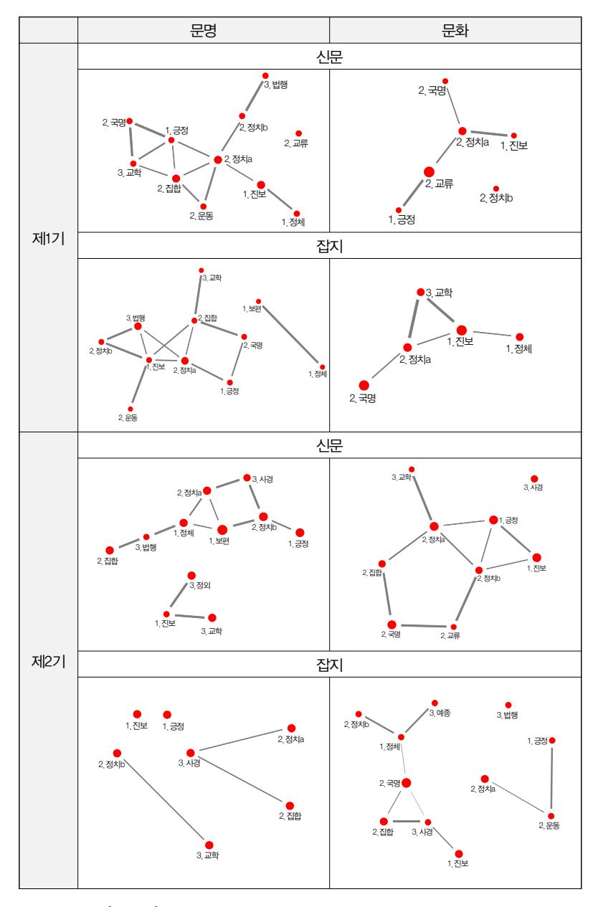

[그림 3] 두 키워드의 시기별ㆍ매체별 의미연결망 지도(개략)

'선'에 작은 동그라미로 표시했다.

먼저 신문에 해당하는 [그림 4]를 살펴보면, '문명(1)-문화(2)'와 '문화(1)- 문화(2)'는 공통 구성마디의 응집 정도의 측면에서 서로 비슷하다고 할 수 있 다. 왜냐하면 두 경우 모두 공통 구성마디가 제1기에는 큰 덩어리와 1개짜리 로 나뉘어 있고, 제2기에는 큰 덩어리 하나로 되어 있어서 두 시기 간 연속성 이 여타 비교 관계에 비해 크다고 할 수 있기 때문이다. '문명(1)-문명(2)'와 '문화(1)-문명(2)'에서는 공통 구성마디가, 제1기와 제2기의 어느 한쪽이나 양쪽이 3개로 분할되어 두 시기 사이의 연관성이 상대적으로 약하다.

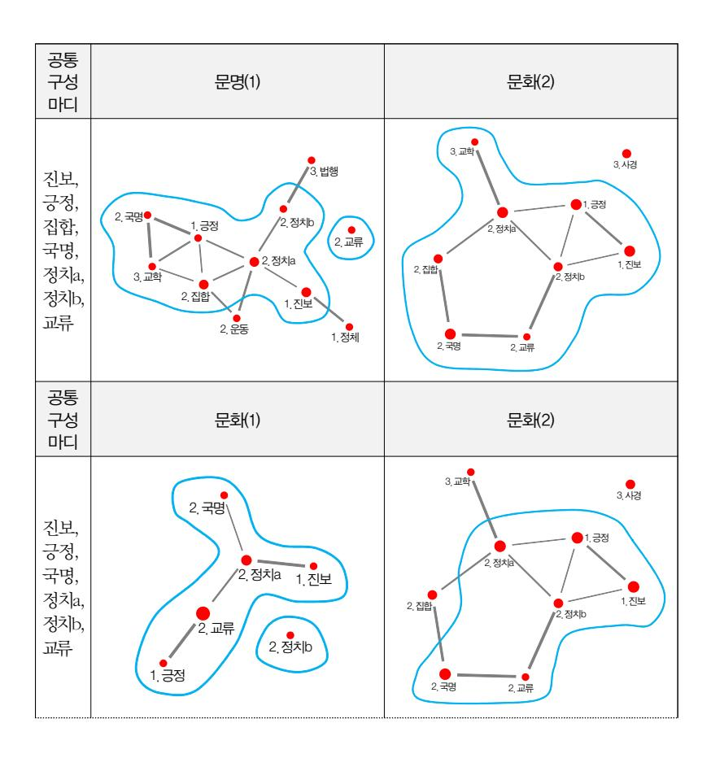

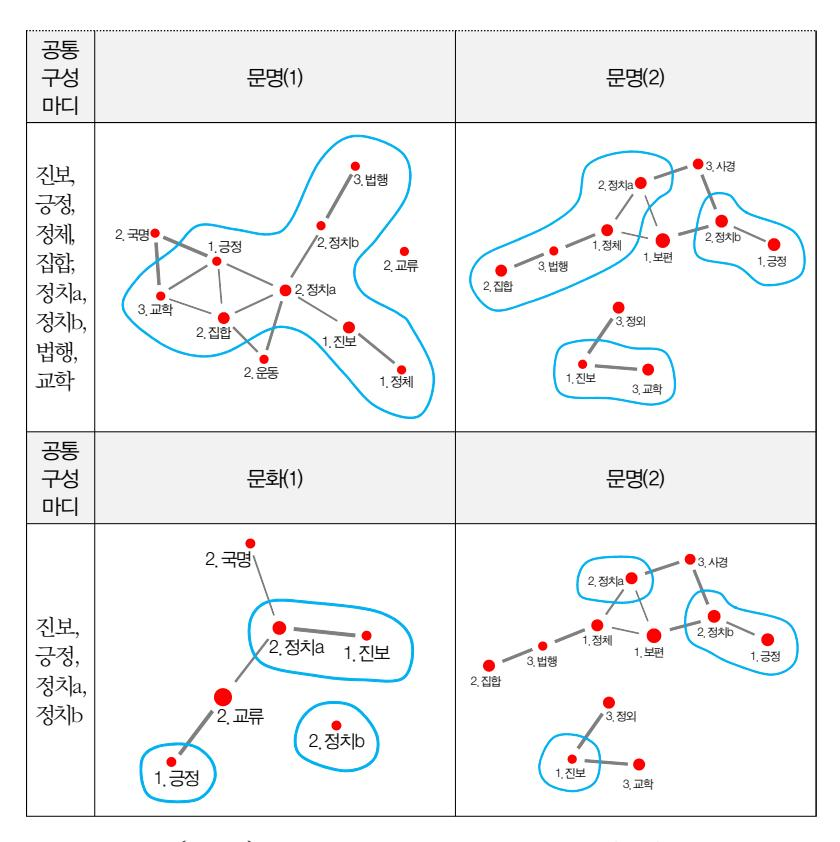

[그림 4] 의미연결망 지도의 시기별 연관성 비교(신문)

연속성이 상대적으로 높은 '문명(1)-문화(2)'와 '문화(1)-문화(2)'에서 공 통 구성마디 간의 1촌 관계를 살펴보면, '문명(1)-문화(2)'가 '2) 정치체 a-1) 긍정판단', '2) 정치체a-2) 집합주체', '2) 정치체a-2) 정치체b'의 세 쌍 을 공유하는 반면, '문화(1)-문화(2)'는 이런 경우가 하나도 없다.

이처럼 '공통 구성마디들의 응집 정도'와 '공통 구성마디 간 1촌 관계'라는 두 지표로 살펴본 결과를 종합하면, 신문의 경우 키워드의 논의 맥락은 제 1기 '문명'에서 제2기 '문화'로 이어지는 경향이 상대적으로 뚜렷하다고 말할 수 있다.

한편 잡지에 해당하는 [그림 5]에서는, 신문과 달리 전체적으로 공통 구 성마디의 응집성 면에서 제1기와 제2기 사이에 유의미한 상관관계가 드러 나지 않는다. 제1기 키워드에 비해 제2기 키워드의 공통 구성마디 간 연결 이 더 분절되어 있다. 1촌 관계도 '문명(1)-문화(2)'에서 한 쌍만 보일 뿐 나 머지 단위에서는 보이지 않는다. 공통 구성마디 간 연결이 여러 개로 분절되 어 있다는 것은, 원래의 공기어연결망 지도에서 의미스펙트럼 구성마디에 해 당하는 공기어가 상대적으로 멀리 떨어져 있었거나, 그 사이에 '9) 기타'에 해 당하는 공기어가 다수 매개되어 있었음을 뜻한다. 그 때문에 '9) 기타' 항목을 제거하자, 그와 1촌을 맺고 있던 공기어의 연결 관계가 삭제되어 의미연결망 지도에서 공통 구성마디들 다수가 고립 분산적으로 나타나는 것이다. 36)

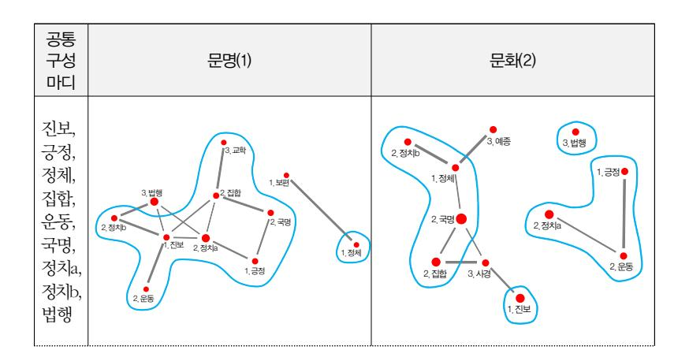

36) 신문의 경우와 잡지의 경우를 서로 비교하면, 신문의 경우 '문명(1)-문화(2)'와 '문화(1)-문 화(2)'에서 두 시기 간 연관성이 상대적으로 높은 반면, 잡지의 경우에는 그렇지 않은 것으로 나타났다. 이 차이의 원인은 명확히 알 수는 없으나, 본 논문에서 활용한 기사의 위상이 매체별로 차이가 나기 때문일 수도 있다. 잡지의 경우 기사 전문을 포함한 반면 신문의 경우 사설만 사용했기 때문에, 후자에서는 키워드인 '문명'과 '문화'에 대한 언급도 잡지에 비해 내용상의 순도가 높지 않았을까 하는 추정을 해본다.

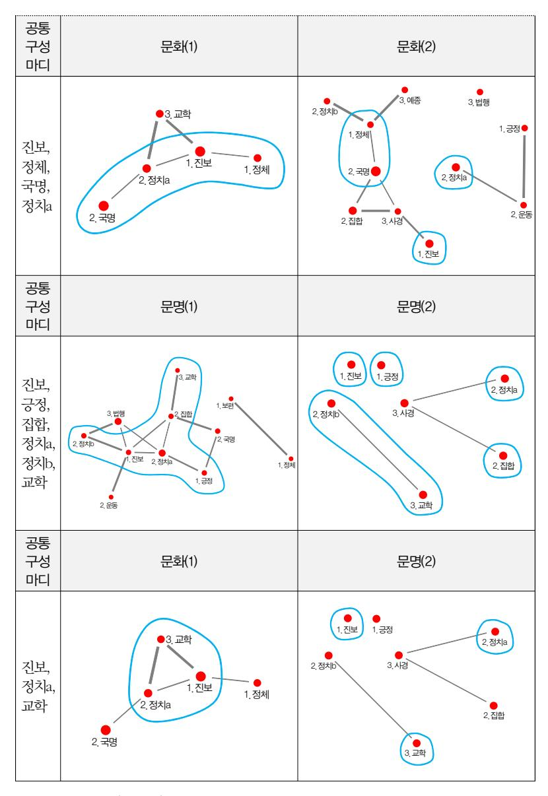

[그림 5] 의미연결망 지도의 시기별 연관성 비교(잡지)

끝으로 이러한 의미연결망 지도 간 비교가 가진 의의와 활용방안에 관해 서 언급해 보자. [그림 6]은 신문의 '문명(1)-문화(2)'에서 논의 맥락의 연속 성이 두드러지는 부분을 표시한 것이다.

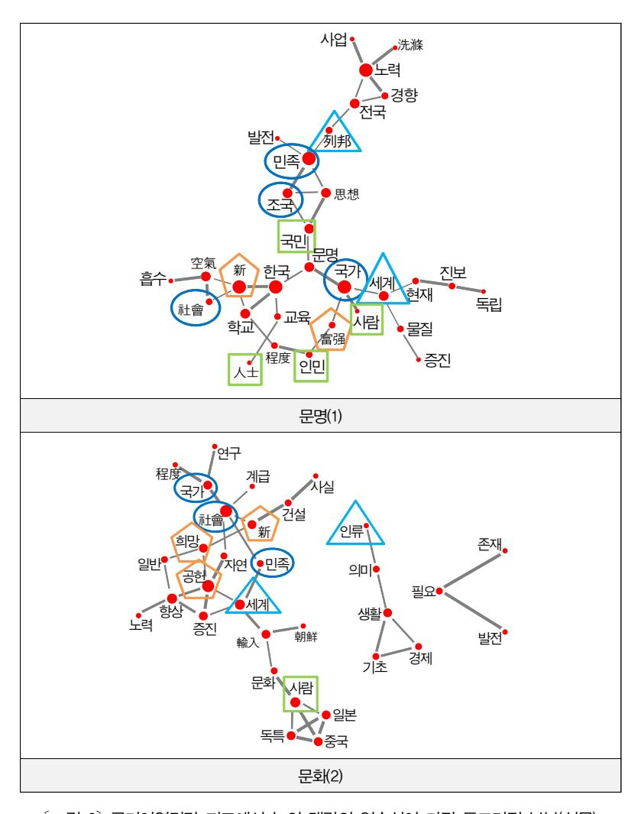

[그림 6] 공기어연결망 지도에서 논의 맥락의 연속성이 가장 두드러진 부분(신문)

[그림 6]은 [그림 2]의 공기어연결망 지도 중 제1기 '문명'과 제2기 '문화' 에 관한 지도에, [그림 4]에서 1촌으로 연결된 공통 구성마디에 해당하는 부 분을 네 종류의 도형으로 표시한 것이다.37) '정치체a'에 해당하는 공기어에 는 동그라미, '정치체b'의 경우는 세모, '집합주체'의 경우는 네모, '긍정판단' 의 경우는 오각형으로 둘러쌌다.

[그림 6]에서도 점과 점이 직접 연결된 1촌 관계가 특히 중요한데, 왜냐하 면 이런 1촌 관계에 있는 단어는 실제 자료의 동일한 문맥에 함께 사용된 것을 대부분 확인할 수 있기 때문이다. 나아가 의미연결망 지도에 표현된 의미스펙트럼 구성마디라는 층위와, 공기어연결망 지도의 공기어라는 단어 층위 간에 존재하는 차이를 염두에 두면 [그림 6]의 활용도는 커질 수 있다. 예컨대 동일한 '정치체a'의 의미스펙트럼 구성마디에 속하더라도 '문명(1)'에 서는 '문화(2)'와 달리 '국가'의 위상이 높아 보인다고 할 수 있다. 우선 해당 공기어도 후자는 '국가·社會·민족'인 데 비해 전자는 '국가·조국·社 會·민족'이 되어, '국가'와 유사한 용어로 보이는 '조국'이 사용되었다. 1촌 관계의 공기어도 '문명(1)'에서 '국가'는 '富强'·'사람'·'세계' 등 3개의 상이 한 구성마디에 해당하는 단어와 동시에 접속되었으나, '문화(2)'로 그러한 접속이 '국가'와 동일한 구성마디에 속하는 '社會' 하나로 줄어들었다. 연결 되는 구성마디의 범위가 급감한 것이다. 이와 직결된 현상으로 '국가' 대신 '社會'의 대두가 주목된다. '문명(1)'에서 '社會'는 '新'이라는 '긍정판단'의 구 성마디와 1촌 관계로 연결되어 있었는데, '문화(2)'로 오면서 1촌 연결 관계 가 기존의 '新'뿐 아니라 '국가' 및 '계급'으로 확장되었다.

37) 의미스펙트럼 구성마디별 공기어 분포는 아래와 같다.

| 구성마디    | 문명(1)          | 문화(2)      |
|---------|----------------|------------|
| 1) 긍정판단 | 富强, 新          | 공헌, 新, 희망  |
| 2) 집합주체 | 국민, 사람, 인민, 人士 | 계급, 사람     |
| 2) 정치체a | 국가, 민족, 社會, 조국 | 국가, 민족, 社會 |
| 2) 정치체b | 세계, 列邦         | 세계, 인류     |

물론 그렇다고 해서 이런 분석이 실제 구체적인 자료의 문맥에서 '문명 (1)'의 '국가-세계' 관계가 '문화(2)'에서 전혀 발견되지 않는다는 뜻은 아니 다. 제2장의 공기어연결망 지도를 산출하는 과정에서 언급했듯이 이 지도상 의 공기어들은 키워드가 있는 수많은 문맥에서 함께 사용된 단어 중, 최상 위권에 속하는 소수, 그러나 키워드와 상대적으로 매우 긴밀하게 사용된 단 어이기 때문이다. 그러나 바로 이러한 비중과 위상을 가지기 때문에 방대한 자료에서 사용된 '문명'과 '문화'의 논의 맥락을 파악하는 데 중요한 증거가 되는 것이다.

# 4. 맺음말

본 논문에서는 한국 근대사의 초기 국면에서 커다란 영향력을 발휘한 '문 명'과 '문화'에 주목하여, 각각의 논의 맥락이 서로 어떤 관계에 있었는가를 언어연결망 분석을 통해 살펴보았다. 본문에서 검토한 내용을 요약하면 다 음과 같다.

제2장에서는 분석에 필수적인 사항 즉 전산 자료의 종류와 범위, 가공 절 차와 그 결과물, 그리고 결과물을 활용한 연결망 작성 등을 서술했다. 제1절 에서는 두 키워드의 논의 맥락을 살펴보는 데 적합한 시기로 1900년대 후반 (1905\~1910)과 1920년대 전반(1920\~1925)을 선정했다. 활용 가능한 대표 적인 전산 자료로, 1900년대 후반의 황성신문과 학회지 11종 및 1920년 대 전반의 동아일보 사설과 개벽을 선택했다.

제2절에서는 전산 자료를 언어연결망 분석에 적합한 코퍼스 자료로 가공 하는 데 적용한 형태 분석 기준 및 절차 등을 명시한 뒤, 상위 빈도 30개 안팎의 공기어를 '점'으로 하는 '공기어연결망 지도'의 산출 기준 및 절차를 밝히고 8개의 연결망 지도를 키워드별·시기별·매체별로 제시했다.

제3장에서는 두 키워드의 논의 맥락을 본격적으로 분석했다. 제1절에서

는 개별 기표 차원의 의미 파악을 넘어서기 위한 시도로, 공기어들을 15개 범주로 정돈해서 '의미스펙트럼'을 만들었다. 그리고 15개 범주 중에서 그 범주에 포함되는 공기어를 하나 이상 포함하여 실제로 의미스펙트럼의 한 요소가 된 범주는 의미스펙트럼 '구성마디'로 명명했다. 이 구성마디의 유무 와 그 구성마디가 포괄하는 공기어 수가 의미스펙트럼의 특성을 형성한다 는 판단 아래, 이 두 값을 근거로 의미스펙트럼 간의 유사도를 측정했다. 그 결과 신문과 잡지 모두에서 1900년대 후반의 '문명'과 1920년대 전반의 '문 화' 사이에서 유사성이 가장 높았다.

제2절에서는 제1절의 문제의식과 분석방법을 한 단계 진전시키기 위해 비교·검토의 주안점을 의미스펙트럼 구성마디 간의 '관계'에 집중했다. 이 를 위해 우선 앞에서 설명한 15개 범주를 공기어연결망 지도에 적용하여 구 성마디 간 관계를 '선'으로 표현한 '의미연결망 지도'를 산출했다. 이 의미연 결망 지도를 구성마디 간 연결 관계에 초점을 두고 서로 비교한 결과, 신문 의 용례에서는 1900년대 후반의 '문명'에서 1920년대 전반의 '문화'로 논의 맥락이 이어진다고 판단할 수 있었다.

의미스펙트럼이라는 발상과 이를 적용한 의미연결망 지도는 본 논문에서 처음 시도한 것이다. 필자는 서로 유관하지만 상이한 기표를 가진 두 단어 의 의미를 파악하기 위해 이 방법을 적용해 보았다. 본문 마지막 부분에 언 급했듯이 의미연결망 지도를 활용하면, 단어들의 '기표-기의' 관계 형성과 변화 양상을 통해 주요 개념의 논의 맥락을 파악하는 데 도움이 되리라 생 각한다. 그런데 아직 방법론적으로 정립되지 못해서 보완할 점도 적지 않 다. 의미스펙트럼을 위한 범주를 설정하고 여기에 공기어를 배치하는 작업 이 핵심적인 중요성을 가진다고 생각되므로 이에 대한 검토와 보완이 필요 하리라 생각한다. 또한 의미스펙트럼과 의미연결망 지도의 활용방안과 유용 성에 관해서도 좀 더 구체적인 차원에서 논의되고 검증될 필요가 있다.

#### 참고문헌

### 1. 1차 자료

- 개벽, 기호흥학회월보, 대동학보, 대한유학생회학보, 대한자강회월보, 대한학회월보, 대한협회회보, 대한흥학보, 서북학회월보, 서우, 태극학보, 호남학보, 황성신문:빅카인즈(Bigkinds) '고신문' 사이 트(https://www.kinds. or.kr/news/libraryNews.do).
- 동아일보:네이버의 '뉴스라이브러리(https://newslibrary.naver.com/search/sear chByDate.nhn#%7B%22mode%22%3A3%2C%22trans%22%3A%221 %22%2C%22pageSize%22%3A20%2C%22date%22%3A%221995-09-06%22 %2C%22page%22%3A1%2C%22officeId%22%3A%2200032%22%2C%22pu blishType%22%3A%2200010%22%2C%22fevt%22%3A5267%7D).

### 2. 2차 자료

### 1) 단행본

- 이지원, 2007, 한국 근대 문화사상사 연구, 혜안.
- 고마고메 다케시(2008), 식민지제국 일본의 문화통합, 오성철·이명실·권경희 역, 역사비평사(駒込武, 1996, 植民地帝国日本の文化統合, 東京:岩波 書店).

#### 2) 논문

- 김현주, 2015, 「계몽기 문화 개념의 운동성과 사회이론」, 개념과 소통 제15호, 5\~45쪽.
- 송인재, 2017, 「개벽의 '문화' 관련 기사를 통해 본 천도교의 문화관」, 시대와 철학 제80호, 161\~198쪽.
- 장석만, 2015, 「식민지 조선에서 "문명-문화-종교"의 개념적 네트워크 형성」, 종 교문화비평 제28호, 215\~239쪽.
- 허수, 2016, 「네트워크분석을 통해 본 1980년대 '민중':동아일보의 용례를 중심 으로」, 개념과 소통 제18호, 53\~95쪽.

#### 3. 기타

- 「[네트워크 이론] 다양한 중심성(Centrality) 척도들」(https://bab2min.tistory.com/ 554, 2018년 10월 27일 검색)
- 「'쉽게 설명한' 구글의 페이지 랭크 알고리즘」(https://sungmooncho.com/2012/08/ 26/pagerank/, 2018년 10월 27일 검색)

### Abstract

# Language Network Analysis of *Munmyeong* and *Munhwa* in Early 20th-Century Korea

―Focusing on the Discussion Context of Major Media Articles

Soo Hur\*

■ Keywords:Munmyeong, Munhwa, co-occurring words, co-occurring word network map, semantic spectrum, semantic network map.

Little research has been done on the relationship between discussions of Munmyeong and Munhwa in early 20th-century Korea. This paper addresses the topic by examining the discussion context of these two keywords and how this changed over the period, using a Language Network Analysis methodology. The study consisted of three stages.

First, a corpus was constructed by extracting the context of the keywords from Hwangseong Sinmun and 11 periodicals published during the 1900s, together with Dong-A Ilbo and Gaebyeok from the 1920s. Using this corpus, eight co-occurring word network maps were calculated, each consisting of the 30 words.

Second, a semantic spectrum was created by arranging the co-occurring words into 15 categories, to allow comparisons among the co-occurring

\* Associate Professor, Department of Korean History, Seoul National University

word network maps. By calculating similarity between these semantic spectra, it was shown that both newspapers and magazines had a high degree of similarity of context for the keywords, with Munmyeong being most similar in the late 1900s and Munhwa in the early 1920s.

Third, to facilitate further analysis, semantic network maps were created which express the relationship between semantic spectrum components as links. These maps were calculated by applying the 15 categories to the co-occurring word network maps. A comparison of these semantic network maps reveals that the discussion context of Munmyeong in late 1900s newspapers was significantly replicated in the discussion context of Munhwa in the early 1920s.
